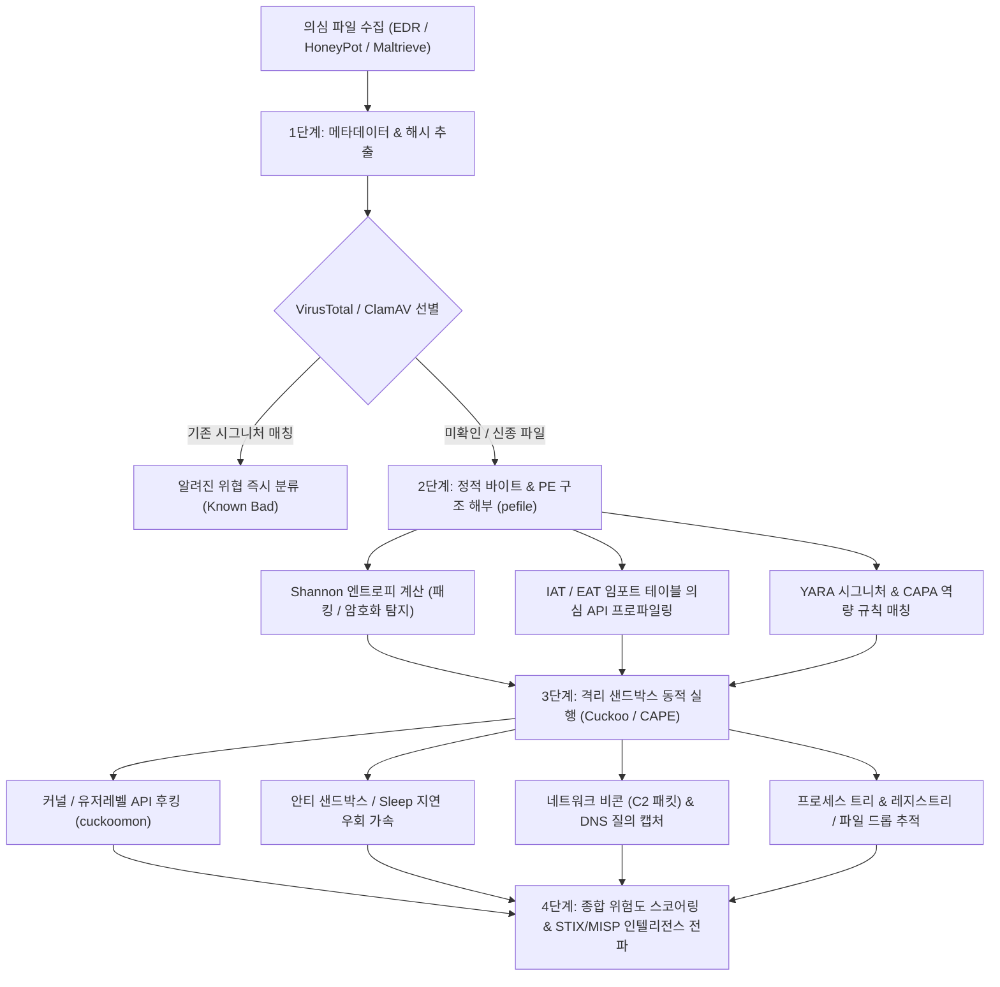
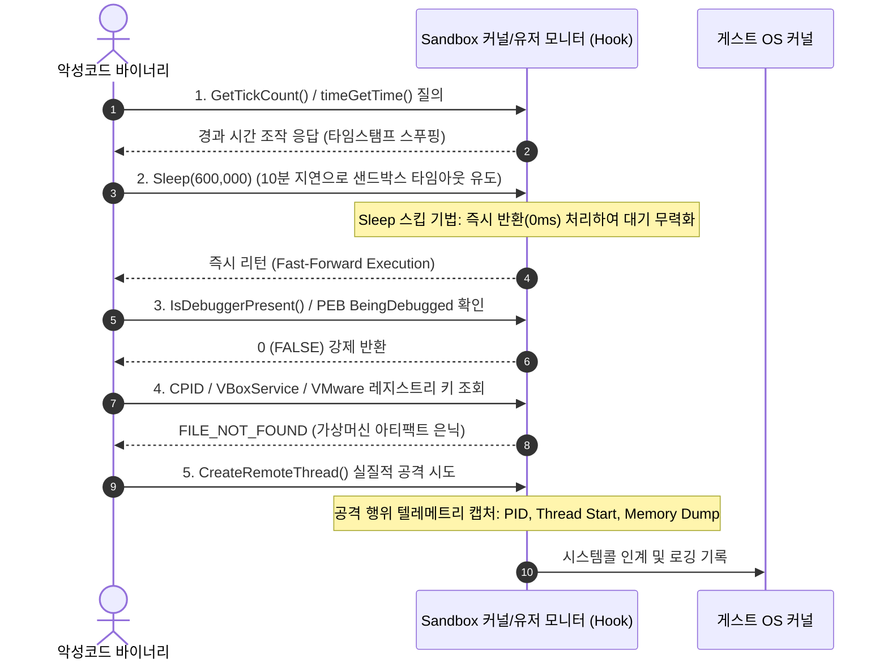

# 09. 심층 분석: 파이썬 오픈소스 기반 악성코드 자동 분석 파이프라인 & 동적 샌드박스 딥다이브

> **핵심 요약**: 본 문서는 대규모 악성코드 인텔리전스 및 침해 대응 현장에서 활용되는 파이썬 기반 오픈소스 분석 자동화 아키텍처를 심층 분석합니다. PE 포맷 바이트 파싱(`pefile`/`peframe`), Shannon 엔트로피 기반 패킹 탐지, YARA 시그니처 매칭 엔진, 그리고 쿠쿠 샌드박스(Cuckoo/CAPEv2) 스타일의 가상머신 API 후킹 및 동적 행위(Behavioral) 텔레메트리 수집 파이프라인을 다룹니다.

---

## 1. 악성코드 분석 자동화 파이프라인 아키텍처

현대 엔터프라이즈 환경에서는 매일 수만 개 이상의 의심스러운 바이너리가 EDR, 이메일 게이트웨이, 허니팟을 통해 유입됩니다. 수동 정적/동적 리버싱만으로는 대응이 불가능하므로, 파이썬 기반의 계층형 자동 분석 오케스트레이션이 필수적입니다.



---

## 2. PE (Portable Executable) 구조와 바이트 레벨 파싱

Windows 실행 파일(PE32 / PE32+)은 정밀하게 구조화된 헤더와 섹션들의 집합체입니다. 파이썬 `pefile` 라이브러리는 저수준 C 구조체를 파이썬 객체로 역직렬화하여 바이너리의 악성 지표를 추출합니다.

### 2.1 핵심 PE 헤더 구조 요약

```
+-----------------------------------------------------------+
| IMAGE_DOS_HEADER (e_magic: 'MZ' = 0x5A4D, e_lfanew: NT오프셋) |
+-----------------------------------------------------------+
| MS-DOS Stub Program ("This program cannot be run in DOS") |
+-----------------------------------------------------------+
| IMAGE_NT_HEADERS                                          |
|   Signature: 'PE\0\0' (0x00004550)                        |
|   IMAGE_FILE_HEADER (Machine, NumberOfSections, TimeDate) |
|   IMAGE_OPTIONAL_HEADER (AddressOfEntryPoint, ImageBase,  |
|                          Subsystem, DllCharacteristics)   |
|     DataDirectory[16] (Export, Import, Resource, Exception)|
+-----------------------------------------------------------+
| IMAGE_SECTION_HEADER[] (.text, .data, .rdata, .rsrc ...)   |
+-----------------------------------------------------------+
| Section Raw Data (코드, 데이터, 리소스, 쉘코드 페이로드)     |
+-----------------------------------------------------------+
```

### 2.2 Shannon 엔트로피(Entropy)를 통한 패킹/암호화 탐지

엔트로피는 데이터의 무작위성(무질서도)을 0.0에서 8.0(바이트당 비트 수) 사이의 값으로 측정한 수학적 지표입니다:

$$H(X) = -\sum_{i=0}^{255} P(x_i) \log_2 P(x_i)$$

- **일반 컴파일된 코드 섹션(`.text`)**: 대략 `5.5 ~ 6.5`
- **단순 텍스트/데이터 섹션(`.data`)**: 대략 `2.0 ~ 4.5`
- **UPX, Themida, VMProtect 등 패커로 압축/암호화된 섹션**: **`7.2 ~ 8.0`**

엔트로피가 7.2 이상이고 표준 섹션명(`.text`, `.data`)과 다른 변칙적 섹션명(예: `UPX0`, `.vmp0`, 임의의 무작위 문자열)을 가지는 경우, 악성 쉘코드 은닉 또는 패킹 상태로 판단합니다.

---

## 3. 정적 악성 역량 프로파일링: IAT (Import Address Table) 헌팅

악성코드가 운영체제와 상호작용하기 위해 호출하는 Windows API의 군집(Cluster)을 분석하면 정적 단계에서도 공격 의도를 90% 이상 파악할 수 있습니다.

### 3.1 악성 행위별 핵심 모니터링 API 매트릭스

| 공격 행위 군집 | 핵심 의심 Windows API | 침투 목적 및 공격 기법 |
| :--- | :--- | :--- |
| **프로세스 인젝션** | `OpenProcess`, `VirtualAllocEx`, `WriteProcessMemory`, `CreateRemoteThread`, `QueueUserAPC`, `NtMapViewOfSection` | 정상 프로세스(explorer, svchost)에 악성 쉘코드 주입 (T1055) |
| **프로세스 할로잉** | `CreateProcessA(CREATE_SUSPENDED)`, `NtUnmapViewOfSection`, `SetThreadContext`, `ResumeThread` | 프로세스 껍데기 교체 및 악성 코드 치환 |
| **안티 디버깅** | `IsDebuggerPresent`, `CheckRemoteDebuggerPresent`, `NtQueryInformationProcess`, `OutputDebugStringA` | 분석가 디버거 부착 탐지 시 프로세스 자폭 |
| **지속성 유지 (Persistence)** | `RegOpenKeyExA`, `RegSetValueExA`, `CreateServiceA`, `StartServiceA` | Run 키 등록 또는 악성 서비스 설치 (T1547) |
| **크리덴셜 탈취** | `OpenProcessToken`, `LookupPrivilegeValueA`, `AdjustTokenPrivileges`, `LsaEnumerateLogonSessions` | SeDebugPrivilege 활성화 및 LSASS 메모리 접근 |
| **C2 네트워크 통신** | `InternetOpenA`, `InternetConnectA`, `HttpOpenRequestA`, `WSAStartup`, `connect`, `URLDownloadToFileA` | 원격 C2 비콘 통신 및 2차 스테이지 페이로드 수신 |

---

## 4. 고도화된 YARA 시그니처 룰셋 설계

YARA는 패턴 매칭을 통해 악성코드 패밀리를 식별하는 업계 표준 엔진입니다. 복합 조건문과 PE 모듈을 결합하여 고신뢰도 탐지 룰을 작성합니다.

```yara
import "pe"

rule APT_Dropper_Generic_Heuristic {
    meta:
        author = "VibeHacking Research Lab"
        description = "Detects packed dropper executing suspicious remote thread injection"
        date = "2026-09-26"
        severity = "HIGH"
        reference = "MITRE ATT&CK T1055, T1027"

    strings:
        // 난독화된 드롭퍼 쉘코드 시작 시그니처 (Egg Hunter 또는 Call-Pop GetPC)
        $shellcode_stub = { E8 00 00 00 00 5D 81 ED ?? ?? ?? ?? 8B }
        
        // 의심스러운 커맨드 실행 및 다운로더 문자열
        $cmd1 = "cmd.exe /c powershell -nop -w hidden -enc" ascii wide nocase
        $cmd2 = "IEX (New-Object Net.WebClient).DownloadString" ascii wide nocase
        $ua   = "Mozilla/5.0 (Windows NT 10.0; Win64; x64) ThreatHunting/3.0" ascii

    condition:
        // 1. PE 매직 넘버 검증 (MZ 헤더)
        uint16(0) == 0x5A4D and
        
        // 2. 의심 섹션 엔트로피 7.2 초과 (패킹 의심)
        for any section in pe.sections : (
            section.name matches /^\.(text|code|upx\d*|vmp\d*)/ and
            section.entropy(section.raw_data_offset, section.raw_data_size) > 7.2
        ) and
        
        // 3. 프로세스 인젝션 관련 IAT 임포트 함수 조합 탐지
        (
            pe.imports("kernel32.dll", "VirtualAllocEx") and
            pe.imports("kernel32.dll", "WriteProcessMemory") and
            pe.imports("kernel32.dll", "CreateRemoteThread")
        ) and
        
        // 4. 악성 문자열 또는 쉘코드 패턴 매칭
        ($shellcode_stub or ($cmd1 or $cmd2) or $ua)
}
```

---

## 5. 동적 샌드박스(Cuckoo/CAPE) 아키텍처와 안티 회피(Anti-Evasion) 방어

정적 분석을 우회하기 위해 공격자들은 샌드박스 감지 로직을 삽입합니다. 가상 환경 내부의 모니터링 엔진(`cuckoomon.dll`)은 이를 인터셉트하여 무력화합니다.



---

## 6. 파이썬 기반 자동화 트리아지 파이프라인 구현

아래는 정적 PE 파싱, 엔트로피 분석, YARA 시그니처 검사, 동적 가상 시뮬레이션을 원스톱으로 수행하는 엔지니어링 수준의 파이프라인 스크립트입니다:

```python
#!/usr/bin/env python3
"""Automated Malware Triage and Analysis Pipeline."""

import math
import hashlib
from typing import Dict, Any, List

def calculate_entropy(data: bytes) -> float:
    """바이트 배열의 Shannon Entropy(0.0~8.0) 계산"""
    if not data:
        return 0.0
    freq = [0] * 256
    for b in data:
        freq[b] += 1
    total = len(data)
    entropy = 0.0
    for count in freq:
        if count > 0:
            p = count / total
            entropy -= p * math.log2(p)
    return round(entropy, 4)

class MalwarePipelineAnalyzer:
    def __init__(self, binary_bytes: bytes):
        self.data = binary_bytes
        self.hashes = {
            "md5": hashlib.md5(binary_bytes).hexdigest(),
            "sha1": hashlib.sha1(binary_bytes).hexdigest(),
            "sha256": hashlib.sha256(binary_bytes).hexdigest(),
        }

    def analyze_pe_headers(self) -> Dict[str, Any]:
        """기본 PE 매직 넘버 및 가상 섹션 엔트로피 파싱"""
        is_pe = self.data.startswith(b"MZ")
        total_entropy = calculate_entropy(self.data)
        is_packed = total_entropy > 7.1

        return {
            "is_pe": is_pe,
            "size_bytes": len(self.data),
            "entropy": total_entropy,
            "suspected_packed": is_packed,
            "hashes": self.hashes,
        }

    def scan_yara_patterns(self, rules: List[Dict[str, Any]]) -> List[str]:
        """악성 시그니처 패턴 매칭"""
        matches = []
        for rule in rules:
            name = rule["name"]
            pattern = rule["pattern"]
            if pattern in self.data:
                matches.append(name)
        return matches
```

---

## 7. 대응 방안 및 결론

1. **심층 심층 방어(Defense in Depth)**: 정적 시그니처만으로는 신종/변종 악성코드를 식별할 수 없으므로, 엔트로피 분석, IAT 군집 프로파일링, 동적 행위 샌드박스를 유기적으로 통합해야 합니다.
2. **샌드박스 하드닝(Hardening)**: 공격자의 Anti-VM 및 Anti-Analysis 우회 전략에 대응하기 위해 커널 레벨 eBPF/디바이스 드라이버 후킹을 통해 Sleep 스킵, 타임스탬프 조작, 디버거 플래그 은닉을 적극 구현해야 합니다.
3. **실습 연계**: 본 장에서 학습한 정적/동적 분석 파이프라인 및 안티 샌드박스 무력화 기법은 **Lab 26 (MalSandbox)** 및 워게임 **Track 40 (`malsandbox`)**에서 실습할 수 있습니다.
