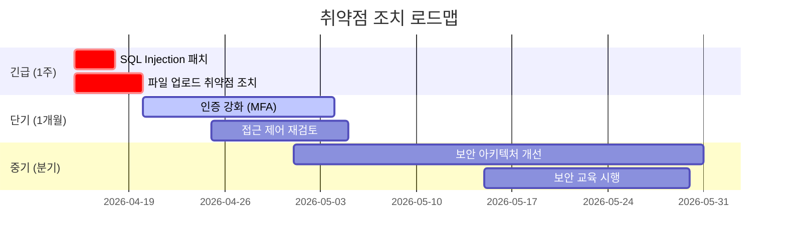

# 전문 침투 테스트 보고서 작성

## 보고서의 목적과 구조

```
모의해킹 보고서 목적:

  경영진 요약 ──► 위험을 비즈니스 언어로 설명
  기술 상세   ──► 재현 가능한 PoC와 증거
  개선 방안   ──► 구체적·우선순위화된 조치
  규정 준수   ──► ISO 27001, PCI-DSS, ISMS-P 근거

보고서 독자별 요구사항:
  CISO/임원  ─ 위험 비용, 사업 영향, 경쟁사 대비 보안 수준
  IT 관리자  ─ 시스템별 취약점 목록, 패치 일정
  개발팀     ─ 코드 수준 취약점, 안전한 코딩 예시
  감사/법무  ─ 컴플라이언스 위반 항목, 법적 근거
```

---

## 1. 보고서 표준 구조

### 전체 목차 템플릿

```markdown
# [고객사명] 모의침투테스트 결과보고서

**기밀 등급:** 대외비 (수신인 한정)
**보고서 버전:** v1.0
**작성일:** 2026-04-15
**작성자:** [수행사명] 보안컨설팅팀
**수신:** [고객사명] 정보보안팀장

---

## 목차
1. 경영진 요약 (Executive Summary)
2. 프로젝트 개요
3. 방법론 및 범위
4. 취약점 요약 및 위험도 분포
5. 상세 취약점 보고서
6. 개선 권고사항
7. 기술 부록
8. 참고 자료
```

---

## 2. 경영진 요약 (Executive Summary)

```markdown
## 1. 경영진 요약

### 1.1 테스트 목적
[고객사명]의 외부/내부 정보시스템에 대한 실제 공격자 시나리오 기반 
모의침투테스트를 수행하여 보안 취약점을 식별하고 개선 방향을 제시합니다.

### 1.2 핵심 발견사항

> **총 47개 취약점 발견 — 즉시 조치 필요 항목 8개**

| 위험도 | 발견 수 | 즉시 조치 |
|--------|---------|-----------|
| 치명적 (Critical) | 3 | ✅ 필수 |
| 높음 (High)       | 5 | ✅ 필수 |
| 중간 (Medium)     | 18 | ⚠️ 30일 이내 |
| 낮음 (Low)        | 14 | 📋 분기 내 |
| 정보 (Info)       | 7 | — |

### 1.3 비즈니스 영향
- **데이터 유출 위험:** 고객 개인정보 23만 건 탈취 가능
- **서비스 중단 위험:** 핵심 결제 시스템 RCE 취약점 존재
- **규정 위반:** ISMS-P 2.10.1 조항 미충족 → 과태료 최대 3,000만 원
- **재정적 손실 추산:** 침해 발생 시 평균 17억 원 (Ponemon 2025 기준)

### 1.4 개선 로드맵


```

---

## 3. CVSS 위험도 평가 체계

### CVSS v3.1 계산기

```python
#!/usr/bin/env python3
"""CVSS v3.1 Base Score Calculator"""

from dataclasses import dataclass
from typing import Literal
import math

@dataclass
class CVSSv31:
    # Attack Vector
    AV: Literal['N', 'A', 'L', 'P'] = 'N'   # Network/Adjacent/Local/Physical
    # Attack Complexity
    AC: Literal['L', 'H'] = 'L'              # Low/High
    # Privileges Required
    PR: Literal['N', 'L', 'H'] = 'N'         # None/Low/High
    # User Interaction
    UI: Literal['N', 'R'] = 'N'              # None/Required
    # Scope
    S: Literal['U', 'C'] = 'U'              # Unchanged/Changed
    # Confidentiality Impact
    C: Literal['N', 'L', 'H'] = 'H'          # None/Low/High
    # Integrity Impact
    I: Literal['N', 'L', 'H'] = 'H'          # None/Low/High
    # Availability Impact
    A: Literal['N', 'L', 'H'] = 'H'          # None/Low/High

    def score(self) -> float:
        AV_map = {'N': 0.85, 'A': 0.62, 'L': 0.55, 'P': 0.2}
        AC_map = {'L': 0.77, 'H': 0.44}
        PR_map = {
            'U': {'N': 0.85, 'L': 0.62, 'H': 0.27},
            'C': {'N': 0.85, 'L': 0.68, 'H': 0.50},
        }
        UI_map = {'N': 0.85, 'R': 0.62}
        CIA_map = {'N': 0.00, 'L': 0.22, 'H': 0.56}

        av = AV_map[self.AV]
        ac = AC_map[self.AC]
        pr = PR_map[self.S][self.PR]
        ui = UI_map[self.UI]

        exploitability = 8.22 * av * ac * pr * ui

        ci = CIA_map[self.C]
        ii = CIA_map[self.I]
        ai = CIA_map[self.A]

        iss = 1 - (1 - ci) * (1 - ii) * (1 - ai)

        if self.S == 'U':
            impact = 6.42 * iss
        else:
            impact = 7.52 * (iss - 0.029) - 3.25 * pow(iss - 0.02, 15)

        if impact <= 0:
            return 0.0

        if self.S == 'U':
            base = min(exploitability + impact, 10)
        else:
            base = min(1.08 * (exploitability + impact), 10)

        # Roundup to 1 decimal
        return math.ceil(base * 10) / 10

    def severity(self) -> str:
        s = self.score()
        if s == 0.0: return "None"
        elif s <= 3.9: return "Low"
        elif s <= 6.9: return "Medium"
        elif s <= 8.9: return "High"
        else: return "Critical"

    def vector_string(self) -> str:
        return (f"CVSS:3.1/AV:{self.AV}/AC:{self.AC}/PR:{self.PR}"
                f"/UI:{self.UI}/S:{self.S}/C:{self.C}/I:{self.I}/A:{self.A}")


# 예시 사용
if __name__ == "__main__":
    # SQL Injection (원격 인증 없이 DB 전체 접근)
    sqli = CVSSv31(AV='N', AC='L', PR='N', UI='N', S='C', C='H', I='H', A='H')
    print(f"SQL Injection: {sqli.score()} ({sqli.severity()})")
    print(f"Vector: {sqli.vector_string()}")
    # → 10.0 Critical

    # 반사형 XSS
    rxss = CVSSv31(AV='N', AC='L', PR='N', UI='R', S='C', C='L', I='L', A='N')
    print(f"Reflected XSS: {rxss.score()} ({rxss.severity()})")
    # → 6.1 Medium

    # 인증 우회
    auth_bypass = CVSSv31(AV='N', AC='L', PR='N', UI='N', S='U', C='H', I='H', A='H')
    print(f"Auth Bypass: {auth_bypass.score()} ({auth_bypass.severity()})")
    # → 9.8 Critical
```

---

## 4. 취약점 상세 보고서 템플릿

### 4.1 Critical 취약점 예시

```markdown
---

### VULN-001: SQL Injection — 로그인 API
**위험도:** Critical (CVSS 3.1: 9.8 — AV:N/AC:L/PR:N/UI:N/S:U/C:H/I:H/A:H)
**발견 위치:** `POST /api/v1/auth/login` → `username` 파라미터
**발견 일시:** 2026-03-20
**CWE:** CWE-89 (Improper Neutralization of Special Elements used in an SQL Command)

#### 취약점 설명
로그인 API의 `username` 파라미터가 사용자 입력값을 SQL 쿼리에 직접 삽입합니다.
공격자는 SQL 쿼리 구조를 변조하여 인증 우회, 데이터베이스 전체 조회,
경우에 따라 운영체제 명령 실행이 가능합니다.

#### 취약한 코드
```python
# ❌ 취약한 구현 (app/auth/views.py:47)
query = f"SELECT * FROM users WHERE username='{username}' AND password='{password}'"
cursor.execute(query)
```

#### 공격 시나리오 및 재현 절차

**환경:** 테스트 서버 (10.0.0.1), 승인 범위 내

**Step 1:** 기본 SQL 인젝션 확인
```http
POST /api/v1/auth/login HTTP/1.1
Host: target.company.com
Content-Type: application/json

{"username": "admin'--", "password": "anything"}
```

**응답 (로그인 성공):**
```json
{"status": "ok", "token": "eyJhbGciOiJIUzI1NiJ9..."}
```

**Step 2:** UNION 기반 데이터 추출
```
username: ' UNION SELECT 1,username,password,4 FROM users--
```

**Step 3:** SQLMap 자동화 확인
```bash
sqlmap -u "https://target.company.com/api/v1/auth/login" \
    --data='{"username":"*","password":"test"}' \
    --dbms=mysql \
    --dump-all \
    --batch
```

**증거 스크린샷:** [첨부 Figure-1.png]

#### 영향 범위
- 인증 없이 관리자 계정 탈취 가능
- `users` 테이블 내 고객 정보 23만 건 전체 노출
- ISMS-P 2.6.1 (개인정보보호), 2.10.1 (취약점 점검) 위반

#### 개선 방안

**즉시 조치 (1일 이내):**
```python
# ✅ 안전한 구현 — Parameterized Query
cursor.execute(
    "SELECT * FROM users WHERE username = %s AND password = %s",
    (username, hashed_password)
)
```

**추가 보안 강화:**
- ORM 사용 (SQLAlchemy, Django ORM) 권장
- WAF 규칙에 SQL Injection 패턴 추가
- 데이터베이스 계정 최소 권한 부여 (SELECT만 허용)
- 정기 취약점 진단 (연 2회)

**참고 자료:**
- OWASP SQL Injection Prevention Cheat Sheet
- CWE-89: https://cwe.mitre.org/data/definitions/89.html

---
```

### 4.2 High 취약점 예시

```markdown
### VULN-002: 비인가 직접 객체 참조 (IDOR) — 사용자 프로필 조회
**위험도:** High (CVSS 3.1: 8.1 — AV:N/AC:L/PR:L/UI:N/S:U/C:H/I:H/A:N)
**발견 위치:** `GET /api/v1/users/{user_id}/profile`
**CWE:** CWE-639 (Authorization Bypass Through User-Controlled Key)

#### 취약점 설명
사용자 프로필 API가 `user_id` 파라미터의 소유권을 검증하지 않아,
인증된 모든 사용자가 임의 계정의 개인정보를 조회·수정할 수 있습니다.

#### 재현 절차
```bash
# Step 1: 일반 사용자로 로그인
TOKEN=$(curl -s -X POST /api/v1/auth/login \
    -d '{"username":"user1","password":"pass"}' | jq -r .token)

# Step 2: 타 사용자 ID로 프로필 조회 (정상 = user_id:1001)
curl -H "Authorization: Bearer $TOKEN" \
    "https://target.company.com/api/v1/users/1002/profile"

# Step 3: 타 사용자 정보 수정
curl -X PUT -H "Authorization: Bearer $TOKEN" \
    -d '{"email":"attacker@evil.com"}' \
    "https://target.company.com/api/v1/users/1002/profile"
```

#### 개선 방안
```python
# ✅ 세션 사용자와 요청 user_id 일치 여부 검증
@require_auth
def get_profile(request, user_id):
    if request.user.id != user_id and not request.user.is_admin:
        return JsonResponse({"error": "Forbidden"}, status=403)
    ...
```
---
```

---

## 5. 자동 보고서 생성기

```python
#!/usr/bin/env python3
"""모의침투테스트 보고서 자동 생성기"""

from dataclasses import dataclass, field
from typing import List, Optional
from datetime import datetime
import json

@dataclass
class Vulnerability:
    vuln_id: str
    title: str
    severity: str          # Critical/High/Medium/Low/Info
    cvss_score: float
    cvss_vector: str
    location: str          # URL, IP, 파일 경로
    cwe: str
    description: str
    reproduction: str      # 재현 절차 (Markdown)
    impact: str
    recommendation: str
    evidence: List[str] = field(default_factory=list)  # 스크린샷 파일명

@dataclass
class PentestReport:
    client: str
    project_name: str
    start_date: str
    end_date: str
    report_date: str
    tester: str
    scope: List[str]
    vulnerabilities: List[Vulnerability] = field(default_factory=list)

    def add_vuln(self, vuln: Vulnerability):
        self.vulnerabilities.append(vuln)

    def severity_counts(self) -> dict:
        counts = {"Critical": 0, "High": 0, "Medium": 0, "Low": 0, "Info": 0}
        for v in self.vulnerabilities:
            counts[v.severity] = counts.get(v.severity, 0) + 1
        return counts

    def risk_score(self) -> float:
        """가중 위험 점수 계산"""
        weights = {"Critical": 10, "High": 7, "Medium": 4, "Low": 1, "Info": 0}
        total = sum(weights.get(v.severity, 0) for v in self.vulnerabilities)
        max_possible = len(self.vulnerabilities) * 10
        return round((total / max_possible * 100) if max_possible > 0 else 0, 1)

    def generate_markdown(self) -> str:
        counts = self.severity_counts()
        total = sum(counts.values())
        risk = self.risk_score()

        # 위험도별 이모지
        sev_emoji = {"Critical": "🔴", "High": "🟠", "Medium": "🟡", "Low": "🔵", "Info": "⚪"}

        md = f"""# {self.client} 모의침투테스트 결과보고서

**기밀 등급:** 대외비  
**프로젝트:** {self.project_name}  
**테스트 기간:** {self.start_date} ~ {self.end_date}  
**보고서 작성일:** {self.report_date}  
**수행자:** {self.tester}  

---

## 1. 경영진 요약

### 테스트 범위
"""
        for s in self.scope:
            md += f"- {s}\n"

        md += f"""
### 취약점 요약

| 위험도 | 발견 수 |
|--------|---------|
"""
        for sev, count in counts.items():
            if count > 0:
                md += f"| {sev_emoji[sev]} {sev} | **{count}** |\n"

        md += f"| **합계** | **{total}** |\n\n"
        md += f"**종합 위험 점수:** {risk}/100 "

        if risk >= 70:
            md += "(⚠️ 고위험 — 즉시 조치 필요)\n"
        elif risk >= 40:
            md += "(주의 — 단계적 개선 권고)\n"
        else:
            md += "(양호 — 지속적 관리 필요)\n"

        md += "\n---\n\n## 2. 상세 취약점\n\n"

        # 위험도 순 정렬
        order = ["Critical", "High", "Medium", "Low", "Info"]
        sorted_vulns = sorted(
            self.vulnerabilities,
            key=lambda v: order.index(v.severity)
        )

        for v in sorted_vulns:
            md += f"""### {v.vuln_id}: {v.title}

**위험도:** {sev_emoji[v.severity]} {v.severity} (CVSS {v.cvss_score} — `{v.cvss_vector}`)  
**위치:** `{v.location}`  
**CWE:** {v.cwe}  

#### 설명
{v.description}

#### 재현 절차
{v.reproduction}

#### 영향
{v.impact}

#### 개선 권고
{v.recommendation}

"""
            if v.evidence:
                md += "#### 증거\n"
                for e in v.evidence:
                    md += f"- {e}\n"
            md += "\n---\n\n"

        return md

    def generate_json(self) -> str:
        """JIRA/Confluence 연동용 JSON 출력"""
        return json.dumps({
            "client": self.client,
            "project": self.project_name,
            "dates": {"start": self.start_date, "end": self.end_date},
            "summary": self.severity_counts(),
            "risk_score": self.risk_score(),
            "vulnerabilities": [
                {
                    "id": v.vuln_id,
                    "title": v.title,
                    "severity": v.severity,
                    "cvss": v.cvss_score,
                    "vector": v.cvss_vector,
                    "location": v.location,
                    "cwe": v.cwe,
                }
                for v in self.vulnerabilities
            ]
        }, ensure_ascii=False, indent=2)


# ===== 사용 예시 =====
if __name__ == "__main__":
    report = PentestReport(
        client="(주)테스트코리아",
        project_name="외부 웹 애플리케이션 모의침투테스트",
        start_date="2026-03-10",
        end_date="2026-03-21",
        report_date="2026-03-28",
        tester="홍길동 (OSCP, CEH)",
        scope=[
            "https://www.testkorea.com",
            "https://api.testkorea.com",
            "https://admin.testkorea.com",
        ]
    )

    report.add_vuln(Vulnerability(
        vuln_id="VULN-001",
        title="SQL Injection — 로그인 API",
        severity="Critical",
        cvss_score=9.8,
        cvss_vector="AV:N/AC:L/PR:N/UI:N/S:U/C:H/I:H/A:H",
        location="POST /api/v1/auth/login → username 파라미터",
        cwe="CWE-89",
        description="로그인 API username 파라미터가 SQL 쿼리에 직접 삽입됩니다.",
        reproduction="""```bash
# 인증 우회
curl -X POST /api/v1/auth/login -d '{"username":"admin\\'--","password":"x"}'
```""",
        impact="고객 개인정보 23만 건 노출, 관리자 계정 탈취, ISMS-P 위반",
        recommendation="Parameterized Query 적용, ORM 사용 권장",
        evidence=["screenshot_sqli_login.png", "sqlmap_output.txt"]
    ))

    report.add_vuln(Vulnerability(
        vuln_id="VULN-002",
        title="IDOR — 사용자 프로필 무단 접근",
        severity="High",
        cvss_score=8.1,
        cvss_vector="AV:N/AC:L/PR:L/UI:N/S:U/C:H/I:H/A:N",
        location="GET /api/v1/users/{id}/profile",
        cwe="CWE-639",
        description="user_id 파라미터 소유권 미검증으로 타 사용자 정보 접근 가능",
        reproduction="```bash\ncurl -H 'Authorization: Bearer USER_TOKEN' /api/v1/users/1002/profile\n```",
        impact="전체 사용자 개인정보 열람·수정 가능",
        recommendation="세션 사용자 ID와 요청 user_id 일치 여부 서버 측 검증",
        evidence=["idor_test_result.png"]
    ))

    # Markdown 보고서 생성
    with open("pentest_report.md", "w", encoding="utf-8") as f:
        f.write(report.generate_markdown())

    # JSON 출력 (JIRA 연동용)
    with open("pentest_report.json", "w", encoding="utf-8") as f:
        f.write(report.generate_json())

    print("보고서 생성 완료!")
    print(f"총 취약점: {sum(report.severity_counts().values())}개")
    print(f"종합 위험 점수: {report.risk_score()}/100")
```

---

## 6. 전문 보고서 작성 체크리스트

```
보고서 품질 기준:

구조와 일관성:
  □ 모든 취약점에 CVSS v3.1 점수와 벡터 문자열 포함
  □ CWE 번호 명시
  □ 취약점 ID 체계적 부여 (VULN-001, VULN-002...)
  □ 위험도 순 정렬

재현성:
  □ 모든 취약점에 단계별 재현 절차 포함
  □ 실제 사용된 명령어/페이로드 명시
  □ 증거 스크린샷 첨부 (타임스탬프 포함)
  □ 테스트 환경 명시 (Burp Suite 버전, OS 등)

영향 분석:
  □ 비즈니스 영향 명시 (데이터 유출 규모, 재정적 손실)
  □ 관련 규정 준수 위반 항목 (ISMS-P, PCI-DSS, GDPR 등)
  □ 공격 시나리오 구체화 (공격자 → 목표 → 방법)

개선 방안:
  □ 즉시/단기/중기 조치 구분
  □ 안전한 코드 예시 제공
  □ 검증 방법 명시 (어떻게 확인하는지)
  □ 참고 자료 링크 (OWASP, CVE, CWE)

전달 방식:
  □ 경영진 요약은 기술 용어 최소화
  □ 도표·차트로 위험도 시각화
  □ 개선 로드맵에 일정 포함
  □ 재테스트 일정 제안
```

---

## 7. 재테스트 (Retest) 보고서

```markdown
## 재테스트 결과

| 취약점 ID | 제목 | 원본 심각도 | 조치 상태 | 재테스트 날짜 | 비고 |
|-----------|------|-------------|-----------|---------------|------|
| VULN-001  | SQL Injection | Critical | ✅ 해결됨 | 2026-04-10 | Parameterized Query 적용 확인 |
| VULN-002  | IDOR | High | ✅ 해결됨 | 2026-04-10 | 서버 측 소유권 검증 추가 |
| VULN-003  | Stored XSS | Medium | ⚠️ 부분 해결 | 2026-04-10 | 입력 이스케이프 적용, 출력 이스케이프 미적용 |
| VULN-004  | 취약한 비밀번호 정책 | Low | ❌ 미해결 | — | 개발 일정 지연 |

### 재테스트 결과 요약
- **완전 해결:** 28개 (59.6%)
- **부분 해결:** 8개 (17.0%)
- **미해결:** 11개 (23.4%)
- **신규 발견:** 2개 (조치 과정에서 발생)
```

---

## 8. ISMS-P 대응 매핑

```python
# 취약점과 ISMS-P 인증 기준 매핑
ISMS_P_MAPPING = {
    "SQL Injection":           "2.10.1 보안 취약점 점검",
    "XSS":                     "2.10.1 보안 취약점 점검",
    "IDOR":                    "2.6.1 접근권한 관리",
    "취약한 인증":              "2.5.1 사용자 계정 관리",
    "세션 고정":               "2.5.4 비밀번호 관리",
    "취약한 암호화":           "2.7.1 암호정책 적용",
    "불필요한 정보 노출":      "2.6.3 응용프로그램 접근",
    "파일 업로드 취약점":      "2.10.1 보안 취약점 점검",
    "SSRF":                    "2.10.1 보안 취약점 점검",
    "로깅 미흡":               "2.11.1 로그관리 절차",
    "취약한 TLS":              "2.7.2 암호키 관리",
}

# PCI-DSS 매핑
PCI_DSS_MAPPING = {
    "SQL Injection":     "Req 6.3.2 (취약점 점검)",
    "취약한 인증":       "Req 8.3 (MFA)",
    "암호화 미흡":       "Req 4.2 (전송 암호화)",
    "패치 미적용":       "Req 6.3.3 (보안 패치)",
    "로깅 미흡":         "Req 10 (로그 모니터링)",
}
```
