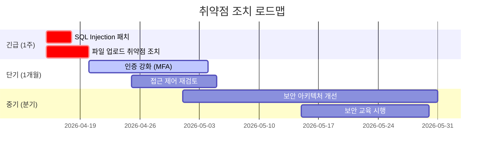

> 🌐 **Language / 언어**: [🇰🇷 한국어](#한국어) | [🇺🇸 English](#english)

---

<a name="한국어"></a>

# 전문 침투 테스트 보고서 작성

## 보고서의 목적과 구조

```
모의해킹 보고서 목적:

  경영진 요약 ──► 위험을 비즈니스 언어로 설명
  기술 상세   ──► 재현 가능한 PoC와 증거
  개선 방안   ──► 구체적·우선순위화된 조치
  규정 준수   ──► ISO 27001, PCI-DSS, ISMS-P 근거

보고서 독자별 요구사항:
  CISO/임원  ─ 위험 비용, 사업 영향, 경쟁사 대비 보안 수준
  IT 관리자  ─ 시스템별 취약점 목록, 패치 일정
  개발팀     ─ 코드 수준 취약점, 안전한 코딩 예시
  감사/법무  ─ 컴플라이언스 위반 항목, 법적 근거
```

---

## 1. 보고서 표준 구조

### 전체 목차 템플릿

```markdown
# [고객사명] 모의침투테스트 결과보고서

**기밀 등급:** 대외비 (수신인 한정)
**보고서 버전:** v1.0
**작성일:** 2026-04-15
**작성자:** [수행사명] 보안컨설팅팀
**수신:** [고객사명] 정보보안팀장

---

## 목차
1. 경영진 요약 (Executive Summary)
2. 프로젝트 개요
3. 방법론 및 범위
4. 취약점 요약 및 위험도 분포
5. 상세 취약점 보고서
6. 개선 권고사항
7. 기술 부록
8. 참고 자료
```

---

## 2. 경영진 요약 (Executive Summary)

```markdown
## 1. 경영진 요약

### 1.1 테스트 목적
[고객사명]의 외부/내부 정보시스템에 대한 실제 공격자 시나리오 기반 
모의침투테스트를 수행하여 보안 취약점을 식별하고 개선 방향을 제시합니다.

### 1.2 핵심 발견사항

> **총 47개 취약점 발견 — 즉시 조치 필요 항목 8개**

| 위험도 | 발견 수 | 즉시 조치 |
|--------|---------|-----------|
| 치명적 (Critical) | 3 | ✅ 필수 |
| 높음 (High)       | 5 | ✅ 필수 |
| 중간 (Medium)     | 18 | ⚠️ 30일 이내 |
| 낮음 (Low)        | 14 | 📋 분기 내 |
| 정보 (Info)       | 7 | — |

### 1.3 비즈니스 영향
- **데이터 유출 위험:** 고객 개인정보 23만 건 탈취 가능
- **서비스 중단 위험:** 핵심 결제 시스템 RCE 취약점 존재
- **규정 위반:** ISMS-P 2.10.1 조항 미충족 → 과태료 최대 3,000만 원
- **재정적 손실 추산:** 침해 발생 시 평균 17억 원 (Ponemon 2025 기준)

### 1.4 개선 로드맵


```

---

## 3. CVSS 위험도 평가 체계

### CVSS v3.1 계산기


CVSS(Common Vulnerability Scoring System)는 취약점의 위험도를 0~10 점수로 표준화하는 체계입니다. 공격 벡터, 복잡도, 필요 권한, 사용자 상호작용, 영향 범위를 기반으로 점수를 계산하며, 취약점 우선순위 결정에 활용합니다.

```python
#!/usr/bin/env python3
"""CVSS v3.1 Base Score Calculator"""

from dataclasses import dataclass
from typing import Literal
import math

@dataclass
class CVSSv31:
    # Attack Vector
    AV: Literal['N', 'A', 'L', 'P'] = 'N'   # Network/Adjacent/Local/Physical
    # Attack Complexity
    AC: Literal['L', 'H'] = 'L'              # Low/High
    # Privileges Required
    PR: Literal['N', 'L', 'H'] = 'N'         # None/Low/High
    # User Interaction
    UI: Literal['N', 'R'] = 'N'              # None/Required
    # Scope
    S: Literal['U', 'C'] = 'U'              # Unchanged/Changed
    # Confidentiality Impact
    C: Literal['N', 'L', 'H'] = 'H'          # None/Low/High
    # Integrity Impact
    I: Literal['N', 'L', 'H'] = 'H'          # None/Low/High
    # Availability Impact
    A: Literal['N', 'L', 'H'] = 'H'          # None/Low/High

    def score(self) -> float:
        AV_map = {'N': 0.85, 'A': 0.62, 'L': 0.55, 'P': 0.2}
        AC_map = {'L': 0.77, 'H': 0.44}
        PR_map = {
            'U': {'N': 0.85, 'L': 0.62, 'H': 0.27},
            'C': {'N': 0.85, 'L': 0.68, 'H': 0.50},
        }
        UI_map = {'N': 0.85, 'R': 0.62}
        CIA_map = {'N': 0.00, 'L': 0.22, 'H': 0.56}

        av = AV_map[self.AV]
        ac = AC_map[self.AC]
        pr = PR_map[self.S][self.PR]
        ui = UI_map[self.UI]

        exploitability = 8.22 * av * ac * pr * ui

        ci = CIA_map[self.C]
        ii = CIA_map[self.I]
        ai = CIA_map[self.A]

        iss = 1 - (1 - ci) * (1 - ii) * (1 - ai)

        if self.S == 'U':
            impact = 6.42 * iss
        else:
            impact = 7.52 * (iss - 0.029) - 3.25 * pow(iss - 0.02, 15)

        if impact <= 0:
            return 0.0

        if self.S == 'U':
            base = min(exploitability + impact, 10)
        else:
            base = min(1.08 * (exploitability + impact), 10)

        # Roundup to 1 decimal
        return math.ceil(base * 10) / 10

    def severity(self) -> str:
        s = self.score()
        if s == 0.0: return "None"
        elif s <= 3.9: return "Low"
        elif s <= 6.9: return "Medium"
        elif s <= 8.9: return "High"
        else: return "Critical"

    def vector_string(self) -> str:
        return (f"CVSS:3.1/AV:{self.AV}/AC:{self.AC}/PR:{self.PR}"
                f"/UI:{self.UI}/S:{self.S}/C:{self.C}/I:{self.I}/A:{self.A}")


# 예시 사용
if __name__ == "__main__":
    # SQL Injection (원격 인증 없이 DB 전체 접근)
    sqli = CVSSv31(AV='N', AC='L', PR='N', UI='N', S='C', C='H', I='H', A='H')
    print(f"SQL Injection: {sqli.score()} ({sqli.severity()})")
    print(f"Vector: {sqli.vector_string()}")
    # → 10.0 Critical

    # 반사형 XSS
    rxss = CVSSv31(AV='N', AC='L', PR='N', UI='R', S='C', C='L', I='L', A='N')
    print(f"Reflected XSS: {rxss.score()} ({rxss.severity()})")
    # → 6.1 Medium

    # 인증 우회
    auth_bypass = CVSSv31(AV='N', AC='L', PR='N', UI='N', S='U', C='H', I='H', A='H')
    print(f"Auth Bypass: {auth_bypass.score()} ({auth_bypass.severity()})")
    # → 9.8 Critical
```

---

## 4. 취약점 상세 보고서 템플릿

### 4.1 Critical 취약점 예시

```markdown
---

### VULN-001: SQL Injection — 로그인 API
**위험도:** Critical (CVSS 3.1: 9.8 — AV:N/AC:L/PR:N/UI:N/S:U/C:H/I:H/A:H)
**발견 위치:** `POST /api/v1/auth/login` → `username` 파라미터
**발견 일시:** 2026-03-20
**CWE:** CWE-89 (Improper Neutralization of Special Elements used in an SQL Command)

#### 취약점 설명
로그인 API의 `username` 파라미터가 사용자 입력값을 SQL 쿼리에 직접 삽입합니다.
공격자는 SQL 쿼리 구조를 변조하여 인증 우회, 데이터베이스 전체 조회,
경우에 따라 운영체제 명령 실행이 가능합니다.

#### 취약한 코드
```python
# ❌ 취약한 구현 (app/auth/views.py:47)
query = f"SELECT * FROM users WHERE username='{username}' AND password='{password}'"
cursor.execute(query)
```

#### 공격 시나리오 및 재현 절차

**환경:** 테스트 서버 (10.0.0.1), 승인 범위 내

**Step 1:** 기본 SQL 인젝션 확인
```http
POST /api/v1/auth/login HTTP/1.1
Host: target.company.com
Content-Type: application/json

{"username": "admin'--", "password": "anything"}
```

**응답 (로그인 성공):**
```json
{"status": "ok", "token": "eyJhbGciOiJIUzI1NiJ9..."}
```

**Step 2:** UNION 기반 데이터 추출
```
username: ' UNION SELECT 1,username,password,4 FROM users--
```

**Step 3:** SQLMap 자동화 확인
```bash
sqlmap -u "https://target.company.com/api/v1/auth/login" \
    --data='{"username":"*","password":"test"}' \
    --dbms=mysql \
    --dump-all \
    --batch
```

**증거 스크린샷:** [첨부 Figure-1.png]

#### 영향 범위
- 인증 없이 관리자 계정 탈취 가능
- `users` 테이블 내 고객 정보 23만 건 전체 노출
- ISMS-P 2.6.1 (개인정보보호), 2.10.1 (취약점 점검) 위반

#### 개선 방안

**즉시 조치 (1일 이내):**
```python
# ✅ 안전한 구현 — Parameterized Query
cursor.execute(
    "SELECT * FROM users WHERE username = %s AND password = %s",
    (username, hashed_password)
)
```

**추가 보안 강화:**
- ORM 사용 (SQLAlchemy, Django ORM) 권장
- WAF 규칙에 SQL Injection 패턴 추가
- 데이터베이스 계정 최소 권한 부여 (SELECT만 허용)
- 정기 취약점 진단 (연 2회)

**참고 자료:**
- OWASP SQL Injection Prevention Cheat Sheet
- CWE-89: https://cwe.mitre.org/data/definitions/89.html

---
```

### 4.2 High 취약점 예시

```markdown
### VULN-002: 비인가 직접 객체 참조 (IDOR) — 사용자 프로필 조회
**위험도:** High (CVSS 3.1: 8.1 — AV:N/AC:L/PR:L/UI:N/S:U/C:H/I:H/A:N)
**발견 위치:** `GET /api/v1/users/{user_id}/profile`
**CWE:** CWE-639 (Authorization Bypass Through User-Controlled Key)

#### 취약점 설명
사용자 프로필 API가 `user_id` 파라미터의 소유권을 검증하지 않아,
인증된 모든 사용자가 임의 계정의 개인정보를 조회·수정할 수 있습니다.

#### 재현 절차
```bash
# Step 1: 일반 사용자로 로그인
TOKEN=$(curl -s -X POST /api/v1/auth/login \
    -d '{"username":"user1","password":"pass"}' | jq -r .token)

# Step 2: 타 사용자 ID로 프로필 조회 (정상 = user_id:1001)
curl -H "Authorization: Bearer $TOKEN" \
    "https://target.company.com/api/v1/users/1002/profile"

# Step 3: 타 사용자 정보 수정
curl -X PUT -H "Authorization: Bearer $TOKEN" \
    -d '{"email":"attacker@evil.com"}' \
    "https://target.company.com/api/v1/users/1002/profile"
```

#### 개선 방안
```python
# ✅ 세션 사용자와 요청 user_id 일치 여부 검증
@require_auth
def get_profile(request, user_id):
    if request.user.id != user_id and not request.user.is_admin:
        return JsonResponse({"error": "Forbidden"}, status=403)
    ...
```
---
```

---

## 5. 자동 보고서 생성기 (Jinja2 기반)


취약점 발견 내용을 체계적인 보고서 형식으로 자동화하는 스크립트입니다. 취약점 제목, 설명, 영향도, 재현 절차, 증거 스크린샷, 권고 사항을 Markdown이나 HTML 형식으로 자동 생성합니다.

```python
#!/usr/bin/env python3
"""
모의침투테스트 보고서 자동 생성기 — Jinja2 템플릿 + JSON 입력 지원
요구사항: pip install jinja2
"""

from __future__ import annotations

import argparse
import json
import math
import sys
import textwrap
from dataclasses import dataclass, field
from datetime import datetime
from pathlib import Path
from typing import Literal, Optional

try:
    from jinja2 import Environment, BaseLoader
except ImportError:
    sys.exit("[-] pip install jinja2")


# ── CVSS v3.1 계산기 ─────────────────────────────────────────────────────────

SeverityLevel = Literal["Critical", "High", "Medium", "Low", "Info"]

_AV = {"N": 0.85, "A": 0.62, "L": 0.55, "P": 0.2}
_AC = {"L": 0.77, "H": 0.44}
_PR = {
    "U": {"N": 0.85, "L": 0.62, "H": 0.27},
    "C": {"N": 0.85, "L": 0.68, "H": 0.50},
}
_UI = {"N": 0.85, "R": 0.62}
_CIA = {"N": 0.00, "L": 0.22, "H": 0.56}


def cvss31_score(vector: str) -> float:
    """CVSS:3.1/AV:N/AC:L/PR:N/UI:N/S:U/C:H/I:H/A:H 형식에서 Base Score 계산."""
    parts = {k: v for part in vector.split("/")[1:] for k, v in [part.split(":")]}
    av = _AV[parts["AV"]]
    ac = _AC[parts["AC"]]
    s = parts["S"]
    pr = _PR[s][parts["PR"]]
    ui = _UI[parts["UI"]]
    exploitability = 8.22 * av * ac * pr * ui
    iss = 1 - (1 - _CIA[parts["C"]]) * (1 - _CIA[parts["I"]]) * (1 - _CIA[parts["A"]])
    if s == "U":
        impact = 6.42 * iss
    else:
        impact = 7.52 * (iss - 0.029) - 3.25 * (iss - 0.02) ** 15
    if impact <= 0:
        return 0.0
    base = (exploitability + impact) if s == "U" else 1.08 * (exploitability + impact)
    return math.ceil(min(base, 10) * 10) / 10


def severity_from_score(score: float) -> SeverityLevel:
    if score == 0.0:
        return "Info"
    elif score <= 3.9:
        return "Low"
    elif score <= 6.9:
        return "Medium"
    elif score <= 8.9:
        return "High"
    return "Critical"


# ── 데이터 모델 ───────────────────────────────────────────────────────────────

@dataclass
class Vulnerability:
    vuln_id: str
    title: str
    cvss_vector: str
    location: str
    cwe: str
    description: str
    reproduction: str
    impact: str
    recommendation: str
    evidence: list[str] = field(default_factory=list)
    severity: str = ""
    cvss_score: float = 0.0

    def __post_init__(self) -> None:
        if self.cvss_vector and not self.cvss_score:
            try:
                self.cvss_score = cvss31_score(self.cvss_vector)
                self.severity = severity_from_score(self.cvss_score)
            except (KeyError, IndexError, ValueError):
                pass


@dataclass
class PentestReport:
    client: str
    project_name: str
    start_date: str
    end_date: str
    report_date: str
    tester: str
    scope: list[str]
    vulnerabilities: list[Vulnerability] = field(default_factory=list)

    def add_vuln(self, vuln: Vulnerability) -> None:
        self.vulnerabilities.append(vuln)

    def severity_counts(self) -> dict[str, int]:
        counts: dict[str, int] = {"Critical": 0, "High": 0, "Medium": 0, "Low": 0, "Info": 0}
        for v in self.vulnerabilities:
            counts[v.severity] = counts.get(v.severity, 0) + 1
        return counts

    def risk_score(self) -> float:
        weights = {"Critical": 10, "High": 7, "Medium": 4, "Low": 1, "Info": 0}
        total = sum(weights.get(v.severity, 0) for v in self.vulnerabilities)
        max_possible = len(self.vulnerabilities) * 10
        return round((total / max_possible * 100) if max_possible > 0 else 0, 1)

    def sorted_vulns(self) -> list[Vulnerability]:
        order = ["Critical", "High", "Medium", "Low", "Info"]
        return sorted(self.vulnerabilities, key=lambda v: order.index(v.severity))

    def to_dict(self) -> dict:
        return {
            "client": self.client,
            "project_name": self.project_name,
            "start_date": self.start_date,
            "end_date": self.end_date,
            "report_date": self.report_date,
            "tester": self.tester,
            "scope": self.scope,
            "summary": self.severity_counts(),
            "risk_score": self.risk_score(),
            "vulnerabilities": [
                {
                    "id": v.vuln_id,
                    "title": v.title,
                    "severity": v.severity,
                    "cvss_score": v.cvss_score,
                    "cvss_vector": v.cvss_vector,
                    "location": v.location,
                    "cwe": v.cwe,
                    "description": v.description,
                    "reproduction": v.reproduction,
                    "impact": v.impact,
                    "recommendation": v.recommendation,
                    "evidence": v.evidence,
                }
                for v in self.sorted_vulns()
            ],
        }


# ── Jinja2 템플릿 ─────────────────────────────────────────────────────────────

MARKDOWN_TEMPLATE = """\
# {{ report.client }} 모의침투테스트 결과보고서

**기밀 등급:** 대외비
**프로젝트:** {{ report.project_name }}
**테스트 기간:** {{ report.start_date }} ~ {{ report.end_date }}
**보고서 작성일:** {{ report.report_date }}
**수행자:** {{ report.tester }}

---

## 1. 경영진 요약

### 테스트 범위

- {{ s }}


### 취약점 요약

| 위험도 | 발견 수 |
|--------|---------|


| {{ sev_icon[sev] }} {{ sev }} | **{{ count }}** |


| **합계** | **{{ total }}** |

**종합 위험 점수:** {{ risk }}/100 — 고위험 (즉시 조치 필요)주의 (단계적 개선 권고)양호 (지속적 관리 필요)

---

## 2. 상세 취약점


### {{ v.vuln_id }}: {{ v.title }}

**위험도:** {{ sev_icon[v.severity] }} {{ v.severity }} (CVSS {{ v.cvss_score }} — `{{ v.cvss_vector }}`)
**위치:** `{{ v.location }}`
**CWE:** {{ v.cwe }}

#### 설명
{{ v.description }}

#### 재현 절차
{{ v.reproduction }}

#### 영향
{{ v.impact }}

#### 개선 권고
{{ v.recommendation }}


#### 증거

- {{ e }}



---


*이 보고서는 자동 생성되었으며, 보안 담당자의 검토가 필요합니다.*
"""

HTML_TEMPLATE = """\
<!DOCTYPE html>
<html lang="ko">
<head>
<meta charset="utf-8">
<title>{{ report.client }} 침투테스트 보고서</title>
<style>
  body { font-family: 'Noto Sans KR', sans-serif; max-width: 1100px; margin: 40px auto; color: #333; }
  h1 { color: #1a1a2e; border-bottom: 3px solid #e94560; padding-bottom: 10px; }
  h2 { color: #16213e; border-left: 5px solid #0f3460; padding-left: 12px; margin-top: 40px; }
  h3 { color: #333; }
  .meta { background: #f8f9fa; padding: 15px; border-radius: 8px; margin-bottom: 30px; }
  .summary-table { width: 100%; border-collapse: collapse; margin: 20px 0; }
  .summary-table th, .summary-table td { border: 1px solid #ddd; padding: 10px 15px; text-align: center; }
  .summary-table th { background: #1a1a2e; color: white; }
  .critical { color: #dc3545; font-weight: bold; }
  .high     { color: #fd7e14; font-weight: bold; }
  .medium   { color: #ffc107; }
  .low      { color: #28a745; }
  .vuln-card { border: 1px solid #ddd; border-radius: 8px; padding: 20px; margin: 20px 0;
               border-left: 6px solid {{ sev_color[v.severity] }}; }
  pre { background: #1e1e1e; color: #d4d4d4; padding: 15px; border-radius: 6px;
        overflow-x: auto; font-size: 13px; }
  .risk-score { font-size: 2em; font-weight: bold; color: {{ risk_color }}; }
</style>
</head>
<body>
<h1>{{ report.client }} 침투테스트 보고서</h1>
<div class="meta">
  <strong>프로젝트:</strong> {{ report.project_name }}<br>
  <strong>기간:</strong> {{ report.start_date }} ~ {{ report.end_date }}<br>
  <strong>수행자:</strong> {{ report.tester }}<br>
  <strong>작성일:</strong> {{ report.report_date }}
</div>

<h2>1. 경영진 요약</h2>
<p class="risk-score">종합 위험 점수: {{ risk }}/100</p>

<table class="summary-table">
  <tr><th>위험도</th><th>발견 수</th></tr>
  
  
  <tr><td class="{{ sev.lower() }}">{{ sev }}</td><td><strong>{{ count }}</strong></td></tr>
  
  
  <tr><td><strong>합계</strong></td><td><strong>{{ total }}</strong></td></tr>
</table>

<h2>2. 상세 취약점</h2>

<div class="vuln-card">
  <h3>{{ v.vuln_id }}: {{ v.title }}</h3>
  <p>
    <strong>위험도:</strong> <span class="{{ v.severity.lower() }}">{{ v.severity }}</span>
    (CVSS {{ v.cvss_score }})<br>
    <strong>위치:</strong> <code>{{ v.location }}</code><br>
    <strong>CWE:</strong> {{ v.cwe }}<br>
    <strong>CVSS 벡터:</strong> <code>{{ v.cvss_vector }}</code>
  </p>
  <h4>설명</h4><p>{{ v.description }}</p>
  <h4>재현 절차</h4><pre>{{ v.reproduction }}</pre>
  <h4>영향</h4><p>{{ v.impact }}</p>
  <h4>개선 권고</h4><p>{{ v.recommendation }}</p>
</div>

</body>
</html>
"""


# ── 보고서 렌더 ───────────────────────────────────────────────────────────────

SEV_ICON = {"Critical": "[CRITICAL]", "High": "[HIGH]", "Medium": "[MEDIUM]",
            "Low": "[LOW]", "Info": "[INFO]"}
SEV_COLOR = {"Critical": "#dc3545", "High": "#fd7e14", "Medium": "#ffc107",
             "Low": "#28a745", "Info": "#6c757d"}


def render(report: PentestReport, fmt: str = "markdown") -> str:
    counts = report.severity_counts()
    total = sum(counts.values())
    risk = report.risk_score()
    risk_color = "#dc3545" if risk >= 70 else "#fd7e14" if risk >= 40 else "#28a745"

    template_str = MARKDOWN_TEMPLATE if fmt == "markdown" else HTML_TEMPLATE
    env = Environment(loader=BaseLoader(), autoescape=(fmt == "html"))
    tmpl = env.from_string(template_str)
    return tmpl.render(
        report=report,
        counts=counts,
        total=total,
        risk=risk,
        risk_color=risk_color,
        sev_icon=SEV_ICON,
        sev_color=SEV_COLOR,
    )


# ── JSON 입력 파서 ────────────────────────────────────────────────────────────

def load_from_json(path: Path) -> PentestReport:
    """JSON 파일에서 PentestReport 객체 생성."""
    data = json.loads(path.read_text(encoding="utf-8"))
    vulns = [
        Vulnerability(**{k: v for k, v in vuln.items() if k not in ("severity", "cvss_score")})
        for vuln in data.pop("vulnerabilities", [])
    ]
    report = PentestReport(**{k: v for k, v in data.items() if k in PentestReport.__dataclass_fields__})
    for v in vulns:
        report.add_vuln(v)
    return report


# ── CLI ───────────────────────────────────────────────────────────────────────

def main() -> None:
    parser = argparse.ArgumentParser(
        description="모의침투테스트 보고서 자동 생성기 (Jinja2)",
        formatter_class=argparse.RawDescriptionHelpFormatter,
        epilog=textwrap.dedent(
            """
            사용 예시:
              # 내장 샘플로 HTML 보고서 생성
              python report_generator.py --demo --format html -o report.html

              # JSON 입력으로 Markdown 보고서 생성
              python report_generator.py --input vulns.json -o report.md

              # JSON 내보내기 (Jira/Confluence 연동)
              python report_generator.py --input vulns.json --format json -o report.json
            """
        ),
    )
    parser.add_argument("--input", "-i", type=Path, help="취약점 JSON 파일")
    parser.add_argument(
        "--format", "-f", choices=["markdown", "html", "json"],
        default="markdown", help="출력 형식 (기본: markdown)",
    )
    parser.add_argument("--output", "-o", type=Path, default=None, help="출력 파일")
    parser.add_argument("--demo", action="store_true", help="내장 샘플 데이터로 실행")
    args = parser.parse_args()

    if args.demo or args.input is None:
        report = _build_demo_report()
    else:
        report = load_from_json(args.input)

    if args.format == "json":
        content = json.dumps(report.to_dict(), ensure_ascii=False, indent=2)
    else:
        content = render(report, fmt=args.format)

    ext = {"markdown": ".md", "html": ".html", "json": ".json"}[args.format]
    out = args.output or Path(f"pentest_report{ext}")
    out.write_text(content, encoding="utf-8")
    print(f"[+] 보고서 생성: {out}")
    counts = report.severity_counts()
    print(f"    취약점: {sum(counts.values())}개 | 위험 점수: {report.risk_score()}/100")
    for sev, cnt in counts.items():
        if cnt:
            print(f"    {SEV_ICON[sev]} {sev}: {cnt}개")


def _build_demo_report() -> PentestReport:
    report = PentestReport(
        client="(주)데모코리아",
        project_name="외부 웹 애플리케이션 모의침투테스트",
        start_date="2026-03-10",
        end_date="2026-03-21",
        report_date=datetime.now().strftime("%Y-%m-%d"),
        tester="보안컨설팅팀",
        scope=[
            "https://www.demokorea.com",
            "https://api.demokorea.com",
            "https://admin.demokorea.com",
        ],
    )
    report.add_vuln(Vulnerability(
        vuln_id="VULN-001",
        title="SQL Injection — 로그인 API",
        cvss_vector="CVSS:3.1/AV:N/AC:L/PR:N/UI:N/S:U/C:H/I:H/A:H",
        location="POST /api/v1/auth/login → username 파라미터",
        cwe="CWE-89",
        description="로그인 API의 username 파라미터가 SQL 쿼리에 직접 삽입되어 인증 우회가 가능합니다.",
        reproduction="curl -X POST /api/v1/auth/login -d '{\"username\":\"admin'--\",\"password\":\"x\"}'",
        impact="고객 개인정보 23만 건 노출, 관리자 계정 탈취, ISMS-P 위반",
        recommendation="Parameterized Query 또는 ORM 적용, WAF 규칙 추가",
        evidence=["screenshot_sqli.png", "sqlmap_output.txt"],
    ))
    report.add_vuln(Vulnerability(
        vuln_id="VULN-002",
        title="IDOR — 사용자 프로필 무단 접근",
        cvss_vector="CVSS:3.1/AV:N/AC:L/PR:L/UI:N/S:U/C:H/I:H/A:N",
        location="GET /api/v1/users/{id}/profile",
        cwe="CWE-639",
        description="user_id 파라미터 소유권을 서버에서 검증하지 않아 타 사용자 정보 접근이 가능합니다.",
        reproduction="curl -H 'Authorization: Bearer USER_TOKEN' /api/v1/users/1002/profile",
        impact="전체 사용자 개인정보 열람·수정 가능",
        recommendation="세션 사용자 ID와 요청 user_id 일치 여부를 서버 측에서 검증",
        evidence=["idor_result.png"],
    ))
    report.add_vuln(Vulnerability(
        vuln_id="VULN-003",
        title="취약한 TLS 설정 — TLS 1.0/1.1 활성화",
        cvss_vector="CVSS:3.1/AV:N/AC:H/PR:N/UI:N/S:U/C:L/I:L/A:N",
        location="api.demokorea.com:443",
        cwe="CWE-326",
        description="TLS 1.0 및 1.1이 활성화되어 있어 다운그레이드 공격에 노출될 수 있습니다.",
        reproduction="nmap --script ssl-enum-ciphers -p 443 api.demokorea.com",
        impact="전송 데이터 복호화 가능성",
        recommendation="TLS 1.2 이상만 허용, HSTS 헤더 적용",
    ))
    return report


if __name__ == "__main__":
    main()
```

---

## 6. 전문 보고서 작성 체크리스트

```
보고서 품질 기준:

구조와 일관성:
  □ 모든 취약점에 CVSS v3.1 점수와 벡터 문자열 포함
  □ CWE 번호 명시
  □ 취약점 ID 체계적 부여 (VULN-001, VULN-002...)
  □ 위험도 순 정렬

재현성:
  □ 모든 취약점에 단계별 재현 절차 포함
  □ 실제 사용된 명령어/페이로드 명시
  □ 증거 스크린샷 첨부 (타임스탬프 포함)
  □ 테스트 환경 명시 (Burp Suite 버전, OS 등)

영향 분석:
  □ 비즈니스 영향 명시 (데이터 유출 규모, 재정적 손실)
  □ 관련 규정 준수 위반 항목 (ISMS-P, PCI-DSS, GDPR 등)
  □ 공격 시나리오 구체화 (공격자 → 목표 → 방법)

개선 방안:
  □ 즉시/단기/중기 조치 구분
  □ 안전한 코드 예시 제공
  □ 검증 방법 명시 (어떻게 확인하는지)
  □ 참고 자료 링크 (OWASP, CVE, CWE)

전달 방식:
  □ 경영진 요약은 기술 용어 최소화
  □ 도표·차트로 위험도 시각화
  □ 개선 로드맵에 일정 포함
  □ 재테스트 일정 제안
```

---

## 7. 재테스트 (Retest) 보고서

```markdown
## 재테스트 결과

| 취약점 ID | 제목 | 원본 심각도 | 조치 상태 | 재테스트 날짜 | 비고 |
|-----------|------|-------------|-----------|---------------|------|
| VULN-001  | SQL Injection | Critical | ✅ 해결됨 | 2026-04-10 | Parameterized Query 적용 확인 |
| VULN-002  | IDOR | High | ✅ 해결됨 | 2026-04-10 | 서버 측 소유권 검증 추가 |
| VULN-003  | Stored XSS | Medium | ⚠️ 부분 해결 | 2026-04-10 | 입력 이스케이프 적용, 출력 이스케이프 미적용 |
| VULN-004  | 취약한 비밀번호 정책 | Low | ❌ 미해결 | — | 개발 일정 지연 |

### 재테스트 결과 요약
- **완전 해결:** 28개 (59.6%)
- **부분 해결:** 8개 (17.0%)
- **미해결:** 11개 (23.4%)
- **신규 발견:** 2개 (조치 과정에서 발생)
```

---

## 8. ISMS-P 대응 매핑

```python
# 취약점과 ISMS-P 인증 기준 매핑
ISMS_P_MAPPING = {
    "SQL Injection":           "2.10.1 보안 취약점 점검",
    "XSS":                     "2.10.1 보안 취약점 점검",
    "IDOR":                    "2.6.1 접근권한 관리",
    "취약한 인증":              "2.5.1 사용자 계정 관리",
    "세션 고정":               "2.5.4 비밀번호 관리",
    "취약한 암호화":           "2.7.1 암호정책 적용",
    "불필요한 정보 노출":      "2.6.3 응용프로그램 접근",
    "파일 업로드 취약점":      "2.10.1 보안 취약점 점검",
    "SSRF":                    "2.10.1 보안 취약점 점검",
    "로깅 미흡":               "2.11.1 로그관리 절차",
    "취약한 TLS":              "2.7.2 암호키 관리",
}

# PCI-DSS 매핑
PCI_DSS_MAPPING = {
    "SQL Injection":     "Req 6.3.2 (취약점 점검)",
    "취약한 인증":       "Req 8.3 (MFA)",
    "암호화 미흡":       "Req 4.2 (전송 암호화)",
    "패치 미적용":       "Req 6.3.3 (보안 패치)",
    "로깅 미흡":         "Req 10 (로그 모니터링)",
}

---

<a name="english"></a>

# Professional Penetration Test Report Writing

## Report Purpose and Structure

```
Penetration test report purpose:

  Executive Summary  -> Explain risks in business language
  Technical Details  -> Reproducible PoC and evidence
  Remediation        -> Specific, prioritized actions
  Compliance         -> ISO 27001, PCI-DSS, ISMS-P basis

Reader requirements by role:
  CISO/Executives  - Risk cost, business impact, security vs competitors
  IT Managers      - System-by-system vulnerability list, patch schedule
  Dev Team         - Code-level vulnerabilities, secure coding examples
  Audit/Legal      - Compliance violations, legal basis
```

---

## 1. Standard Report Structure

### Full Table of Contents Template

```markdown
# [Client Name] Penetration Test Results Report

**Confidentiality Level:** Restricted (limited recipients)
**Report Version:** v1.0
**Date:** 2026-04-15
**Author:** [Vendor Name] Security Consulting Team
**Recipient:** [Client Name] Information Security Manager

---

## Table of Contents
1. Executive Summary
2. Project Overview
3. Methodology and Scope
4. Vulnerability Summary and Risk Distribution
5. Detailed Vulnerability Reports
6. Remediation Recommendations
7. Technical Appendix
8. References
```

---

## 2. Executive Summary

```markdown
## 1. Executive Summary

### 1.1 Test Purpose
Conducted a real-world attack scenario-based penetration test on
[Client Name]'s external/internal information systems to identify
security vulnerabilities and provide improvement guidance.

### 1.2 Key Findings

> **Total 47 vulnerabilities found — 8 require immediate action**

| Severity | Count | Immediate Action |
|---------|-------|-----------------|
| Critical | 3 | Required |
| High | 5 | Required |
| Medium | 18 | Within 30 days |
| Low | 14 | Within quarter |
| Info | 7 | — |

### 1.3 Business Impact
- **Data Breach Risk:** 230,000 customer records potentially exfiltrable
- **Service Disruption Risk:** RCE vulnerability in core payment system
- **Compliance Violation:** ISMS-P 2.10.1 non-compliance
```

---

## 3. CVSS Risk Scoring

```python
#!/usr/bin/env python3
"""CVSS v3.1 Base Score Calculator"""

from dataclasses import dataclass
from typing import Literal
import math

@dataclass
class CVSSv31:
    AV: Literal['N', 'A', 'L', 'P'] = 'N'
    AC: Literal['L', 'H'] = 'L'
    PR: Literal['N', 'L', 'H'] = 'N'
    UI: Literal['N', 'R'] = 'N'
    S: Literal['U', 'C'] = 'U'
    C: Literal['N', 'L', 'H'] = 'H'
    I: Literal['N', 'L', 'H'] = 'H'
    A: Literal['N', 'L', 'H'] = 'H'

    def score(self) -> float:
        AV_map = {'N': 0.85, 'A': 0.62, 'L': 0.55, 'P': 0.2}
        AC_map = {'L': 0.77, 'H': 0.44}
        PR_map = {
            'U': {'N': 0.85, 'L': 0.62, 'H': 0.27},
            'C': {'N': 0.85, 'L': 0.68, 'H': 0.50},
        }
        UI_map = {'N': 0.85, 'R': 0.62}
        CIA_map = {'N': 0.00, 'L': 0.22, 'H': 0.56}

        av = AV_map[self.AV]
        ac = AC_map[self.AC]
        pr = PR_map[self.S][self.PR]
        ui = UI_map[self.UI]

        exploitability = 8.22 * av * ac * pr * ui
        iss = 1 - (1 - CIA_map[self.C]) * (1 - CIA_map[self.I]) * (1 - CIA_map[self.A])

        if self.S == 'U':
            impact = 6.42 * iss
        else:
            impact = 7.52 * (iss - 0.029) - 3.25 * pow(iss - 0.02, 15)

        if impact <= 0:
            return 0.0

        if self.S == 'U':
            base = min(exploitability + impact, 10)
        else:
            base = min(1.08 * (exploitability + impact), 10)

        return math.ceil(base * 10) / 10

    def severity(self) -> str:
        s = self.score()
        if s == 0.0: return "None"
        elif s <= 3.9: return "Low"
        elif s <= 6.9: return "Medium"
        elif s <= 8.9: return "High"
        else: return "Critical"
```

---

## 6. Professional Report Writing Checklist

```
Report Quality Standards:

Structure and Consistency:
  All vulnerabilities include CVSS v3.1 score and vector string
  CWE number specified
  Systematic vulnerability ID (VULN-001, VULN-002...)
  Sorted by severity

Reproducibility:
  Step-by-step reproduction procedures for all vulnerabilities
  Actual commands/payloads used
  Evidence screenshots attached (with timestamps)
  Test environment specified

Impact Analysis:
  Business impact specified (data breach scale, financial loss)
  Related compliance violations (ISMS-P, PCI-DSS, GDPR)
  Attack scenarios detailed

Remediation:
  Immediate/short-term/mid-term actions separated
  Safe code examples provided
  Verification methods specified
  Reference links (OWASP, CVE, CWE)

Delivery:
  Executive summary minimizes technical jargon
  Risk visualized with charts
  Remediation roadmap includes timeline
  Retest schedule proposed
```

---

## 8. ISMS-P Compliance Mapping

```python
# Vulnerability to ISMS-P certification criteria mapping
ISMS_P_MAPPING = {
    "SQL Injection":           "2.10.1 Security Vulnerability Assessment",
    "XSS":                     "2.10.1 Security Vulnerability Assessment",
    "IDOR":                    "2.6.1 Access Rights Management",
    "Weak Authentication":     "2.5.1 User Account Management",
    "Weak Encryption":         "2.7.1 Encryption Policy Application",
    "Information Disclosure":  "2.6.3 Application Access",
    "File Upload Vuln":        "2.10.1 Security Vulnerability Assessment",
    "SSRF":                    "2.10.1 Security Vulnerability Assessment",
}

# PCI-DSS mapping
PCI_DSS_MAPPING = {
    "SQL Injection":     "Req 6.3.2 (Vulnerability Assessment)",
    "Weak Auth":         "Req 8.3 (MFA)",
    "Weak Encryption":   "Req 4.2 (Transport Encryption)",
    "Missing Patches":   "Req 6.3.3 (Security Patches)",
    "Logging Issues":    "Req 10 (Log Monitoring)",
}
```
```
