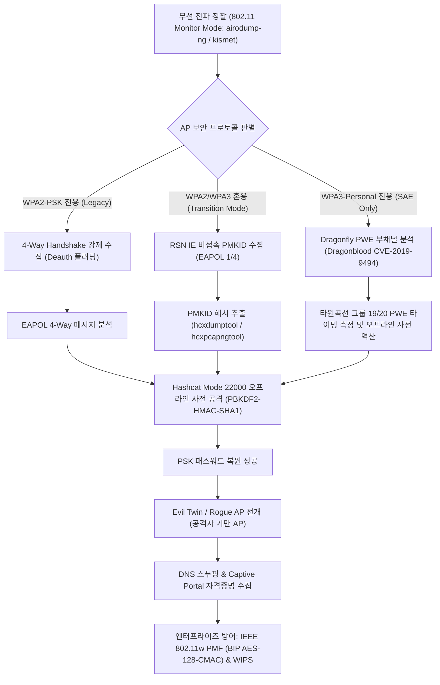
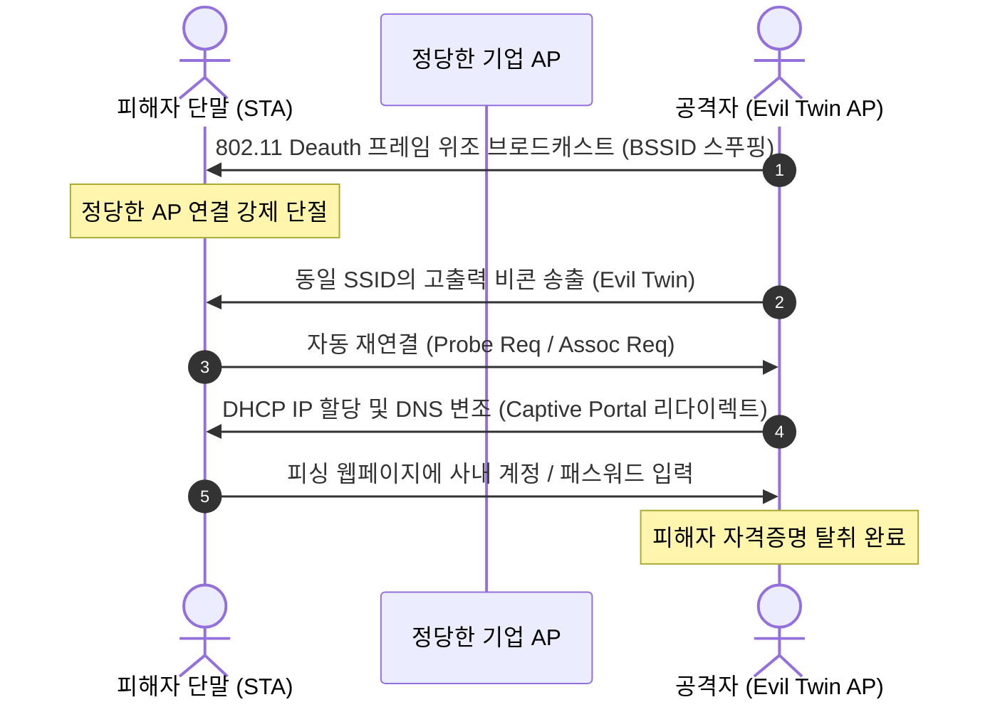

# 07. 심층 분석: WPA3 SAE 드래곤플라이 프로토콜, PMKID 오프라인 크래킹 및 802.11w PMF 방어 딥다이브

> **핵심 요약**: 본 문서는 차세대 무선 네트워크 보안 표준인 IEEE 802.11ax/be 및 WPA3-Personal(SAE - Simultaneous Authentication of Equals), 그리고 과도기 무선 환경을 겨냥한 첨단 침투 기법을 심층 분석합니다. 4-Way Handshake를 대기하지 않고 EAPOL 1/4 RSN IE에서 즉각 암호 키를 수집하는 **PMKID 공격**, WPA3의 PWE 도출 타이밍 부채널인 **Dragonblood(CVE-2019-9494)** 및 **Transition Downgrade**, 그리고 Deauth 프레임 위조를 원천 봉쇄하는 **IEEE 802.11w Protected Management Frames (PMF / BIP)** 방어 아키텍처를 다룹니다.

---

## 1. 현대 무선 네트워크 침투 및 방어 라이프사이클

전통적인 WPA2-PSK 환경에서는 공격자가 정당한 클라이언트가 AP에 접속할 때 발생하는 4-Way Handshake(EAPOL 4단계 교환)를 스니핑하거나, 인위적으로 Deauthentication 프레임을 전송하여 재인증을 유발해야 했습니다. 반면 현대 무선 공격은 AP 자체의 캐싱 메커니즘(PMKID)과 WPA3 전환 모드(Transition Mode)의 다운그레이드 취약점을 공략합니다.



---

## 2. 802.11 프레임 아키텍처 및 무선 통신 원리

IEEE 802.11 MAC 계층 프레임은 크게 3대 범주(관리, 제어, 데이터)로 나뉩니다:

```
+-------------------------------------------------------------------------+
|                         IEEE 802.11 MAC Frame                           |
+-------------------+----------+----------+----------+----------+---------+
| Frame Control(2B) | Dur/ID(2)| Addr1(6B)| Addr2(6B)| Addr3(6B)| Seq(2B) |
+-------------------+----------+----------+----------+----------+---------+
| Addr4 (6B) [WDS]  |  QoS Control (2B)   |   HT Control (4B)             |
+-------------------+---------------------+-------------------------------+
| Frame Body (0 ~ 2304 Bytes: RSN IE, EAPOL, WPA Key Data)                |
+-------------------------------------------------------------------------+
| FCS (Frame Check Sequence: 4 Bytes CRC-32)                             |
+-------------------------------------------------------------------------+
```

1. **관리 프레임 (Management Frame - Type 00)**:
   - `Beacon (Subtype 1000)`: AP가 자신의 SSID, 지원 암호 방식, 채널 정보를 브로드캐스트.
   - `Probe Request / Response (Subtype 0100 / 0101)`: 단말과 AP 간의 능동적 탐색.
   - `Authentication / Deauthentication (Subtype 1011 / 1100)`: 인증 개시 및 강제 연결 해제.
   - `Association Request / Response (Subtype 0000 / 0001)`: 결합 요청 및 RSN 파라미터 교환.
2. **제어 프레임 (Control Frame - Type 01)**:
   - RTS/CTS (Request/Clear to Send), ACK, BlockAck 등 전송 매체 충돌 방지 및 수신 확인.
3. **데이터 프레임 (Data Frame - Type 10)**:
   - EAPOL(802.1X / WPA Handshake), IP 패킷 등 실 데이터 페이로드 암호화 전송.

---

## 3. PMKID 공격 수학적 원리 (RSN IE EAPOL 우회)

### 3.1 PMKID 도출 공식

PMKID는 802.11i / 802.11r 로밍 가속 기술의 일환으로 도입된 값으로, 클라이언트가 이전에 인증받은 AP에 재결합할 때 4-Way Handshake를 생략하고 즉시 연결할 수 있도록 식별자로 사용됩니다.

$$\text{PMK} = \text{PBKDF2-HMAC-SHA1}(\text{Passphrase}, \text{SSID}, 4096, 256\text{ bits})$$

$$\text{PMKID} = \text{HMAC-SHA1-128}(\text{PMK}, \text{"PMK Name"} \parallel \text{MAC}_{\text{AP}} \parallel \text{MAC}_{\text{STA}})$$

### 3.2 왜 4-Way Handshake 없이 공격 가능한가?
공격자가 임의의 MAC 주소로 타깃 AP에 `Association Request` 프레임을 전송하면, AP는 공격자 단말이 과거에 접속했던 클라이언트인지 확인하기 위해 **첫 번째 EAPOL 메시지(Message 1 of 4)**를 반환합니다. 이 프레임의 RSN IE(Information Element, Tag ID 48) 내부에는 AP가 직접 계산한 `PMKID`가 포함되어 있습니다.

따라서 공격자는 네트워크에 접속 중인 피해자 단말이 전혀 없더라도, **AP 단독만으로 유효한 암호화 해시를 단 1초 만에 수집**할 수 있습니다.

### 3.3 실전 수집 및 Hashcat 22000 크래킹

```bash
# 1. 무선 인터페이스 모니터 모드 활성화
sudo ip link set wlan0 down
sudo iw dev wlan0 set type monitor
sudo ip link set wlan0 up

# 2. hcxdumptool을 통한 RSN IE PMKID 캡처
sudo hcxdumptool -i wlan0 -o pmkid_capture.pcapng --enable_status=1

# 3. pcapng를 Hashcat Mode 22000 형식으로 변환
hcxpcapngtool -o hash.hc22000 pmkid_capture.pcapng

# 4. Hashcat 22000 모드로 GPU 오프라인 사전 공격
hashcat -m 22000 -a 0 hash.hc22000 /usr/share/wordlists/rockyou.txt -w 3
```

---

## 4. WPA3 SAE (Dragonfly) 및 Dragonblood 취약점 분석

### 4.1 SAE (Simultaneous Authentication of Equals) 프로토콜
WPA3-Personal은 공유 사전 키를 직접 전송하지 않고, Diffie-Hellman 키 교환에 패스워드를 바인딩하는 **Dragonfly 핸드셰이크**를 사용합니다:
1. **Commit 단계**: 사전 패스워드로부터 타원곡선 위의 점 PWE(Password Element)를 도출하고 스칼라 값과 원소 값을 교환.
2. **Confirm 단계**: 상호 계산된 공유 비밀키(PMK)의 해시값을 대조하여 상대방이 패스워드를 알고 있는지 상호 검증.
3. 순방향 비밀성(PFS: Perfect Forward Secrecy)이 보장되어 패스워드가 나중에 노출되더라도 과거 패킷 복호화 불가능.

### 4.2 Dragonblood 취약점 (CVE-2019-9494) 메커니즘
PWE를 도출하는 `Hunting-and-Pecking` 루프 알고리즘에서 패스워드와 카운터 값에 따라 루프 반복 횟수 및 타원곡선 덧셈 연산 시간이 미세하게 달라집니다.
- **타이밍 부채널(Timing Leak)**: 공격자는 인증 요청 패킷에 대한 응답 지연 시간을 통계적으로 측정하여 PWE 계산에 소요된 루프 횟수를 역추적.
- **캐시 부채널(Cache-based Side Channel)**: 모듈러 거듭제곱 연산 시 메모리 캐시 접근 패턴을 관측하여 패스워드 후보군을 지수적으로 축소.

### 4.3 WPA3 Transition Downgrade 공격
대부분의 공공/기업망은 구형 단말 지원을 위해 `WPA2/WPA3-Transition Mode`를 설정합니다. 공격자는 정당한 WPA3 비콘의 RSN 정보 중 SAE 인증 키 관리(AKM Suite 8)를 변조하거나 허위 WPA2 전용 비콘을 스푸핑하여 단말이 취약한 WPA2 4-Way Handshake로 협상하도록 유도합니다.

---

## 5. Evil Twin (Rogue AP) 및 Deauthentication 공격



---

## 6. 엔터프라이즈 무선 보안 하드닝: IEEE 802.11w PMF 방어

### 6.1 IEEE 802.11w PMF (Protected Management Frames)
기존 802.11 표준에서는 데이터 프레임만 암호화되고 Deauthentication, Disassociation, Action 프레임 등의 관리 프레임은 평문으로 전송되어 누구나 발신지 MAC을 변조하여 서비스 거부(DoS)를 유발할 수 있었습니다.

IEEE 802.11w 표준은 관리 프레임에 암호화 및 무결성 태그를 부여합니다:
- **유니캐스트 관리 프레임**: CCMP / GCMP 대칭키 암호화 적용.
- **브로드캐스트 관리 프레임**: **BIP (Broadcast Integrity Protocol)** 적용. AES-128-CMAC 알고리즘 기반 IGTK(Integrity Group Temporal Key)를 통해 위조 여부를 즉각 감지하고 폐기.

### 6.2 Hostapd 방어 설정 예시

```ini
# /etc/hostapd/hostapd.conf - WPA3 Enterprise/Personal 802.11w 강화 설정

interface=wlan0
ssid=Enterprise_Corp_Secure
hw_mode=g
channel=6

# WPA3-Personal (SAE) 필수 설정
wpa=2
wpa_key_mgmt=SAE
rsn_pairwise=CCMP

# IEEE 802.11w Protected Management Frames (PMF)
# 1 = Optional (WPA2 호환 가능, Deauth 위조 취약점 잔존)
# 2 = Required (WPA3 필수 요구사항, 위조된 Deauth 완벽 차단)
ieee80211w=2
sae_pwe=2
group_mgmt_cipher=BIP-GMAC-128
```

---

## 7. 실습 랩 및 워게임 연계 가이드

- **실습 랩**: [Lab 27: WiFiShield (포트 8027)](../labs/27_wifi_wpa3_security_lab/README.md)
  - `POST /api/wifi/pmkid/crack`: RSN IE PMKID 오프라인 해시 크래킹 시뮬레이션
  - `POST /api/wifi/sae/attack`: WPA3 SAE PWE 부채널 및 다운그레이드 공격
  - `POST /api/wifi/defense/mfp`: 802.11w PMF required 강제 및 Rogue AP 격리
- **워게임 트랙**: `wifisec` (무선 네트워크 & Wi-Fi 보안 35제)
- **종합 점검 명령**:
  ```bash
  python3 vhack.py lab test 27
  python3 vhack.py solve 27 --step 1
  ```
