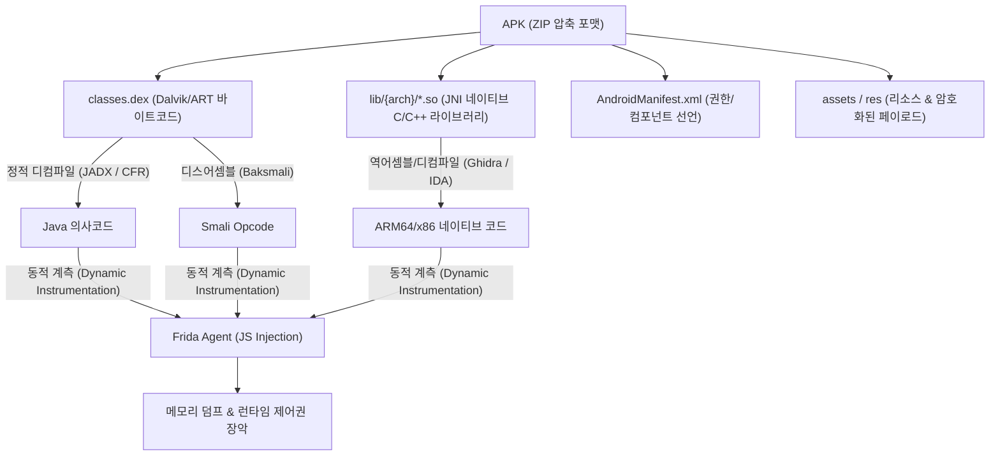

# 제28장 모바일 해킹 심층: 안드로이드 악성코드 분석 & Frida 동적 후킹 (Deep-dive)

> **난이도**: ★★★★☆ | **실습 연계**: [Lab 19 (DroidShield)](file:///mnt/d/바이브해킹%20자료/vibe-hacking/labs/19_android_frida_lab/README.md) | **워게임 트랙**: `droidpwn` / `mobile`

---

## 1. 안드로이드 애플리케이션 아키텍처 & 악성코드 분석 개요

현대 안드로이드 악성코드(Banker, Spyware, Ransomware)는 단순한 Java 코드 레벨의 악의적 행위를 넘어, **탐지 회피(Anti-Analysis)**, **난독화(Obfuscation)**, **루팅 탐지(Root Detection)**, **SSL 피닝(SSL Pinning)**, **JNI 네이티브 라이브러리(`*.so`) 은닉** 기술을 결합하여 분석을 방해합니다.



---

## 2. 안드로이드 정적 분석과 난독화 해제

### 2.1 DEX 및 Smali 연산자 구조
Java 소스코드는 `javac`를 통해 자바 바이트코드(`.class`)로 컴파일된 후, `d8`/`r8` 툴체인을 거쳐 Dalvik 바이트코드인 `classes.dex`로 변환됩니다.

| Smali 연산자 | 동작 설명 | 분석 시 착안점 |
| :--- | :--- | :--- |
| `const-string v0, "..."` | 레지스터 `v0`에 문자열 참조 로드 | 악성 C2 도메인, 난독화 키 참조점 |
| `invoke-virtual {v0, v1}, L...;->method()` | 일반 인스턴스 메서드 호출 | 중요 로직 분기 및 반환값 추적 |
| `invoke-static {v0}, L...;->checkRoot()` | 정적 유틸리티 메서드 호출 | 보안 검증 및 무결성 체크 함수 |
| `if-nez v0, :cond_0` | `v0 != 0`일 때 `:cond_0` 레이블로 점프 | 루팅/무결성 판정 분기 반전 대상 |

### 2.2 문자열 암호화 및 복원 기법
악성코드는 분석가의 정적 스트링 추출(`strings`, `grep`)을 무력화하기 위해 XOR, AES, 커스텀 시프트 연산으로 문자열을 숨겨둡니다.

```python
# 일반적인 XOR 복호화 루틴 (Python 분석 스크립트)
def deobfuscate_xor(enc_bytes: bytes, key: int = 0x5A) -> str:
    return "".join(chr(b ^ key) for b in enc_bytes)

# 예: [0x32, 0x33, 0x38, ...] -> "https://malicious-c2.internal/api"
```

---

## 3. Frida 런타임 계측(Dynamic Instrumentation) 심층

Frida는 디버거 없이도 타깃 프로세스 메모리에 Google V8 자바스크립트 엔진을 주입하여, 실행 중인 함수의 인자(Arguments), 반환값(Return Value), 내부 변수를 실시간으로 조작할 수 있는 DBI(Dynamic Binary Instrumentation) 프레임워크입니다.

### 3.1 루팅 탐지(Root Detection) 메커니즘 & 우회

안드로이드 앱의 루팅 탐지 방식은 다음과 같이 5가지 계층으로 구성됩니다:
1. **바이너리 존재 검사**: `/system/bin/su`, `/system/xbin/su`, `/sbin/su`, `/data/local/tmp/su`
2. **빌드 태그 검사**: `android.os.Build.TAGS.contains("test-keys")`
3. **루팅 패키지/관리자 앱 검사**: `com.topjohnwu.magisk`, `eu.chainfire.supersu`
4. **디렉터리 권한 검사**: `/system` 파티션 읽기/쓰기(`rw`) 마운트 여부
5. **명령어 실행 반환 검사**: `Runtime.getRuntime().exec("su")`

#### [실무 Frida 루팅 우회 스크립트]
```javascript
Java.perform(function () {
    console.log("[*] [Frida] Android Root Detection Bypass Hooks Loaded...");

    // 1. File.exists() 후킹: su 바이너리 및 매지스크 패키지 탐지 무력화
    var File = Java.use("java.io.File");
    File.exists.implementation = function () {
        var path = this.getAbsolutePath();
        if (path.indexOf("su") !== -1 || path.indexOf("magisk") !== -1 || path.indexOf("busybox") !== -1) {
            console.log("[-] [Bypass] Blocked root file check: " + path);
            return false;
        }
        return this.exists.call(this);
    };

    // 2. Build.TAGS 후킹: "test-keys" -> "release-keys"
    var Build = Java.use("android.os.Build");
    Build.TAGS.value = "release-keys";

    // 3. 커스텀 보안 검증 클래스 직접 후킹
    try {
        var SecurityManager = Java.use("com.vibe.droidshield.SecurityChecker");
        SecurityManager.isDeviceRooted.implementation = function () {
            console.log("[+] [Bypass] Hooked SecurityChecker.isDeviceRooted() -> return false");
            return false;
        };
    } catch (err) {
        console.log("[-] SecurityChecker class not found, skipping specific hook.");
    }
});
```

---

### 3.2 SSL Pinning(인증서 고정) 메커니즘 & 우회

SSL Pinning은 중간자 공격(MITM)을 방지하기 위해 클라이언트가 특정 CA 또는 공개키 해시만을 신뢰하도록 고정하는 기술입니다. 프록시 도구(Burp Suite, mitmproxy, Charles)의 CA 인증서를 강제로 무시하도록 후킹해야 패킷 가로채기가 가능합니다.

```javascript
Java.perform(function () {
    console.log("[*] [Frida] Universal SSL Pinning Bypass Activated...");

    // 1. TrustManagerImpl (Android N+)
    try {
        var TrustManagerImpl = Java.use("com.android.org.conscrypt.TrustManagerImpl");
        TrustManagerImpl.verifyChain.implementation = function (untrustedChain, trustAnchorChain, host, clientAuth, ocspData, tlsSctData) {
            console.log("[+] [Bypass] TrustManagerImpl.verifyChain() bypassed for host: " + host);
            return untrustedChain;
        };
    } catch (e) {}

    // 2. OkHttp3 CertificatePinner
    try {
        var CertificatePinner = Java.use("okhttp3.CertificatePinner");
        CertificatePinner.check.overload('java.lang.String', 'java.util.List').implementation = function (hostname, peerCertificates) {
            console.log("[+] [Bypass] OkHttp3 CertificatePinner.check(String, List) bypassed for: " + hostname);
            return; // 검증 통과(No Exception)
        };
    } catch (e) {}
});
```

---

### 3.3 JNI 네이티브 라이브러리(`*.so`) 및 네이티브 후킹

최신 악성코드는 핵심 알고리즘(라이선스 검증, 복호화 키 파생)을 `libnative.so` 같은 C/C++ 공유 라이브러리로 옮깁니다. 이때 `Interceptor.attach`를 사용하여 기계어 함수 수준에서 후킹을 수행합니다.

```javascript
// Native Exported Function 후킹
var moduleName = "libnative-crypto.so";
var exportName = "Java_com_vibe_droidshield_NativeCrypto_validateLicense";

var targetAddr = Module.findExportByName(moduleName, exportName);
if (targetAddr) {
    Interceptor.attach(targetAddr, {
        onEnter: function (args) {
            console.log("[*] Native validateLicense called!");
            // args[0] = JNIEnv*, args[1] = jobject, args[2] = jstring (Input Key)
        },
        onLeave: function (retval) {
            console.log("[*] Native validateLicense original return: " + retval);
            retval.replace(ptr(1)); // 강제로 참(1) 반환
            console.log("[+] Native validateLicense return replaced with 1 (TRUE)");
        }
    });
}
```

---

## 4. 실습 랩 연계: Lab 19 (DroidShield)

[Lab 19 (DroidShield)](file:///mnt/d/바이브해킹%20자료/vibe-hacking/labs/19_android_frida_lab/README.md)는 본 챕터에서 학습한 안드로이드 악성코드 분석 기술을 실전 API 환경에서 공략하는 환경을 제공합니다.

1. **Mission 1 (루팅 탐지 우회)**: 클라이언트의 무결성 검증을 우회하여 디바이스 인증 토큰 탈취
2. **Mission 2 (SSL Pinning 무력화)**: 커스텀 HTTP 헤더에 담긴 암호화된 전송 토큰 스니핑
3. **Mission 3 (JNI 네이티브 검증 우회)**: `libnative.so` C2 라이선스 체크 함수의 반환값을 변조하여 관리자 제어권 획득
4. **Mission 4 (C2 암호화 매개변수 복원)**: 난독화된 바이트 스트림을 역산하여 원격 명령 제어 플래그 회수
