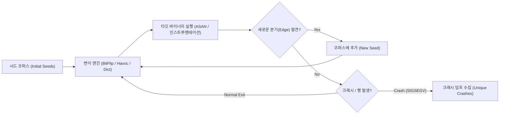

# 30-07. 실전 커버리지 유도 퍼징 & 크래시 트리아지 심층 분석 (AFL++, ASAN, Crash Triage Deep-Dive)

> **핵심 키워드**: `Coverage-guided Fuzzing`, `AFL++`, `AddressSanitizer (ASAN)`, `Shadow Memory`, `Use-After-Free (CWE-416)`, `Crash Triage`, `AFL-tmin`, `Crash Minimization`

---

## 1. 커버리지 유도 퍼징 (Coverage-guided Fuzzing) 아키텍처

현대 취약점 발굴에서 가장 강력한 기법은 프로그램의 분기 실행 경로(Edge Coverage)를 피드백 루프로 삼아 변이(Mutation)를 진화시키는 **커버리지 유도 퍼징(Coverage-guided Fuzzing)**입니다.



### 주요 퍼징 프레임워크 비교

| 프레임워크 | 핵심 메커니즘 | 컴파일 요구 | 주요 활용 분야 |
| :--- | :--- | :--- | :--- |
| **AFL++** | 분기 비트맵(64KB shared memory), CmpLog, MOpt, Deflag | 소스코드 권장 (QEMU/FRIDA 모드 지원) | 파일 포맷, 네트워크 파서, 커널 모듈 |
| **LibFuzzer** | 인프로세스(In-process) 라이브러리 퍼징, 단일 함수 단위 | LLVM Clang 필수 (`-fsanitize=fuzzer`) | 오픈소스 라이브러리, 암호화 모듈 (OSS-Fuzz) |
| **Honggfuzz** | 하드웨어 BTS/PT(Intel Processor Trace) 피드백 | 바이너리 직접 실행 가능 | 고성능 멀티스레드 퍼징, 브라우저 엔진 |

---

## 2. LLVM 인스트루멘테이션 & AFL++ 공유 메모리 비트맵 원리

AFL++는 컴파일 시 기본 블록(Basic Block)마다 고유 난수 ID를 부여하고, 분기 전환(`cur_location ^ (prev_location >> 1)`)을 64KB 공유 메모리 배열(`__afl_area_ptr`)에 기록합니다.

```c
// AFL 컴파일러가 각 Basic Block 진입부에 삽입하는 어셈블리 의사코드
cur_location = <COMPILE_TIME_RANDOM_ID>;
shared_mem[cur_location ^ prev_location]++;
prev_location = cur_location >> 1;
```

1. **상대적 분기 추적**: `A -> B` 전이와 `B -> A` 전이를 서로 다른 인덱스로 계산하여 방향성을 보존합니다.
2. **히트 카운트 버킷**: 실행 횟수를 `1, 2, 3, 4~7, 8~15, 16~31, 32~127, 128~255`의 8개 버킷으로 나누어 미세한 반복 증가도 새로운 경로로 감지합니다.

---

## 3. AddressSanitizer (ASAN) 섀도우 메모리 원리

AddressSanitizer는 정상 실행 시 탐지되지 않는 미세한 메모리 손상(Out-of-bounds, Use-After-Free)을 런타임에 즉시 트랩(`SIGSEGV`)합니다.

### 섀도우 메모리 매핑 구조
- 가상 메모리의 매 **8바이트** 애플리케이션 메모리를 **1바이트**의 섀도우 메모리에 1:8 비율로 매핑합니다.
- 변환 공식: `Shadow = (App_Addr >> 3) + Offset` (x86_64 리눅스 기준 Offset = `0x7fff8000`)

```
애플리케이션 메모리 8바이트        섀도우 바이트 (1바이트)
[ byte 0 ~ 7 ] 모두 접근 가능  --> 0x00
[ byte 0 ~ k ] k바이트만 유효   --> 0x0k (1 <= k <= 7)
Heap Redzone (경계 영역)        --> 0xFA
Freed Heap Region (해제 영역)    --> 0xFD
Stack Redzone                   --> 0xF1
Global Redzone                  --> 0xF9
```

### ASAN Use-After-Free 덤프 정밀 분석

```text
=================================================================
==4192==ERROR: AddressSanitizer: heap-use-after-free on address 0x603000000040 at pc 0x0000004012b8
READ of size 4 at 0x603000000040 thread T0
    #0 0x4012b7 in process_packet_header /app/target/packet_parser.c:48:15
    #1 0x4014f3 in parse_network_stream /app/target/packet_parser.c:92:9

0x603000000040 is located 0 bytes inside of 32-byte region [0x603000000040,0x603000000060)
freed by thread T0 here:
    #0 0x7f18b32b840f in free (/usr/lib/x86_64-linux-gnu/libasan.so.6+0xb840f)
    #1 0x401211 in free_session_chunk /app/target/packet_parser.c:35:5

previously allocated by thread T0 here:
    #0 0x7f18b32b8808 in malloc (/usr/lib/x86_64-linux-gnu/libasan.so.6+0xb8808)
    #1 0x401184 in allocate_session_chunk /app/target/packet_parser.c:22:21
=================================================================
```

- **발생 원인**: `allocate_session_chunk`에서 할당된 32바이트 청크가 `free_session_chunk`에서 해제된 후, `process_packet_header`에서 여전히 해당 메모리 포인터를 역참조(Dangling Pointer Read)함.
- **섀도우 바이트**: 해당 주소 영역이 `0xfa`(Redzone)와 `0xfd`(Freed)로 둘러싸여 있어 역참조 즉시 ASAN 핸들러가 강제 종료시킴.

---

## 4. 크래시 트리아지 (Crash Triage) & 결정적 재현 PoC 제작

퍼징을 통해 수천 개의 크래시 파일이 생성되었을 때, 이를 중복 제거(Deduplication)하고 익스플로잇 가능성을 평가하는 절차입니다.

### 1단계: 크래시 최소화 (Minimization)
`afl-tmin`을 사용하여 크래시를 유발하는 데 불필요한 바이트를 제거하여 최소 PoC를 추출합니다:
```bash
# 크래시 유발 입력값 최소화
afl-tmin -i out/crashes/id:000000,... -o min_poc.bin -- ./target_bin @@
```

### 2단계: 취약점 분류 (CWE 매핑)
- **CWE-122**: Heap-based Buffer Overflow (힙 경계 초과 쓰기)
- **CWE-416**: Use After Free (해제된 포인터 재참조)
- **CWE-476**: NULL Pointer Dereference (널 역참조)
- **CWE-190**: Integer Overflow or Wraparound (정수 오버플로우)

### 3단계: 근본 원인 해결 (Patch)
```c
// 취약한 코드 (Dangling Pointer 남김)
void free_session_chunk(SessionChunk *chunk) {
    if (chunk) {
        free(chunk->data);
        free(chunk);
    }
}

// 안전한 패치 코드 (명시적 포인터 NULL 초기화)
void free_session_chunk_safe(SessionChunk **chunk_ptr) {
    if (chunk_ptr && *chunk_ptr) {
        if ((*chunk_ptr)->data) {
            free((*chunk_ptr)->data);
            (*chunk_ptr)->data = NULL;
        }
        free(*chunk_ptr);
        *chunk_ptr = NULL; // 댕글링 포인터 원천 방지
    }
}
```

---

## 5. 실습 연계 및 실전 랩 안내

- **실습 랩**: [Lab 24: 퍼징 & 취약점 발굴 랩 (`labs/24_fuzzing_vulnerability_lab/`)](../labs/24_fuzzing_vulnerability_lab/README.md)
  - 실행: `python3 vhack.py lab start 24`
  - 대시보드: `http://localhost:8024`
- **워게임 트랙**: 워게임 터미널(`wargame/`) `fuzzing` 트랙 (35개 문제)
- **자동 솔버**: `python3 vhack.py solve 24`
