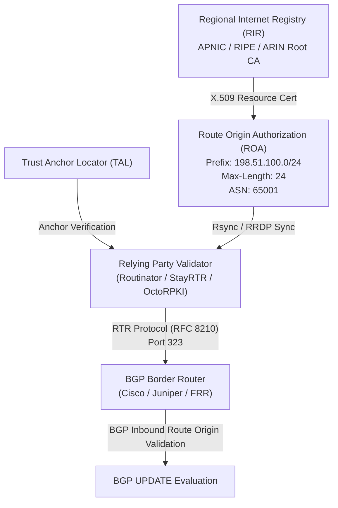

> 🌐 **Language / 언어**: [🇰🇷 한국어](#한국어) | [🇺🇸 English](#english)

---

<a name="한국어"></a>

# BGP 라우팅 하이재킹 & RPKI ROA 심층 해부: 인터넷 코어 경로 조작과 글로벌 방어 아키텍처

> 🏢 **연계 실습 랩**: [Lab 32: BGPRouteGuard - BGP Routing Hijacking & RPKI Lab](../../labs/32_bgp_routeguard_lab)  
> 🎯 **관련 워게임 트랙**: `bgp` (BGP 라우팅·RPKI & 코어 네트워크 보안 35제)

---

## 0. 개요 및 왜 BGP 라우팅 보안인가?

인터넷은 수만 개의 독립적인 네트워크, 즉 **자율 시스템(Autonomous System, AS)**들이 상호 연결된 거대한 분산 메시 네트워크입니다. 전 세계 100,000개 이상의 AS 간에 어떤 경로로 트래픽을 전달할지 결정하는 유일한 표준 프로토콜이 바로 **BGP-4 (Border Gateway Protocol Version 4, RFC 4271)**입니다.

그러나 BGP는 1989년(RFC 1105) 인터넷 초창기 "상호 신뢰하는 학술망 및 소수 통신사" 환경에서 설계되었습니다. 프로토콜 자체에 암호학적 인증이나 경로 소유권 검증 메커니즘이 존재하지 않아, 피어가 전달하는 **BGP Update(경로 공표 메시지)**를 기본적으로 신뢰하는 치명적인 취약점을 안고 있습니다.

공격자나 설정 오류를 범한 ISP가 악의적으로 타사의 IP 대역을 선언하면, 전 세계 라우터들이 트래픽을 엉뚱한 공격자 네트워크로 전송하게 되며, 이는 **대규모 통신 두절(Blackholing)**, **DNS 하이재킹**, **금융 자산 탈취(암호화폐 거래소 하이재킹)** 및 **은밀한 국가급 도청(Man-in-the-Middle)**으로 직결됩니다.

```
+-----------------------------------------------------------------------------------+
|                        BGP 경로 공표 및 하이재킹 공격 모델                        |
+-----------------------------------------------------------------------------------+

     [ 정상 서비스 오리진 ]                  [ 글로벌 백본 Tier-1 ]               [ 공격자 / 악성 AS ]
         (AS 65001)                              (AS 64512)                           (AS 64599)
      198.51.100.0/24                         전 세계 FIB 전파                     198.51.100.0/24 선언
             │                                       │                                     │
             │ 1. 정상 경로 공표                      │                                     │
             │    Prefix: 198.51.100.0/24            │                                     │
             │    AS-Path: [65001]                   │                                     │
             ├──────────────────────────────────────>│                                     │
             │                                       │                                     │
             │                                       │ 2. [★ Attack 1: Exact Prefix Hijack]│
             │                                       │    Prefix: 198.51.100.0/24          │
             │                                       │    AS-Path: [64599] (더 짧거나 우위) │
             │                                       │<────────────────────────────────────┤
             │                                       │                                     │
             │                                       │ 3. [★ Attack 2: Sub-prefix LPM]     │
             │                                       │    Prefix: 198.51.100.0/25 (/25 세분)│
             │                                       │    LPM(최장 일치)으로 /24 완전 무력화│
             │                                       │<────────────────────────────────────┤
             │                                       │                                     │
             │                                       │ 4. [★ Attack 3: AS-Path Leak]       │
             │                                       │    AS-Path: [64599, 65001] 위조     │
             │                                       │    MITM 트래픽 감청 경로 형성       │
             │                                       │<────────────────────────────────────┤
             │                                       │                                     │
             │ 5. 트래픽 탈취                        ▼                                     │
             │ <=========================== [전 세계 클라이언트 트래픽] ==================>│
             │ (정상 서버 패킷 수신 불가)                                          (공격자 감청/블랙홀)
```

---

## 1. BGP-4 아키텍처와 최적 경로 선택(Best Path Selection)

BGP는 거리 벡터(Distance Vector)를 고도화한 **경로 벡터(Path Vector)** 라우팅 프로토콜입니다.

### 1.1 eBGP vs iBGP
- **eBGP (External BGP)**: 서로 다른 AS 간 피어링. 기본적으로 패킷 전송 시 수신 라우터는 AS-Path의 가장 왼쪽에 자신의 ASN을 추가(Prepend)합니다. TTL은 관례적으로 1로 설정됩니다.
- **iBGP (Internal BGP)**: 동일한 AS 내부 라우터 간 피어링. AS 내부 루프 방지를 위해 iBGP로 수신한 경로는 다른 iBGP 피어에게 재선언하지 않는 Split-Horizon 규칙을 따르며, 풀 메시(Full Mesh)나 Route Reflector(RR)가 요구됩니다.

### 1.2 BGP 최적 경로 결정 알고리즘 (Best Path Algorithm)
라우터가 동일한 프리픽스에 대해 여러 경로를 수신했을 때 다음 우선순위로 단 하나의 경로를 FIB(Forwarding Information Base)에 등록합니다:
1. **Weight** (Cisco 전용, 라우터 로컬, 높을수록 우선)
2. **Local Preference** (AS 내부 전파, 높을수록 우선, 기본 100)
3. **Locally Originated** (로컬 생성 경로 우선)
4. **AS-Path 길이** (짧을수록 우선)
5. **Origin Code** (IGP > EGP > Incomplete)
6. **MED (Multi-Exit Discriminator)** (외부 피어로 전송, 낮을수록 우선)
7. **eBGP > iBGP** (외부 경로 우선)
8. **최저 IGP Metric** (Next-hop 도달 비용)
9. **가장 오래된 eBGP 경로** (경로 안정성)
10. **최저 BGP Router ID**

---

## 2. 3대 BGP 라우팅 공격 기법 심층 분석

### 2.1 공격 1: Exact Prefix Hijacking (완전 일치 프리픽스 탈취)
- **원리**: 정상 기업이 `198.51.100.0/24`를 공표하고 있을 때, 공격자 AS가 동일한 `198.51.100.0/24`를 오리진(Origin)으로 선언합니다.
- **파급력**: BGP Best Path 알고리즘에 의해 공격자 AS와 물리적/네트워크적으로 가까운 전 세계 라우터들은 공격자의 AS-Path가 더 짧다고 판단하여 트래픽을 공격자에게 전달합니다 (인터넷의 부분적 분할 및 탈취).

### 2.2 공격 2: Sub-prefix Hijacking (최장 일치 규칙 우회)
- **원리**: IP 포워딩 하드웨어(TCAM/FIB)는 항상 **최장 일치 프리픽스(Longest Prefix Match, LPM)**를 절대적으로 우선시합니다.
- 정상 대역이 `/24`일 때, 공격자가 `/25`(`198.51.100.0/25` 및 `198.51.100.128/25`)를 선언하면:
  - 아무리 정상 AS-Path가 짧고 신뢰도가 높아도, `/25`가 더 구체적인 네트워크이므로 **전 세계 100%의 트래픽이 공격자에게 흡수**됩니다.
  - 대표 사례: 2008년 파키스탄 텔레콤 유튜브 차단 시도 중 `/24`를 `/25`로 전 세계에 유출하여 전 세계 유튜브 접속이 마비된 사건.

### 2.3 공격 3: AS-Path Forgery & BGP Route Leak (경로 위조 및 경로 유출)
- **AS-Path Forgery**: 오리진 필터를 속이기 위해 공격자 AS가 AS-Path에 희생자 ASN을 강제로 결합(`[공격자ASN, 희생자ASN]`)하여 공표.
- **BGP Route Leak (RFC 7908)**: 멀티홈드 고객(Customer) 또는 피어(Peer)가 트랜짓(Transit) 사업자로부터 수신한 경로를 다른 트랜짓 사업자에게 전파하여, 원치 않는 중간자 트래픽이 저대역폭 피어 링크로 몰려 대규모 정전 및 감청이 발생하는 현상.

---

## 3. RPKI (Resource Public Key Infrastructure) & ROA 방어 아키텍처

BGP의 원초적 신뢰 결함을 종식시키기 위해 IETF가 표준화한 기술이 **RPKI (RFC 6480)**입니다.



### 3.1 ROA (Route Origin Authorization) 구조
ROA는 "특정 IP 프리픽스는 오직 지정된 ASN만이 공표할 권한을 갖는다"는 사실을 증명하는 디지털 서명된 암호화 객체(X.509 기반)입니다:
- **Authorized Prefix**: 허가된 IP 대역 (예: `198.51.100.0/24`)
- **Max-Length**: 세분화가 허용되는 최대 프리픽스 길이 (예: `24`로 설정 시 `/25` 서브프리픽스 공격 원천 차단)
- **Origin ASN**: 허가된 발신 자율 시스템 번호 (예: `AS 65001`)

### 3.2 BGP Route Origin Validation (ROV, RFC 6811) 3단계 상태
라우터는 수신한 BGP Update를 로컬 RPKI 캐시와 비교하여 3가지 상태 중 하나를 부여합니다:
1. **Valid (유효)**: 수신 경로를 포괄하는 ROA가 존재하며, Prefix 길이 <= MaxLength이고 Origin ASN이 일치함.
2. **Invalid (비유효 - 즉시 폐기 대상)**: Covering ROA가 존재하나, Origin ASN이 불일치하거나 Prefix 길이가 MaxLength를 초과함.
3. **NotFound / Unknown (미등록)**: 해당 프리픽스를 커버하는 ROA가 공용 RPKI 저장소에 등록되어 있지 않음.

---

## 4. BGP 피어 보안 & 차세대 라우팅 방어 체계

1. **RFC 5925 TCP-AO (TCP Authentication Option)**:
   - 취약한 레거시 MD5 서명(RFC 2385)을 대체하여 SHA-1/AES-128-CMAC 기반의 리플레이 방지 및 무결성을 제공하는 BGP 세션 보호 규격.
2. **RFC 5082 GTSM (Generalized TTL Security Mechanism)**:
   - 직접 연결된 eBGP 피어 간 TTL을 255로 전송하고 수신 시 254 이상인지 검사하여 원격 스푸핑 패킷을 드롭.
3. **RFC 9234 BGP Role & Only-to-Customer (OTC) 속성**:
   - 피어 간 BGP 역할을 자동 협상하고, Non-Client 링크에서 유출된 경로에 OTC 속성을 마킹하여 2홉 이상 떨어진 라우터가 유출 경로를 자동 차단.
4. **ASPA (Autonomous System Provider Authorization)**:
   - 단순 오리진 검증(RPKI ROV)을 넘어, AS-Path 전체의 홉(Hop-by-Hop) 관계가 정당한 Provider-Customer 체인인지 암호학적으로 검증하여 경로 유출 및 스푸핑을 완벽 차단.
5. **MANRS (Mutually Agreed Norms for Routing Security)**:
   - 글로벌 네트워크 운영자 연합이 채택한 4대 필수 보안 규범: (1) 필터링, (2) 안티스푸핑(BCP 38), (3) 조정/연락처 등록, (4) 글로벌 검증(ROA/IRR).

---

## 5. 실전 엔터프라이즈 BGP 하드닝 가이드 (FRRouting / Cisco)

```cisco
! Cisco IOS-XE RPKI & MANRS 하드닝 설정 예시
router bgp 65001
 bgp router-id 198.51.100.1
 bgp log-neighbor-changes
 ! 1. RPKI 캐시 서버 연결 (RTR 프로토콜)
 rpki server tcp 127.0.0.1 port 3323 refresh 300
 
 ! 2. eBGP 피어 설정 및 TCP-AO 적용
 neighbor 192.0.2.99 remote-as 64599
 neighbor 192.0.2.99 description Rogue_Peer_Sim
 neighbor 192.0.2.99 maximum-prefix 50 80 restart 10
 neighbor 192.0.2.99 ttl-security hops 1
 
 address-family ipv4 unicast
  ! 3. RPKI Invalid 경로 즉시 폐기 및 로컬 프리퍼런스 강등
  neighbor 192.0.2.99 route-map RPKI_INBOUND_FILTER in
 exit-address-family

! Route-map 정책 정의
route-map RPKI_INBOUND_FILTER permit 10
 match rpki valid
 set local-preference 100
route-map RPKI_INBOUND_FILTER permit 20
 match rpki not-found
 set local-preference 70
route-map RPKI_INBOUND_FILTER deny 30
 match rpki invalid
! RPKI Invalid 경로는 FIB에 아예 진입하지 못하도록 DROP!
```

---

<a name="english"></a>

# BGP Route Hijacking & RPKI ROA Deep-Dive: Core Internet Routing Exploitation & Global Defense

> 🏢 **Hands-on Lab**: [Lab 32: BGPRouteGuard - BGP Routing Hijacking & RPKI Lab](../../labs/32_bgp_routeguard_lab)  
> 🎯 **Wargame Track**: `bgp` (BGP Routing, RPKI & Core Network Security - 35 Challenges)

---

## 0. Overview: Why BGP Security Matters

The global Internet is composed of over 100,000 independent networks called **Autonomous Systems (AS)**. The glue binding all these disparate entities into a coherent routing fabric is the **Border Gateway Protocol (BGP-4, RFC 4271)**.

Designed in 1989 without cryptographic authentication or origin authorization, BGP relies on implicit trust between peering parties. When an entity announces an IP prefix via a BGP UPDATE, recipient routers accept and propagate the route unless explicitly configured otherwise.

A rogue AS or misconfigured operator announcing prefixes they do not own triggers **BGP Route Hijacking**, resulting in denial of service, traffic blackholing, cryptocurrency theft, and state-sponsored eavesdropping.

---

## 1. BGP Architecture & Path Selection

BGP is an enhanced distance-vector protocol utilizing **Path Vectors**. When competing announcements for the same prefix arrive, routers run the deterministic **BGP Best Path Selection Algorithm**:
1. Highest **Weight** (local to router)
2. Highest **Local Preference** (internal to AS, default 100)
3. Locally generated routes
4. Shortest **AS-Path length**
5. Lowest **Origin type** (IGP < EGP < Incomplete)
6. Lowest **MED**
7. eBGP over iBGP
8. Lowest IGP metric to next-hop
9. Oldest eBGP route
10. Lowest BGP router ID

---

## 2. The Three Primary BGP Attack Vectors

### 2.1 Exact Prefix Hijacking
- An attacker announces the identical prefix (e.g. `198.51.100.0/24`) as the legitimate owner.
- Routers geographically closer to the attacker see a shorter AS-Path or prefer the peer link, redirecting a substantial portion of global ingress traffic to the attacker.

### 2.2 Sub-prefix Hijacking (Longest Prefix Match)
- IP routing hardware strictly follows the **Longest Prefix Match (LPM)** forwarding rule.
- If the victim announces `198.51.100.0/24`, and an attacker announces `198.51.100.0/25` and `198.51.100.128/25`:
  - Regardless of path length or local preference, the `/25` route wins universally across 100% of global routers.

### 2.3 AS-Path Forgery & BGP Route Leaks (RFC 7908)
- Attackers forge the AS-Path by appending the victim's ASN (e.g., `[AttackerASN, VictimASN]`) to bypass naive origin filters.
- Route leaks propagate transit routes between non-customer peers, dragging global traffic through unequipped intermediary networks for espionage or disruption.

---

## 3. RPKI (Resource Public Key Infrastructure) Architecture

RPKI (RFC 6480) binds IP prefix allocations to legitimate Autonomous System Numbers using cryptographic digital signatures anchored in the Regional Internet Registries (RIRs).

### 3.1 ROA (Route Origin Authorization) Specification
A ROA digitally certifies that an ASN is authorized to originate specific prefixes:
- **Prefix**: The base IP network block.
- **MaxLength**: The maximum allowable prefix length (stops LPM sub-prefix fragmentation).
- **Origin ASN**: The authorized originating autonomous system.

### 3.2 BGP Route Origin Validation (ROV, RFC 6811)
BGP routers evaluate received updates against cached ROA databases:
- **Valid**: Exact/subprefix match where length <= MaxLength and origin ASN matches.
- **Invalid**: Covering ROA exists, but origin ASN does not match OR prefix length exceeds MaxLength. (Must be discarded).
- **NotFound**: No covering ROA registered in global repository.

---

## 4. Comprehensive Defense Matrix

| Defense Layer | Protocol / Standard | Target Attack Vector | Enforcement Mechanism |
|:---|:---|:---|:---|
| **Origin Verification** | RPKI ROV (RFC 6811) | Exact & Sub-prefix Hijacks | Discard all `Invalid` routes at FIB ingestion |
| **Path Verification** | ASPA & BGPsec (RFC 8205) | AS-Path Spoofing & Leaks | Cryptographic hop-by-hop path authorization |
| **Peer Role Leak Defense**| RFC 9234 BGP Roles & OTC | Transit-to-Peer Route Leaks | Only-to-Customer attribute tagging & drops |
| **Session Integrity** | RFC 5925 TCP-AO & GTSM | TCP RST injection & spoofing | Cryptographic TCP option & TTL=255 verification |
| **Hygiene Standard** | MANRS Compliance | Global routing anomalies | Strict inbound prefix filtering & max-prefix caps |
