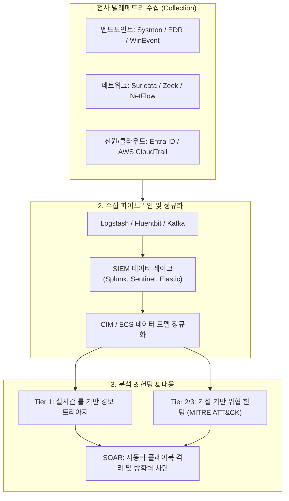
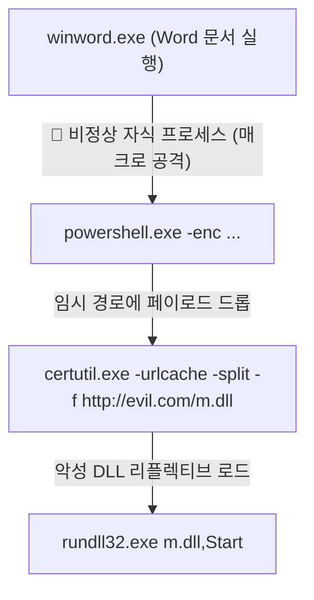
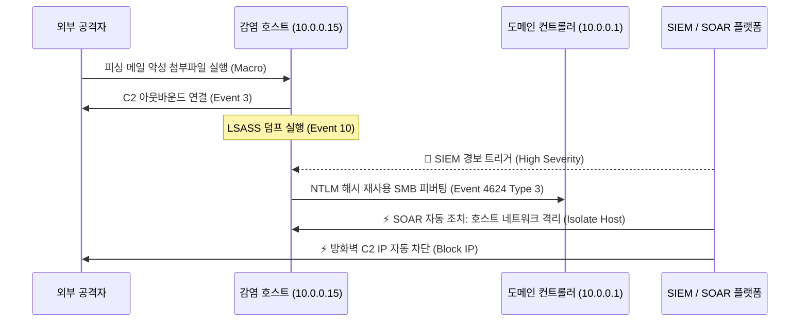

# 07. 차세대 SOC 관제 및 SIEM 실전 위협 헌팅 심층 가이드 (Modern SOC & SIEM Threat Hunting Deep-Dive)

> **대상**: 엔터프라이즈 SOC(보안관제센터) 분석가, DFIR 엔지니어, 블루팀 및 위협 헌팅 실무자  
> **핵심 원천**: SANS DFIR & Blue Team Toolkit, SANS SEC555/FOR508, Splunk Enterprise Security/Azure Sentinel 실무 쿼리집, MITRE ATT&CK Matrix  
> **선수 지식**: Windows 이벤트 로그 구조, Sysmon 텔레메트리, TCP/IP 네트워크 프로토콜, 정규식 및 SPL/KQL 쿼리 기초

---

## 1. 개요: 현대 SOC 구조 및 위협 헌팅 패러다임

엔터프라이즈 보안관제(SOC)는 단순 경보 알림(Alert-driven) 방식에서 가설 기반의 능동적 위협 헌팅(Hypothesis-driven Threat Hunting)으로 진화했습니다.



### 1.1 SOC 분석 티어별 핵심 R&R
* **Tier 1 (Triage Specialist)**: 경보 필터링, 거짓 양성(False Positive) 판별, IoC 기본 평판 조회(VirusTotal, Shodan, AbuseIPDB).
* **Tier 2 (Incident Responder)**: 심층 포렌식, 공격 벡터 규명, 횡적 이동(Lateral Movement) 추적, 격리 및 억제(Containment).
* **Tier 3 (Threat Hunter / Lead)**: 미탐(False Negative) 위협 색출, 알려지지 않은 제로데이 공격 탐지, 고도화된 탐지 시그니처/룰(Sigma, YARA-L) 개발.

---

## 2. 엔드포인트 텔레메트리 심층 분석 (Sysmon)

Windows 기본 이벤트 로그(Security.evtx)만으로는 고도화된 악성 행위를 가시화하기 어렵습니다. Microsoft Sysinternals **Sysmon(System Monitor)** 은 프로세스 계층, 원격 스레드 주입, 네트워크 연결을 세부적으로 기록합니다.

### 2.1 Sysmon 핵심 Event ID 매트릭스

| Event ID | 이벤트 명칭 | 주요 관제 포인트 및 이상 징후 |
| :---: | :--- | :--- |
| **1** | Process Creation | 부모-자식 프로세스 변조(Parent PID Spoofing), LOLBins 실행, 비정상 커맨드라인 파라미터 |
| **3** | Network Connection | 비정상 프로세스(cmd.exe, powershell.exe, certutil.exe)의 아웃바운드 인터넷 연결 |
| **7** | Image Loaded | 난독화된 DLL 인젝션, 기만 드라이버 로드(BYOVD), 서명되지 않은 악성 모듈 로드 |
| **8** | CreateRemoteThread | 프로세스 인젝션(DLL Injection, Process Hollowing, Reflective DLL) |
| **10** | ProcessAccess | LSASS 메모리 덤프 시도(Mimikatz: `0x1010` / `0x143a` 권한 요청) |
| **11** | FileCreate | 의심스러운 확장자(`.vbs`, `.hta`, `.ps1`) 생성, 시작프로그램 폴더 드롭 |
| **13** | RegistryEvent | Run/RunOnce 레지스트리 지속성(Persistence) 등록 |
| **22** | DNSEvent | 악성 C2 도메인 쿼리, DGA(Domain Generation Algorithm), DNS 터널링 |

### 2.2 부모-자식 프로세스 비정상 계층(Process Tree Anomaly)
정상적인 엔드포인트 환경에서는 웹서버(`w3wp.exe`)나 오피스 프로그램(`winword.exe`, `excel.exe`)이 쉘(`cmd.exe`, `powershell.exe`)을 실행하지 않습니다.



---

## 3. 네트워크 텔레메트리 & NIDS 시그니처 헌팅

네트워크 기반 침입 탐지 시스템(Suricata, Zeek)은 C2(명령제어) 트래픽, 비인가 데이터 유출, 내부 정찰 행위를 실시간 포착합니다.

### 3.1 Suricata 침해 탐지 시그니처 예제
다음은 PowerShell을 이용한 비정상 다운로드 및 Cobalt Strike 비콘 탐지 시그니처입니다:

```suricata
# 1. PowerShell 기본 WebClient User-Agent 감지
alert http any any -> any any (
    msg:"BLUE_HUNT - Suspicious PowerShell Default User-Agent Detected";
    flow:established,to_server;
    content:"User-Agent|3a 20|WindowsPowerShell"; nocase; http_header;
    classtype:trojan-activity;
    sid:1000001; rev:1;
)

# 2. DNS 대량 터널링 쿼리 탐지 (길이 60자 이상의 서브도메인)
alert dns any any -> any 53 (
    msg:"BLUE_HUNT - High Entropy Long Subdomain DNS Tunneling Suspect";
    flow:to_server;
    dns.query; pcre:"/^[a-zA-Z0-9]{60,}\.[a-zA-Z0-9\-\.]+/";
    threshold:type both, track by_src, count 10, seconds 60;
    classtype:bad-unknown;
    sid:1000002; rev:1;
)
```

### 3.2 TLS 지문(JA3 / JA3S) 분석
암호화된 HTTPS 트래픽에서도 SSL/TLS Client Hello 패킷의 파라미터(TLS 버전, Cipher Suites, Extensions, Elliptic Curves 등)를 해시화한 **JA3 지문**을 추출하여 C2 클라이언트를 정확히 식별할 수 있습니다:
* **Cobalt Strike 기본 JA3**: `72a589da586844d7f0818ce684948eea`
* **Metasploit Meterpreter JA3**: `a0e9f5d64349fb13191bc781f81f42e1`

---

## 4. 실전 SIEM 상관분석 룰 및 쿼리 (Splunk SPL & KQL)

### 4.1 Splunk SPL: LOLBins(Certutil)를 통한 외부 페이로드 다운로드 탐지
공격자가 방화벽을 우회하기 위해 윈도우 내장 유틸리티인 `certutil.exe`로 파일을 다운로드하는 행위를 탐지합니다:

```spl
index=sysmon EventCode=1 
    Image="*\\certutil.exe" 
    (CommandLine="*-urlcache*" OR CommandLine="*-split*")
| eval TargetURL=replace(CommandLine, ".*(https?://[^\s]+).*", "\1")
| stats count min(_time) as first_seen max(_time) as last_seen 
        values(Computer) as Hosts values(User) as Users values(ParentImage) as ParentProcesses
        by Image, TargetURL
| where count > 0
```

### 4.2 Splunk SPL: LSASS 메모리 덤프 (Pass-the-Hash 준비 행위) 탐지
`EventCode=10`에서 비인가 프로세스가 `lsass.exe`의 전체 가상 메모리를 읽으려 시도하는 행위를 잡습니다:

```spl
index=sysmon EventCode=10 TargetImage="*\\lsass.exe"
| where NOT match(SourceImage, "(?i)C:\\\\Program Files( \(x86\))?\\\\(Windows Defender|Microsoft|VMware)")
| eval GrantedAccessMask=GrantedAccess
| search GrantedAccessMask="0x1010" OR GrantedAccessMask="0x1410" OR GrantedAccessMask="0x1F0FFF"
| table _time Computer SourceImage TargetImage GrantedAccess CallTrace
```

### 4.3 Azure Sentinel (KQL): 횡적 이동 원격 WMI/PowerShell 실행 헌팅
```kql
SecurityEvent
| where TimeGenerated >= ago(24h)
| where EventID == 4688 // Process Creation
| where Process has_any ("wmic.exe", "powershell.exe", "cmd.exe")
| where CommandLine has_any ("process call create", "Invoke-Command", "Enter-PSSession")
| summarize StartTime=min(TimeGenerated), EndTime=max(TimeGenerated), ExecutionCount=count() 
    by Computer, Account, ParentProcessName, NewProcessName, CommandLine
| sort by ExecutionCount asc
```

---

## 5. 실전 위협 헌팅 시나리오 및 SOAR 대응 플레이북

### 5.1 APT 공격 체인 헌팅 시나리오
1. **피싱 및 매크로 실행**: Word 매크로 → `powershell.exe` 자식 프로세스 기동 (`Sysmon EventID 1`)
2. **C2 비콘 연결**: PowerShell이 외부 알 수 없는 IP/포트로 SSL 핸드셰이크 (`Sysmon EventID 3`, `Suricata HTTP/DNS`)
3. **권한 상승 및 자격증명 탈취**: `lsass.exe` 메모리 접근 (`Sysmon EventID 10`) 및 SAM 하이브 덤프
4. **내부 전파(Lateral Movement)**: WMI 및 SMB를 이용해 도메인 컨트롤러(DC)로 침투 (`EventID 4624 Logon Type 3`)



### 5.2 SOAR 자동화 플레이북 (Containment Workflow)
* **단계 1 (자동 평판 검증)**: 경보 발생 시 파싱된 IP/URL을 VirusTotal/AlienVault OTX API로 점수화.
* **단계 2 (호스트 격리)**: 악성 판정(점수 > 5) 시 EDR API(CrowdStrike, Defender for Endpoint)를 호출해 감염 단말의 네트워크를 완전 격리(Isolate).
* **단계 3 (경계 차단)**: 차세대 방화벽(Palo Alto, Fortinet)의 Dynamic Block List에 C2 IP 자동 등록.
* **단계 4 (분석 티켓 생성)**: Jira/ServiceNow에 트리아지 로그, 타임라인, 포렌식 아티팩트를 첨부한 이슈 생성 및 분석가 호출.

---

## 6. 결론 및 실전 체크리스트

1. **로그 소스 가시성 확보**: 엔드포인트(Sysmon), 네트워크(Suricata/Zeek), 인증(Windows Event 4624, 4625, 4672)의 3대 축 수집 필수.
2. **CIM 데이터 모델 정규화**: 벤더마다 다른 필드명을 통일하여 일관된 헌팅 쿼리 적용.
3. **가설 수립 훈련**: "공격자가 도메인 환경에 진입했다면 어떻게 자격증명을 탈취할 것인가?"를 바탕으로 헌팅 쿼리를 지속적으로 커스텀 개발.
