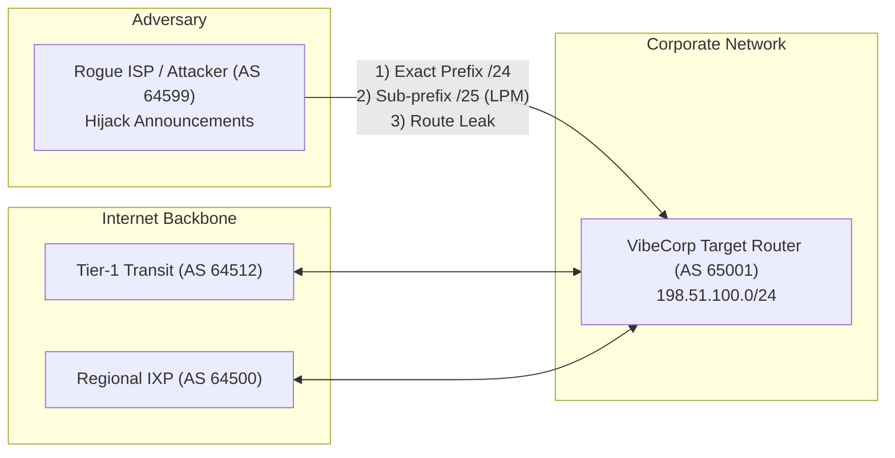

# Lab 32 — BGPRouteGuard: BGP Routing Hijacking & RPKI ROA Defense Lab

이 랩은 인터넷 코어 라우팅 프로토콜인 **BGP-4 (Border Gateway Protocol, RFC 4271)**의 신뢰 결함과 라우팅 하이재킹 공격, 그리고 이를 암호학적으로 방어하는 **RPKI (Resource Public Key Infrastructure) ROA (Route Origin Authorization)** 메커니즘을 학습하는 핸즈온 실습 환경입니다.

---

## 1. 랩 개요

- **타깃 시스템**: VibeCorp 글로벌 백본 AS 65001 경계 라우터 (BGP Border Gateway Router)
- **접속 포트**: `127.0.0.1:8032` (웹 대시보드 및 BGP 시뮬레이션 API)
- **보호 대상 프리픽스**: `198.51.100.0/24` (금융 API 및 클라우드 코어 인프라)
- **정상 오리진 AS**: `AS 65001`
- **공격자 피어**: `AS 64599` (Rogue ISP / 악성 자율 시스템)

### 네트워크 토폴로지

---

## 2. 3단계 실전 공격 시나리오 & 획득 플래그

### Step 1: Exact Prefix Hijacking (완전 일치 프리픽스 탈취)
- **공격 원리**: BGP는 피어가 전송한 경로 선언(BGP Update)을 기본적으로 검증하지 않습니다. 공격자 AS 64599가 `198.51.100.0/24`를 더 높은 Local Preference나 짧은 AS-Path로 선언하면 라우터는 최적 경로(Best Path)로 선택하여 트래픽을 공격자에게 전달합니다.
- **API**: `POST /api/bgp/exploit/prefix-hijack`
- **획득 플래그**: `FLAG{BGP_EXACT_PREFIX_HIJACK_4401}`

### Step 2: Sub-prefix Hijacking (최장 일치 규칙 우회)
- **공격 원리**: IP 라우터는 항상 **최장 프리픽스 일치(Longest Prefix Match, LPM)** 규칙에 따라 패킷을 포워딩합니다. 정상 경로가 `/24`인 경우, 공격자가 더 구체적인 `/25`(`198.51.100.0/25`)를 선언하면 AS-Path 길이나 Local Preference와 상관없이 해당 대역의 모든 트래픽이 공격자에게 100% 흡수됩니다.
- **API**: `POST /api/bgp/exploit/subprefix-hijack`
- **획득 플래그**: `FLAG{BGP_SUBPREFIX_LPM_HIJACK_5512}`

### Step 3: AS-Path Forgery & BGP Route Leak (경로 위조 및 경로 유출)
- **공격 원리**: 단순 오리진 검증을 우회하기 위해 AS-Path 뒤쪽에 정상 ASN 65001을 붙여 `[64599, 65001]`로 선언하거나, 비고객 피어로부터 받은 경로를 다른 피어에게 재선언(Transit-to-Peer Leak, RFC 7908)하여 트래픽을 가로채는 중간자(MITM) 감청 경로를 형성합니다.
- **API**: `POST /api/bgp/exploit/as-path-leak`
- **획득 플래그**: `FLAG{BGP_ASPATH_LEAK_INTERCEPTION_6623}`

---

## 3. 엔터프라이즈 방어 & 하드닝 원칙

1. **RPKI Route Origin Validation (ROV, RFC 6811)**:
   - RIR(APNIC, RIPE, ARIN 등)에 등록된 암호화 서명 객체(ROA)와 BGP Update의 (Prefix, MaxLength, Origin ASN)을 검증하여 `Invalid` 판정 시 라우팅 테이블(FIB) 진입을 즉시 차단(Strict Discard)합니다.
2. **MaxLength 제한**:
   - ROA 선언 시 과도한 서브프리픽스 분할을 허용하지 않도록 `max_length`를 엄격히 제한(예: `/24`는 `max_length 24`로 고정)하여 Step 2와 같은 LPM 파편화 공격을 원천 차단합니다.
3. **MANRS (Mutually Agreed Norms for Routing Security) 라우트 필터**:
   - 피어링 세션별로 인바운드 프리픽스 필터(IRR 및 RPKI 기반 화이트리스트)를 강제 적용하고, 세션당 수신 가능한 최대 프리픽스 수(`max-prefix`)를 제한하여 DoS를 방지합니다.
4. **RFC 9234 BGP Role & Only-to-Customer (OTC) 속성**:
   - 피어 간 BGP Role(Peer, Customer, Provider)을 협상하고, Non-Transit 세션에서 유출된 경로를 감지하여 Step 3와 같은 Route Leak을 차단합니다.
